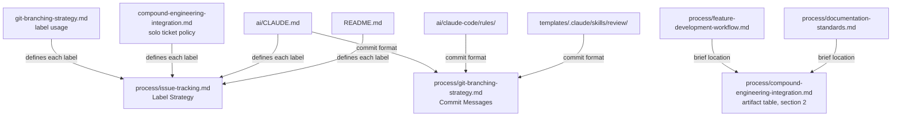

# Label and Commit Convention Ownership - Plan

## Goal Capsule

- Objective: someone adopting these standards can bootstrap their GitHub label set from one document and write their first commit from one document, without a second document telling them something different.
- Means: one owning section per rule, every other document links to it (KTD1).
- Authority: the R-IDs govern product behavior. Where a document's current text conflicts with an R, the R wins and the text changes.
- Execution profile: documentation edits only. No code changes, no GitHub tracker changes, no repository settings changes.
- Stop conditions: stop and ask if resolving a contradiction would require editing an ADR body, or if a label turns out to be in use on the tracker in a way this plan does not account for.
- Finishes the work: `ce-work` or a human on branch `27-reconcile-label-and-artifact-taxonomy`, shipped as one PR closing both #27 and #25.

---

## Product Contract

### Summary

Make `process/issue-tracking.md` § Label Strategy the single owner of every GitHub label definition, and `process/git-branching-strategy.md` § Commit Messages the single owner of the commit-message format. Every other document that currently restates either rule links to the owner instead. Along the way, declare the priority tier that is already in daily use, tag the team-scale label families so the solo mode's skip list stops reading as an unexplained deviation, and give experiment briefs a declared home.

This applies the pattern #36 established for artifact paths to the two rules that still drift.

### Problem Frame

The label strategy and the commit convention are each stated in several documents, and the copies have diverged.

For labels, `process/issue-tracking.md` § Label Strategy defines 15 labels and 2 open families. Seven labels are prescribed elsewhere and defined nowhere in it, and `ai/CLAUDE.md:66-70` carries a near-complete second copy that already omits the milestone family. Meanwhile several label families the strategy does define are used by nothing on the tracker, because `process/compound-engineering-integration.md:100` tells solo work to skip milestones, point and size labels, and theme labels. The bare `epic` label is not on that skip list; `:97` prescribes it for solo work. The strategy is simultaneously incomplete and over-prescriptive, and neither fact is visible from inside it.

For commits, `ai/claude-code/rules/engineering-standards.md:47` says `type(scope): description` while `process/git-branching-strategy.md:129` says `<type>: 
` with a subject limit of 50. The rule file is always loaded into agent context, so an agent and a human reading the standards are given different instructions about the same artifact. The 50-character limit is followed by 7 of this repository's last 34 commits.

`process/compound-engineering-integration.md:217-221` already names this failure mode and prescribes the remedy: other documents restate claims rather than linking to them, nothing propagates a correction, and the durable fix is to stop restating.

### Key Decisions

- KD1. Absorb #25 into this work (session-settled: user-directed — chosen over a separate PR: both issues edit the same paragraphs of `process/git-branching-strategy.md`, and doing them apart means a second pass over the same text). Governs R10, R11, R12, R13, R14.
- KD2. Labels the strategy prescribes but nothing uses stay declared and are tagged by mode, rather than being adopted on the tracker (session-settled: user-directed — chosen over actually applying point, epic and milestone labels to live issues: adopting them would contradict `process/compound-engineering-integration.md:100`, which #36 ratified, and add per-issue overhead to solo work). Governs R3.
- KD3. Experiment and spike briefs live at `docs/experiments/` (session-settled: user-directed, option set narrowed to `docs/experiments/` or `docs/spikes/` with the choice delegated — `docs/experiments/` is already written at `process/git-branching-strategy.md:262` and `process/feature-development-workflow.md:255` already calls the artifact an "experiment brief", so ratifying it adds no new name). Governs R8, R9.

### Requirements

**Label ownership**

- R1. `process/issue-tracking.md` § Label Strategy is the only place in live documentation where a GitHub label is defined. Other documents may instruct a reader to apply a label and must link to § Label Strategy for its definition.
- R2. Every label named anywhere in live documentation appears in § Label Strategy: the seven currently orphaned (`feature`, `refactor`, `priority:high`, `experiment`, `spike`, `from-review`, `from-deferred-q`) are each either defined there or removed from the document that names them.
- R3. Every label defined in § Label Strategy is marked with the mode that uses it. The column resolves against the two axes this repository already runs, scale (team-scale versus solo + AI) and toolchain (CE-mode versus standards-mode), and its values are team-scale, CE-mode, and both, where both means create it at any scale in either mode. The solo skip list at `process/compound-engineering-integration.md:100` becomes a restatement of the strategy's own tagging rather than a deviation from it.
- R4. The priority tier `priority:high`, `priority:medium`, `priority:low` is defined in § Label Strategy, with the meaning each currently carries in practice.
- R5. One label covers "new capability". `enhancement` is it, and `feature` is named as not used.
- R6. `refactor` is not an issue label. It is a commit type, and `tech-debt` is the issue label for that work.
- R7. `spike` is defined in § Label Strategy and `experiment` is named as not used, matching the tracker, where `spike` is live on #32, #33 and #34.
- R18. No structure bullet, worked example or search-query example in live documentation prescribes a label tagged team-scale without saying so.

**Experiment artifacts**

- R8. `docs/experiments/` is declared as the home for experiment and spike briefs in `process/documentation-standards.md` and as a row in the artifact table at `process/compound-engineering-integration.md` § 2, which governs path ownership.
- R9. `process/feature-development-workflow.md` § Experiments or Spikes names that location. It currently describes the brief's fields and no path.

**Commit convention ownership**

- R10. `process/git-branching-strategy.md` § Commit Messages is the only place the commit format, the type vocabulary, the tense rule and the subject-length limit are stated.
- R11. Scope is optional and allowed: `type(scope): description` and `type: description` are both valid.
- R12. The subject-length limit is a single number covering the full header including any `type(scope): ` prefix, with a one-line justification that survives checking.
- R13. The three documents that restate the commit format (`ai/claude-code/rules/engineering-standards.md:47`, `ai/CLAUDE.md:60`, `templates/.claude/skills/review/SKILL.md:36`) each carry a pointer instead. The third is a review checklist shipped to adopters, so leaving it would have adopters' tooling flag commits that follow the corrected standard.
- R17. Every worked commit example conforms to the rules it illustrates, including the fenced examples at `process/git-branching-strategy.md:150-155` and `:159-163` and the one at `code/python-standards.md:1684`.
- R14. A PR title satisfies § Commit Messages, because the document recommends squash-merge at `process/git-branching-strategy.md:113` and states at `:116-120` that the PR title becomes the commit subject on `main`. The approved examples at `:180-184` carry a type prefix; the commit format is not relaxed to accommodate them.

**Cross-reference integrity**

- R15. Every replacement points at its owner using the repository's dominant link form, a backticked path as link text with a relative target, extended with a section anchor.
- R16. The three bare-filename pointers at `process/issue-tracking.md:403-405` become real relative links, since one of them is the commit-convention pointer this work touches and an unlinked reference cannot be checked.

### Scope Boundaries

In scope: Markdown under `process/`, `ai/`, `templates/`, the root `README.md`, and `docs/README.md`. `code/python-standards.md:1684` is inspected under R17 but not edited.

Out of scope, and deliberately so:

- Creating, renaming or deleting labels on the GitHub tracker. This work changes documents. The tracker already carries the priority tier and `spike`; nothing here requires a settings change.
- `docs/plans/` and `archive/`. Both hold point-in-time artifacts and both are excluded from the documentation checks at `scripts/check-docs.mjs:41`. Their stale line-number citations are a symptom of the same problem but they are history, not live guidance.
- Editing the body of `docs/engineering/adr/0001-six-layer-ai-architecture.md`, which names "conventional commits" among unchanged invariants at `:80`. `process/compound-engineering-integration.md:223` governs: an ADR gets a dated amendment, never a body edit. Assess whether the wording is falsified before writing one.

#### Deferred to Follow-Up Work

- Teaching `scripts/check-docs.mjs` to verify that a link's anchor exists. The checker strips the fragment at `:117`, so every anchor this plan adds passes CI whether or not the target heading exists. This belongs with #37, which already reworks `checkLinks`.
- Reconciling `templates/.claude/skills/*/SKILL.md`, which fetch standards from absolute `raw.githubusercontent.com` URLs pinned to `main`. They are never link-checked and lag any branch until merge.
- The `v1.0-ga` and `v2.0-api-redesign` dual identity, named as milestone titles at `process/issue-tracking.md:40-41` and re-declared as labels at `:160-161`.

### Success Criteria

- A reader who creates the labels tagged for their own mode, then reads every other document in `process/` and `ai/`, encounters no label definition outside § Label Strategy and no instruction to apply a label outside their mode without a scope qualifier.
- A reader who writes a commit from `process/git-branching-strategy.md` § Commit Messages alone passes the `templates/.claude/skills/review` checklist.
- The subject-length number can be defended from a primary source without citing the 50/72 convention, which does not say what the draft in #25 says it says.

### Sources

- `process/compound-engineering-integration.md:217-221` — the repository's own statement of this failure mode and its remedy. The dependent list there names `ai/CLAUDE.md`, `ai/claude-code/rules/`, `docs/README.md` and the root `README.md`.
- `ai/claude-code/README.md:39` and `docs/engineering/adr/0001-six-layer-ai-architecture.md:37` — Layer 1 rule files stay small and point rather than encode policy inline. This is the argument for R13, not file length: both rule files are already well under budget at 61 and 41 lines.
- `docs/solutions/best-practices/prove-a-check-fails-before-trusting-it-passes.md` — a grep sweep that reports nothing is not evidence the sweep worked. Governs the verification approach below.
- Commit subject length, verified against primary sources: `72` appears zero times in git's own `Documentation/git-commit.adoc`, whose soft limit is 50 for a bare summary. In the 50/72 convention 72 is the body wrap width, not a subject limit. The real support for 72 as a full-header limit is gitlint's `title-max-length` default of 72 and the Linux kernel's 70-75 summary rule at `Documentation/process/submitting-patches.rst`.
- This repository's last 34 commits on `main`: 7 fit 50 characters, 31 fit 72, 34 fit 100. One uses a scope.

---

## Planning Contract

### Key Technical Decisions

- KTD1. One owning section per rule, cited by relative path plus anchor from everywhere else. This applies the pattern #36 established for the artifact table. Governs R1, R10, R15.
- KTD2. The subject-length limit is 72 characters for the full header, including any `type(scope): ` prefix, justified as gitlint's default and within the Linux kernel's 70-75 range. Do not justify it as "the widely used convention" — #25 proposes that wording and it is wrong, because 72 in the 50/72 convention is the body wrap. Governs R12.
- KTD3. `feature` and `refactor` are both removed from `process/git-branching-strategy.md:70` rather than added to § Label Strategy, for two different reasons. `refactor` is a commit type from the vocabulary at `:138-145` that leaked into a label list, and `tech-debt` is the issue label for that work. `feature` is not a commit type at all: that vocabulary spells it `feat:`. It goes because `enhancement` already covers new capability, which is the arbitration #27's first item asked for. Governs R5, R6.
- KTD4. § Label Strategy owns label *definitions*; documents that own a workflow keep their *usage policy* and link for the definition. So `process/compound-engineering-integration.md` keeps the solo ticket policy that says when to file a `from-review` issue, and § Label Strategy gains the definition of what `from-review` means, tagged CE-mode. Governs R1, R3.
- KTD5. `ai/CLAUDE.md:60` is deleted and replaced with a pointer, not corrected. Correcting it recreates the copy that drifted. Governs R13, and the same reasoning applies to the label blocks at `:49-52` and `:66-70`.
- KTD6. Mode tagging is rendered as a column in the § Label Strategy table rather than as separate per-mode sections, so a reader sees every label in one list and cannot bootstrap a partial set by reading one section.

### Assumptions

- The tracker's live label set matches what the open issues show: `documentation`, `bug`, `enhancement`, `tech-debt`, `spike`, and the three `priority:*` labels. This was read from open issues, not from repository settings. If settings carry labels no issue uses, R3's mode tagging needs a second pass.
- `testing` and `blocked` are defined in § Label Strategy and appear on no open issue. They are treated as available-in-both-modes rather than team-scale, because neither is tied to the three-tier hierarchy. Confirm during U1.
- The ADR's "conventional commits" phrase at `:80` is broad enough that making scope optional does not falsify it, so no amendment is needed. U4 verifies this rather than assuming it.

### High-Level Technical Design

Rule ownership after this work:

Every arrow is a link. No box restates what the box it points at defines.

### System-Wide Impact

The commit format is stated on three surfaces that serve different readers, which is why the contradiction went unnoticed. `ai/claude-code/rules/engineering-standards.md` is always loaded into agent context. `process/git-branching-strategy.md` is what a human reads. `templates/.claude/skills/review/SKILL.md` ships to adopters and enforces the rule during review. An agent, a human and an adopter's tooling were each being told something different about the same artifact, and only the third one fails loudly.

R13 covers all three deliberately. Fixing the rule file alone, which is what #25 names, leaves an agent-facing copy and an enforcement copy live.

The shipped template skills reach standards over absolute `raw.githubusercontent.com` URLs pinned to `main`, so an adopter's review checklist keeps enforcing the old rule until this work merges. Nothing in the repository can close that window; it is named here so the PR description can.

### Sequencing

U1 before U2 and U3, because both point at what U1 writes. U4 before U5, for the same reason. U6 is independent and can land in any position.

---

## Implementation Units

### U1. Make Label Strategy the complete, mode-tagged owner

- Goal: § Label Strategy defines every label named anywhere in live documentation, and marks the mode each belongs to.
- Requirements: R1, R2, R3, R4, R5, R6, R7
- Dependencies: none
- Files: `process/issue-tracking.md`
- Approach:
  1. Convert the five label subsections at `:144-170` into one table with columns for label, meaning, and mode. Mode values are both, team-scale, and CE-mode. KTD6 governs the single-table shape.
  2. Add `priority:high`, `priority:medium`, `priority:low` with the meaning they carry in practice, tagged both.
  3. Add `spike` tagged both, and `from-review` and `from-deferred-q` tagged CE-mode, with definitions taken from `process/compound-engineering-integration.md:98`.
  4. Split the epic family. Tag the bare `epic` label available in both modes, because `process/compound-engineering-integration.md:97` prescribes one umbrella epic per multi-phase plan for solo + AI work. Tag `epic-{theme-slug}`, the milestone family and the estimation family team-scale, which is what the skip list at `:100` actually names: milestones, point/size labels, theme labels.
  5. Add a short note naming `feature`, `refactor` and `experiment` as deliberately not used, with the replacement for each: `enhancement` for `feature`, `tech-debt` for `refactor` as an issue label, and `spike` for `experiment`. A reader arriving from an older document then knows they are not missing a label.
  6. Move the `epic-{theme-slug}` format rule from `:262` into the table's entry for that family, since `:262` is currently the only place it is stated. Use `epic-{theme-slug}` as the single placeholder spelling. Three are live and it is the most used, at `:216`, `:262`, `:264` and `ai/CLAUDE.md:68`, against two uses of `epic-{theme-name}` and one of `epic-{slug}`.
- Patterns to follow: the artifact table at `process/compound-engineering-integration.md` § 2, which is the repository's existing example of a table that governs rather than describes.
- Test scenarios:
  - A search for each of the 22 label names across `process/`, `ai/`, `templates/` and `README.md` returns exactly one entry in § Label Strategy: a table row, or the deliberately-not-used note for `feature`, `refactor` and `experiment`. `refactor` also appears outside it as a commit type in the vocabulary at `process/git-branching-strategy.md:138-145`, which is correct and expected.
  - The same search run with a pattern that only matches backticked names still finds `process/issue-tracking.md:65` and `:121`, where labels appear unbackticked inside fenced examples. If it does not, the pattern is wrong, not the tree.
  - Every label observed on an open issue (`documentation`, `bug`, `enhancement`, `tech-debt`, `spike`, the three `priority:*`) appears in the table tagged both.
- Verification: the table carries a mode for every row, and no label definition remains outside it.

### U2. Reconcile the rest of issue-tracking.md with the mode tags

- Goal: the three-tier hierarchy and its examples stop presenting team-scale metadata as the base structure.
- Requirements: R3, R16, R18
- Dependencies: U1
- Files: `process/issue-tracking.md`
- Approach:
  1. Qualify the Tier 2 and Tier 3 structure bullets at `:57` and `:114-115`, which list epic, milestone and `points-N` labels as part of the base structure.
  2. Add a scope qualifier to § Consistent Labeling at `:185-191`, whose stated rationale at `:191` is bulk filtering by epic-theme and milestone labels, and to § Search Queries at `:193-207`, whose three `gh` examples all filter on team-scale families.
  3. Precede the two fenced worked examples at `:63-65` and `:117-121` with the same qualifier used for the structure bullets. Both list team-scale labels (`epic-auth-system`, `v2.0-api-redesign`, `points-5`) and the second doubles as a copy-paste template, so keep the examples intact and qualify them rather than editing the labels out.
  4. Leave `:359-375` § Epic Size Guidelines alone unless a change is unavoidable. The sentence at `:364` is cited as an argument by `process/compound-engineering-integration.md:125`; changing its wording breaks that argument in another live document.
  5. Turn the three bare-filename pointers at `:403-405` into relative links.
  6. Add a changelog entry at `:3-13` following the file's own existing version-header convention. This is housekeeping the file already demands; it is not a decision about whether sibling documents should adopt version headers.
- Patterns to follow: the CE carve-out banner already at `:19`, which is the file's existing way of marking mode-specific guidance.
- Test scenarios:
  - Reading `:57` and `:114-115` alone, a solo-mode adopter is not told to apply a label the strategy tags team-scale without a qualifier.
  - The sentence `process/compound-engineering-integration.md:125` argues from is still present at `process/issue-tracking.md:364` with its meaning intact.
  - Each of the three former bare-filename pointers at `:403-405` resolves to an existing file.
  - The fenced examples at `:63-65` and `:117-121` still read as valid templates, and a solo-mode adopter can tell which of their labels do not apply.
- Verification: no structure bullet or worked example prescribes a team-scale label without saying so.

### U3. Point the label restatements at the owner

- Goal: no document outside § Label Strategy defines a label.
- Requirements: R1, R2, R15
- Dependencies: U1
- Files: `ai/CLAUDE.md`, `README.md`, `process/git-branching-strategy.md`, `process/compound-engineering-integration.md`
- Approach:
  1. Delete the label blocks at `ai/CLAUDE.md:49-52` and `:66-70` and replace them with a single pointer. Per KTD5, do not correct them in place.
  2. Rewrite `process/git-branching-strategy.md:70` to drop `feature` and `refactor` per KTD3 and link to § Label Strategy instead of listing labels.
  3. Keep the instruction at `:243` to apply `priority:high`, now that it is defined, and link on first use. Rewrite `:261` so it names only `spike`, dropping `experiment`, mirroring step 2's removal of `feature` and `refactor` from `:70`.
  4. In `process/compound-engineering-integration.md:98`, keep the policy about when to file each reactive sub-issue and link for the definitions, per KTD4. Reword `:100` so the skip list reads as the strategy's team-scale tagging rather than a deviation from a default.
  5. Adjust `README.md:79`, which restates the five subsection names that U1 replaces with one table.
- Patterns to follow: write pointers as ``[`process/issue-tracking.md`](./issue-tracking.md#label-strategy)``. No link in the live tree combines both halves yet: `process/issue-tracking.md:19` supplies the backticked-path link text without a fragment, and `:167` supplies the fragment with prose link text.
- Test scenarios:
  - `ai/CLAUDE.md` contains no label definition, and the pointer that replaces the two deleted blocks resolves.
  - `process/git-branching-strategy.md:70` no longer names `feature` or `refactor`, and `:261` no longer names `experiment`.
  - `process/compound-engineering-integration.md:100` reads as the strategy's own team-scale tagging rather than a deviation from a default.
- Verification: a sweep for each label name returns only definitions inside § Label Strategy, plus usage instructions that link to it.

### U4. Consolidate the commit convention in its owner

- Goal: `process/git-branching-strategy.md` § Commit Messages states the format, the types, the tense rule and one subject limit, consistently with the document's own PR guidance.
- Requirements: R10, R11, R12, R14, R17
- Dependencies: none
- Files: `process/git-branching-strategy.md`
- Approach:
  1. Change the format at `:129` to make scope optional, showing both `type(scope): description` and `type: description` as valid.
  2. Replace the 50-character limit at `:169` with 72 for the full header, carrying the one-line justification from KTD2. Do not reproduce #25's justification.
  3. Rewrite the approved PR-title examples at `:180-184` to carry a type prefix and fit 72 characters, and state in the PR-title section that a title must satisfy § Commit Messages because squash-merge makes it the subject on `main`. This is the direction R14 fixes: the examples move, not the format. It adds an obligation on every adopter PR, so call it out in the PR body rather than letting it land silently.
  4. Check every worked example against the rules as changed. The two fenced examples at `:150-155` and `:159-163` use `type: summary` with no scope, which stays valid under R11; confirm both fit 72 characters. `code/python-standards.md:1684` uses `git commit -m "feat: initial project setup"`, also valid, so confirm rather than change it.
  5. Check whether `docs/engineering/adr/0001-six-layer-ai-architecture.md:80` is falsified by making scope optional. If it is, append a dated amendment; if not, record that it was checked and leave it. `process/compound-engineering-integration.md:223` forbids editing the body either way.
- Patterns to follow: the amendment already appended to ADR-0001 by #36, if step 5 needs one.
- Test scenarios:
  - A subject of exactly 72 characters is valid and 73 is not, under the limit as written.
  - `type: description` and `type(scope): description` are both readable as valid from the section alone.
  - Each worked example in the document satisfies the rules the same document states, per R17.
  - The subject-length justification does not claim 72 comes from the 50/72 convention.
  - Each approved PR-title example at `:180-184` satisfies § Commit Messages as rewritten, prefix included, within 72 characters.
- Verification: the format, type vocabulary, tense rule and subject limit each appear exactly once in live documentation.

### U5. Point the commit-format restatements at the owner

- Goal: the three restatements become pointers, including the one shipped to adopters.
- Requirements: R13, R15
- Dependencies: U4
- Files: `ai/claude-code/rules/engineering-standards.md`, `ai/CLAUDE.md`, `templates/.claude/skills/review/SKILL.md`
- Approach:
  1. Shrink `ai/claude-code/rules/engineering-standards.md:47` to a one-line summary plus a link, per the Layer 1 discipline in Sources.
  2. Apply the same treatment to `ai/CLAUDE.md:60`, which #25 does not name and which would otherwise keep the contradiction alive.
  3. Update `templates/.claude/skills/review/SKILL.md:36`. This ships to adopters as a review checklist and currently enforces the format the standard is moving away from. Note that this file reaches standards by absolute URL pinned to `main`, so its guidance lags until merge.
- Patterns to follow: `templates/.claude/agents/code-reviewer.md:27` already says "conventional commit messages" without naming a format, which is the shape that survives either resolution.
- Test scenarios:
  - A commit written from § Commit Messages passes the checklist in `templates/.claude/skills/review/SKILL.md` as edited.
  - `type(scope): description` appears in live documentation only inside § Commit Messages.
- Verification: all three former restatements carry a pointer, and each pointer resolves.

### U6. Declare where experiment briefs live

- Goal: one declared location for experiment and spike briefs, consistent across the documentation standard, the governing artifact table, and both documents that discuss experiments.
- Requirements: R8, R9
- Dependencies: none
- Files: `process/documentation-standards.md`, `process/compound-engineering-integration.md`, `process/feature-development-workflow.md`, `process/git-branching-strategy.md`, `docs/README.md`
- Approach:
  1. Add `docs/experiments/` to the `docs/` taxonomy at `process/documentation-standards.md:28-47`, where it does not currently appear.
  2. Add a row for it to the artifact table at `process/compound-engineering-integration.md` § 2, owner "standards", alongside the existing human-authored rows. That table governs path ownership as of #36.
  3. Name the location at `process/feature-development-workflow.md:255`, which describes the brief's fields and gives no path.
  4. Reconcile `process/git-branching-strategy.md:262`, currently the only prescription of the path in the repository, so it links rather than declares.
  5. Add `experiments/` to the subdirectory list at `docs/README.md:10`.
- Patterns to follow: the existing standards-owned rows in the § 2 table, `docs/engineering/designs/` and `docs/product/`.
- Test scenarios:
  - `docs/experiments/` resolves to the same location from all five documents.
  - The § 2 artifact table row assigns it an owner, so the path-decides-ownership rule covers it.
- Verification: declared in `process/documentation-standards.md` and as a row in the `process/compound-engineering-integration.md` § 2 artifact table per R8, matching how `docs/product/` is already carried in both, and linked from the other three.

---

## Verification Contract

| Gate | Command or method | Applies to |
|---|---|---|
| Documentation checks | `npm ci --prefix scripts && node scripts/check-docs.mjs` | all units |
| Label sweep | grep each label name across `process/`, `ai/`, `templates/`, `README.md` | U1, U2, U3 |
| Commit-format sweep | grep `type(scope)` and `<type>:` across the same paths | U4, U5 |
| Anchor resolution | open each new anchor link and confirm the heading exists | U2, U3, U5, U6 |
| Argument integrity | confirm `process/compound-engineering-integration.md:125` still resolves against the text it cites | U2 |

Two of these gates need care, for reasons this repository has already paid for.

Anchor links are not verified by CI. `scripts/check-docs.mjs:117` splits the fragment off and checks only the file part, so a link to `#label-strategy` passes whether or not that heading exists. Every anchor added by this work is checked by hand, or the heading text is left unchanged.

The label and commit sweeps are the kind of check that reports success by finding nothing, which is the failure mode `docs/solutions/best-practices/prove-a-check-fails-before-trusting-it-passes.md` documents. Before trusting a clean sweep, confirm the pattern matches a known instance. Labels appear both backticked in prose and unbackticked inside fenced examples, at `process/issue-tracking.md:65` and `:121`, so a pattern that only matches backticked names will report clean while missing them.

---

## Definition of Done

- Every requirement R1 through R18 is satisfied, or explicitly deferred in the PR body with a reason.
- `node scripts/check-docs.mjs` passes.
- Both #27 and #25 can be closed by this PR. Its body carries the disposition of each acceptance criterion from both issues.
- The PR body records the subject-length justification and states that #25's proposed justification was checked and not used, so the next reader does not reintroduce it.
- No label definition, and no statement of the commit format, exists outside its owning section in live documentation.
- No tracker labels were created, renamed or deleted.
