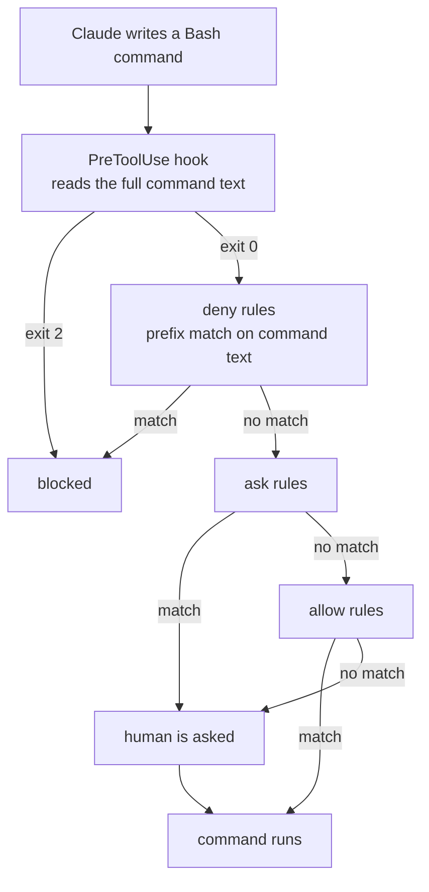

# Template Hook Wiring and Permission Honesty - Plan

## Goal Capsule

- Objective: an adopter who copies the starter kit into a new project gets a Layer 6 that actually stops the writes it says it stops, and is not led to believe the permission list stops anything it does not.
- Means: correct the hook wiring and the hook scripts together, narrow the allow list that contradicts the deny list, and state plainly where the permission boundary is (KTD1, KTD2).
- Authority: the R-IDs govern the kit's behavior. Where the issue's text and the Claude Code documentation disagree, the documentation wins and the R records what was found.
- Execution profile: edits under `templates/.claude/`, `templates/README.md`, `templates/CLAUDE.md`, plus one new script under `scripts/` and a CI job. No changes to `process/`, `ai/`, or the ADR.
- Stop conditions: stop and ask if the captured hook payload (U3) contradicts this plan's assumed field names in a way that changes what the hooks can check; stop and ask if the pre-fix settings file turns out to have disabled the whole settings file, since that changes what the fix restores and what the PR body must say.
- Finishes the work: `ce-work` or a human on branch `24-template-claude-settings-json-hooks-never-fire`, shipped as one PR closing #24, and #28 as well if the fold-in recommendation in Scope Boundaries is accepted.

---

## Product Contract

### Summary

Make the two example hooks in `templates/.claude/` run and do something, and stop the permission block in `templates/.claude/settings.json` from implying a guarantee it cannot hold.

Three defects sit between an adopter and a working Layer 6, not the two the issue names. The hook entries use the wrong object shape, so nothing is registered. The hook scripts read `TOOL_NAME` and `TOOL_INPUT` from the environment, which Claude Code does not set, so even correctly registered they exit 0 on every call. And both scripts' docstrings teach the same wrong settings shape, so the first hook an adopter writes from the template inherits the defect.

On the permission side, the fix is not a longer deny list. The deny rules are documented by Claude Code as covering the invocation the model usually writes rather than the program, and the hole they leave is opened by `Bash(git:*)` in the allow list, not by their own incompleteness. Narrow the allow list, keep the deny entries, and say in one place what the rules are and are not.

### Problem Frame

`templates/.claude/` is the starter kit the repository tells every adopter to copy into their project root: `README.md:128` and `ai/claude-code/README.md:91` both instruct it, and `ai/claude-code/README.md:37` names `templates/.claude/hooks/` as the vendor-neutral baseline for Layer 6. That baseline has never run.

`templates/.claude/settings.json` puts `command` directly on the matcher object. Claude Code's schema for a hook matcher requires a `hooks` array and admits no other keys, so both entries are structurally invalid. Commit `8389dc4`, closing #20, corrected the event names in this same file from kebab-case to PascalCase and did not correct the object structure. That is the pattern `docs/solutions/best-practices/a-corrected-claim-is-not-a-verified-claim.md` names: the research that exposed the first error lent its standing to a replacement that had not been through it.

The second defect compounds the first and has gone unmentioned. Claude Code passes hook input as a JSON object on stdin and sets no `TOOL_NAME` or `TOOL_INPUT` variable. Both scripts read those variables, find them empty, fail their `if tool_name not in (...)` guard, and exit 0. Fixing the wiring alone produces two processes that launch, do nothing, and report success — which would satisfy a loose reading of the issue's "verified to fire" while leaving Layer 6 exactly as non-functional as before.

The permission block has a different shape of problem. Nothing in the repository claims the deny rules are a security boundary; the false comfort is entirely in the file, read by someone who assumes a `deny` list denies. Claude Code's own documentation is explicit that it does not: "A Bash rule matches the command text Claude writes ... It doesn't match the same program invoked in a different form, so a deny or ask rule covers the invocation Claude usually produces and isn't a security boundary around the program."

### Key Decisions

- KD1. The hook wiring and the hook scripts are one fix, not two. Governs R1, R4, R5. A registered hook that exits 0 on every call is not a working Layer 6, and the issue's second acceptance criterion is satisfiable without it being one.
- KD2. The deny list is documented as advisory rather than extended, and the allow list narrows instead. Governs R11, R12, R13. Enumerating deny variants does not terminate; narrowing an allow list is a closed set you opt into.
- KD3. `templates/README.md` owns the permission statement; every other document links to it. Governs R12, R14. This applies the one-owner-per-rule pattern #27 established.

### Requirements

**Hook wiring**

- R1. Both `PreToolUse` and `PostToolUse` entries in `templates/.claude/settings.json` use `{ "matcher": ..., "hooks": [{ "type": "command", "command": ... }] }`.
- R2. The hook command resolves to the right script regardless of which directory the session was started in.
- R3. Each hook matcher names only tools Claude Code currently exposes.
- R4. `templates/.claude/settings.json` carries no key on a hook matcher object other than `matcher` and `hooks`.

**Hook scripts**

- R5. Both example hooks read the tool event from the JSON object Claude Code writes to stdin. Neither reads `TOOL_NAME` or `TOOL_INPUT` from the environment.
- R6. The field names each hook reads out of that payload are taken from a payload captured from a running session, not from documentation or from this plan.
- R7. `example-block.py` exits 2 with its reason on stderr when the blocked pattern appears in the content being written, and exits 0 otherwise.
- R8. A hook that receives absent or malformed stdin exits 0, so a wiring mistake in an adopter's project degrades to no enforcement rather than to a broken session.
- R9. Each hook's docstring shows the settings shape that works and exit-code semantics that match the documented behavior of that hook's event. No docstring in the kit shows the pre-fix shape.
- R10. No branch of either script handles a tool that does not exist.

**Permission honesty**

- R11. No file in the kit presents the `deny` list as a guarantee.
- R12. The kit states in exactly one place that Bash permission rules match command text and are not a boundary around the program, names the two mechanisms that are a boundary, and cites the Claude Code documentation for both claims.
- R13. No entry in `allow` auto-approves a command that an entry in `deny` claims to block. `git push`, written in any form, reaches a human decision.
- R14. `templates/CLAUDE.md` links to the owner of R12 rather than restating it.

**Proof**

- R15. Each hook can be exercised from a shell by piping a payload to it, with no Claude Code session running.
- R16. The end-to-end check proves both directions: the blocked pattern is blocked, a clean write proceeds, and the pre-fix settings shape does not block.
- R17. Whether the pre-fix shape produced a settings error that disabled the whole file, permissions included, is determined and recorded in the PR body.

**Recurrence guard**

- R18. A repository check fails when a hook entry in a tracked `.claude/settings.json` omits its `hooks` array, carries an unknown key on the matcher, or names a script that is not in the tree.
- R19. That check is proven to fail against the pre-fix file before it is trusted on the post-fix one.
- R20. CI runs the check on a pull request that touches `templates/.claude/`.

### Scope Boundaries

In scope: `templates/.claude/settings.json`, both files under `templates/.claude/hooks/`, `templates/README.md`, `templates/CLAUDE.md`, one new file under `scripts/`, `.github/workflows/docs.yml`, and `process/documentation-standards.md`.

Out of scope, and deliberately so:

- Adding a second example hook, or converting `example-block.py` from a Write/Edit content rule into a Bash destructive-command blocker. The permission statement points at the `PreToolUse` slot as the place a real command check goes; it does not need to ship one to make that point, and converting the example would lose the Write/Edit demonstration the kit currently teaches.
- `ai/claude-code/README.md`, `README.md` and the ADR. All three describe Layer 6 correctly in the abstract. Nothing they say becomes false or true as a result of this work.
- Sandboxing configuration. It is named in the permission statement as one of the two real boundaries and is a project-level choice, not a starter-kit default.
- Windows support for the hook commands. `python3` on PATH is assumed; see KTD5.

#### Deferred to Follow-Up Work

Nothing from #28 is deferred. It was originally listed here and has since been folded in; see D1 and U6.

**#28 is folded into this PR as U6.** Both issues say so, and #28 says it directly: "a README rewrite that documents the hooks should not land describing hooks that do not fire." The converse also holds. U2 writes a permission section into a document whose closing line still reads "**Placeholder** - Templates will be added as common patterns emerge from project work," which is incoherent on its face. U6 resolves that, and is severable: dropping it leaves U2 and the rest of this plan intact, with the incoherence returning to #28.

### Success Criteria

- A reader who copies the kit, asks Claude to write a file containing the blocked pattern, and watches the write get refused has seen Layer 6 work. That is the signal the Objective names, and nothing short of it counts.
- A reader who reads the permission block and the statement that governs it can say, without opening the Claude Code documentation, which of the two mechanisms actually stops a `git push -f`.

### Sources

- Claude Code hooks reference, `https://code.claude.com/docs/en/hooks`. The matcher object requires a nested `hooks` array of `{"type": "command", "command": ...}`. Hook scripts receive JSON on stdin; the environment carries `CLAUDE_PROJECT_DIR` and related variables but not the tool payload. Exit 2 blocks a `PreToolUse` call with stderr as the reason; `PostToolUse` fires after the tool has already succeeded and cannot block.
- Claude Code permissions reference, `https://code.claude.com/docs/en/permissions`. "A Bash rule matches the command text Claude writes ... It doesn't match the same program invoked in a different form, so a deny or ask rule covers the invocation Claude usually produces and isn't a security boundary around the program." The page's own table gives `Bash(git push *)` stopping `git push origin main` and not `git -C . push origin main`. It also warns that "Bash permission patterns that try to constrain command arguments are fragile," and names the two alternatives: sandboxing for enforcement that does not depend on command text, and a `PreToolUse` hook to inspect the full command text.
- The same page on precedence: rules are evaluated deny, then ask, then allow, and "A blocking hook also takes precedence over allow rules. A hook that exits with code 2 stops the tool call before permission rules are evaluated, so the block applies even when an allow rule would otherwise let the call proceed." This is why the hook, not a rearranged rule list, is the answer to the issue's fourth acceptance criterion.
- Claude Code tools reference, `https://code.claude.com/docs/en/tools-reference`. The file-editing tools are `Edit`, `Write` and `NotebookEdit`. There is no `MultiEdit` tool, so the `MultiEdit` alternative in both matchers matches nothing and the `edits[]` branch in `example-block.py` is unreachable.
- The published Claude Code settings schema, `https://json.schemastore.org/claude-code-settings.json`. Its `hookMatcher` definition sets `required: ["hooks"]` and `additionalProperties: false`. Checked against `templates/.claude/settings.json` as it stands, both the `PreToolUse` and `PostToolUse` entries report an unexpected `command` key and a missing `hooks` key. This is the schema-level confirmation of the defect, and the reason the guard in U5 can be small.
- `docs/solutions/best-practices/prove-a-check-fails-before-trusting-it-passes.md` governs U4 and U5. A check that never fails is a check nobody has shown to work.
- `docs/solutions/best-practices/a-corrected-claim-is-not-a-verified-claim.md` governs the whole change. It is the failure mode `8389dc4` shipped, and this plan is a second correction to the same file by the same route.

---

## Planning Contract

### Key Technical Decisions

- KTD1. Wiring and scripts land together, and the unit that proves it does so with a probe that does not need a Claude Code session. Governs R1, R5, R15. The issue's second acceptance criterion, read loosely, is satisfied by two processes that launch and exit 0; the offline probe is what makes "fires" mean "checks something and acts on it."
- KTD2. The deny entries stay exactly as written and gain a statement that they are advisory; the allow list is what changes. Governs R11, R12, R13. Adding `Bash(rm -fr:*)` and `Bash(git push -f:*)` is cheap and stops two more forms, and that is the argument against it: a longer list reads as a complete list, and the next reader has less reason to doubt it than the current one does. Meanwhile the list that actually does damage is the allow list, because `Bash(git:*)` auto-approves `git push -f` while `rm -fr` — never allowed by anything — still prompts. The asymmetry is the finding: on `rm` the deny rule is merely decorative, on `git push` it is contradicted. Narrowing `allow` fixes the half that is real and terminates, because an allow list is a set you opt into rather than a set of forms you have to have anticipated.
- KTD3. The permission statement lives in `templates/README.md` under its own heading; `templates/CLAUDE.md` carries a one-line link. Governs R12, R14. JSON takes no comments, so the kit's own configuration file cannot host it. Of the two Markdown files an adopter copies, `CLAUDE.md` goes to the project root and is loaded into every session, which argues for keeping it short and pointing, per the Layer 1 discipline at `ai/claude-code/README.md:41`.
- KTD4. The recurrence guard is a purpose-built structural check, not validation against the published JSON schema. Governs R18, R19. The schema would catch this defect — it was used above to confirm it — but it is community-maintained, sets `additionalProperties: false` throughout, and lags Claude Code releases, so a newly valid setting would fail CI. A false-positive-prone check trains people to ignore the output, which is the reasoning `docs/plans/2026-09-20-2150-fence-aware-doc-checks-plan.md` KD2 already applied to the slugifier. A sixty-line check over the four invariants that actually broke here has no upstream to drift from and needs no new dependency.
- KTD5. The hook command is anchored on `$CLAUDE_PROJECT_DIR` rather than left relative. Governs R2. The relative form works when the session starts at the project root, which is the usual case and why this has not been noticed; it silently stops resolving when the session starts in a subdirectory. Claude Code sets the variable for exactly this. Quote it so a path with a space survives: `python3 "$CLAUDE_PROJECT_DIR"/.claude/hooks/...`.
- KTD6. `MultiEdit` comes out of both matchers and the `edits[]` branch comes out of `example-block.py`. Governs R3, R10. The tool does not exist, so the branch is unreachable and the matcher alternative matches nothing. Leaving it is dead code in a file whose whole purpose is to be copied.

### Assumptions

Each of these is a point where a blocking question would have been asked. They are recorded rather than resolved.

- A1. Resolved by D1: #28 is folded into this PR and is U6. U2 is written so it lands either way, so dropping U6 leaves this plan intact.
- A2. `example-block.py` keeps its `time.sleep(` example rule. Converting it to a Bash command check would make the permission statement self-demonstrating, and would also delete the Write/Edit example the kit teaches. Judged the larger change and the wrong trade for a starter kit.
- A3. The `tool_input` field names are `file_path`, `content`, `old_string` and `new_string`. This is what this session's own tool schemas carry, and the hooks documentation's worked example uses `tool_input.command` for Bash in the same shape. It is nonetheless an assumption about a payload nobody in this planning run has seen, which is exactly why R6 exists and why U3 opens by capturing one. If the capture disagrees, the capture wins.
- A4. The guard runs as a second job inside `.github/workflows/docs.yml` rather than a new workflow file, so the existing `check-docs` job keeps its name for any branch protection that references it. The workflow's display name, "Documentation checks", becomes slightly narrow; judged not worth a rename that would change a check name.
- A5. No new npm dependency. The guard uses `node:fs` and nothing else.
- A6. One PR, branch `24-template-claude-settings-json-hooks-never-fire`, per the standards-mode naming at `ai/CLAUDE.md`.
- A7. The narrowed git allow list is `status`, `diff`, `log`, `show`, `add`, `commit`, `branch`, `switch`, `checkout`, `stash`, `fetch`, `pull`, `restore`. Chosen as the set a routine session needs without a human decision. `push` is deliberately absent. This is a judgement call about someone else's daily workflow and is the single item in this plan most likely to want adjusting.
- A8. The scratch-project verification in U4 is run by a human or an agent with a Claude Code session available. If the implementer has no such session, U4 steps 2 through 5 cannot be executed and the unit's offline half is not a substitute; say so rather than marking the criterion met.

### Sign-Off Record

The four decisions this plan referred to the repository owner were settled on 2026-09-21, each as recommended. They are recorded here because a plan that reads as undecided invites the next reader to relitigate it.

- D1. **#28 is folded into this PR**, as U6. Resolves A1 and the Deferred to Follow-Up Work entry. U6 is severable.
- D2. **The deny entries stay as written and are documented as advisory; the allow list narrows.** Confirms KTD2. The rejected alternative — adding `Bash(rm -fr:*)` and `Bash(git push -f:*)` — is recorded in KTD2 along with the reason it was rejected, which is that a longer list reads as a complete one.
- D3. **The narrowed git allow list is A7 as written**, with `push` absent. A7 flagged itself as the item most likely to want adjusting; it was accepted unchanged, so an implementer who finds it obstructive should raise it rather than quietly widen it.
- D4. **The recurrence guard is the purpose-built structural check**, not validation against the published JSON schema. Confirms KTD4.

### High-Level Technical Design

What stops a destructive command, after this change:



Two properties of that order are what the permission statement has to convey. The hook sits ahead of every rule, so it is the only layer that sees the command as written rather than as a prefix. And the `allow` box is the last one: a command that reaches it matched no deny and no ask, so a broad allow entry is not a convenience, it is the decision.

### Sequencing

U1 before U3, because U3 opens by capturing a payload from a hook that has to be registered to produce one. U3 before U4. U5 after U1 and U3, because its proof step needs both the post-fix files to check and the pre-fix shape to check against. U2 depends on nothing and can land in any position. U6 comes after U1, U2 and U3, because it describes a starter kit whose hooks and permission rules those units change, and describing them before they are correct is the failure #28 exists to stop.

---

## Implementation Units

### U1. Correct the hook wiring

- Goal: both hook entries register, and their commands resolve from any working directory.
- Requirements: R1, R2, R3, R4
- Dependencies: none
- Files: `templates/.claude/settings.json`
- Approach:
  1. Replace the `command` key on each matcher object with a `hooks` array holding one `{ "type": "command", "command": ... }` entry.
  2. Anchor each command on the project directory, quoted so a path containing a space survives: `python3 "$CLAUDE_PROJECT_DIR"/.claude/hooks/pre-tool-use/example-block.py`, and the matching path for the post-tool-use script. KTD5 governs.
  3. Change both matchers from `Write|Edit|MultiEdit` to `Write|Edit`. KTD6 governs.
  4. Leave the `permissions` block untouched. U5 owns it.
- Patterns to follow: the shape in the hooks documentation's own example, reproduced in the corrected docstrings U3 writes.
- Test scenarios:
  - The file parses as JSON.
  - Each entry under `hooks.PreToolUse` and `hooks.PostToolUse` has exactly the keys `matcher` and `hooks`.
  - Each element of each `hooks` array has `type` equal to `command` and a non-empty `command`.
  - Each command names a path that exists under `templates/.claude/hooks/`.
  - The string `MultiEdit` does not appear in the file.
- Verification: the checks in U5 pass against the file, and `/hooks` in the U4 scratch project lists both entries.

### U2. Say what the permission rules are

- Goal: one place in the kit states what a Bash permission rule matches and what stops a command it does not match, and the allow list stops contradicting the deny list.
- Requirements: R11, R12, R13, R14
- Dependencies: none
- Files: `templates/.claude/settings.json`, `templates/README.md`, `templates/CLAUDE.md`
- Approach:
  1. In `templates/.claude/settings.json`, replace `Bash(git:*)` with the explicit subcommand list from A7. Leave the two `deny` entries exactly as they are, per KTD2.
  2. Add a `## Permissions and hooks` section to `templates/README.md`. It says four things and no more: a Bash rule matches the command text the model writes, so `Bash(rm -rf:*)` does not cover `rm -fr` or `rm --recursive --force` and `Bash(git push --force:*)` does not cover `git push -f` or a `+ref` push; the deny entries are defence in depth against the form the model usually writes, not a boundary around the program; the two mechanisms that are a boundary are sandboxing and a `PreToolUse` hook, because a hook that exits 2 is evaluated before the permission rules and overrides an allow entry; and this is why the allow list names git subcommands rather than `Bash(git:*)`, since an allow entry is the last box in the order and a broad one is a decision rather than a convenience.
  3. Cite the Claude Code permissions page for the first and third claims. Quote or drop, per `docs/solutions/best-practices/a-corrected-claim-is-not-a-verified-claim.md`: the sentence about what a Bash rule matches is quotable from that page and the sentence about hook precedence is quotable from it too. Do not write a clause that is neither.
  4. Add one line to `templates/CLAUDE.md`, under `### AI Behavior`, linking to that section. Do not restate it, per KTD3.
  5. Name the asymmetry explicitly in the section, because it is the part a reader will get wrong: `rm` is in no allow entry, so a variant the deny rule misses still reaches a prompt; `git push -f` was auto-approved by `Bash(git:*)`, so the deny rule was not merely incomplete, it was contradicted.
- Patterns to follow: the pointer form settled by #27, a backticked relative path as link text with a section anchor, as at `ai/CLAUDE.md`.
- Test scenarios:
  - Reading `templates/.claude/settings.json` and `templates/README.md` together, no sentence claims the deny list blocks a command class.
  - `git push --force`, `git push -f`, and `git push origin +main` each match no entry in `allow` as rewritten.
  - Every claim in the new section is either quotable from the cited page or is a statement about this kit's own configuration.
  - `templates/CLAUDE.md` contains no second statement of the rule, and its link resolves to a heading that exists.
- Verification: `node scripts/check-docs.mjs` passes, which now covers the new anchor; and the allow list contains no entry matching a push.

### U3. Make the example hooks read what Claude Code sends

- Goal: both hooks act on the real payload, and their docstrings teach the shape that works.
- Requirements: R5, R6, R7, R8, R9, R10
- Dependencies: U1
- Files: `templates/.claude/hooks/pre-tool-use/example-block.py`, `templates/.claude/hooks/post-tool-use/example-notify.py`
- Approach:
  1. **Capture a payload first.** Stand up the scratch project by the procedure in U4 step 2 — U3 borrows it, it is not a dependency on U4's result — and temporarily replace the `PostToolUse` command there with one that writes stdin to a file, `sh -c 'cat > /tmp/hook-payload.json'`. Trigger a write and read what arrives. Record the exact `tool_input` field names for `Write` and for `Edit`. R6 governs: the field names in the scripts come from this file, not from A3 and not from the documentation. If they disagree with A3, the capture wins and the difference goes in the PR body.
  2. Rewrite the input handling in both scripts: `json.load(sys.stdin)`, then `tool_name` and `tool_input` off the resulting object. Delete every reference to `os.environ`.
  3. Wrap the read so that absent or malformed stdin exits 0 (R8). An adopter who mis-wires a hook should lose the enforcement, not the session.
  4. In `example-block.py`, drop the `MultiEdit` branch and read the content from the Write and Edit fields the capture named. Keep the `time.sleep(` example rule and the exit-2-with-stderr behavior (A2, R7).
  5. Rewrite the "Usage in .claude/settings.json" block in both docstrings to the nested shape. These are a third copy of the defect and the one adopters copy when writing their own first hook.
  6. Correct the "Environment variables provided by Claude Code" block in both docstrings: the payload arrives on stdin, and the environment carries `CLAUDE_PROJECT_DIR` rather than the tool fields.
  7. Correct the exit-code block in `example-notify.py`. `PostToolUse` runs after the tool has already succeeded, so it cannot block; exit 1 is a non-blocking error that surfaces as a hook error rather than the "warning" the current text implies. Leave the commented-out selector-check example, adjusting its exit code comment to match.
- Patterns to follow: the existing docstring layout in both files. The sections stay; their contents change.
- Test scenarios:
  - A `Write` payload whose content contains `time.sleep(` exits 2, and the stderr text names the pattern.
  - The same payload without the pattern exits 0 and writes nothing to stderr.
  - An `Edit` payload whose `new_string` contains the pattern exits 2.
  - A payload naming a tool the matcher would not have selected exits 0.
  - Empty stdin exits 0. A single `{` on stdin exits 0.
  - A `PostToolUse` payload naming a written file exits 0 and prints the file path on stderr.
  - Neither file contains the string `TOOL_NAME`, `TOOL_INPUT`, `os.environ` or `MultiEdit`.
- Verification: every scenario above run as a piped command, per U4 step 1.

### U4. Prove both hooks fire, in both directions

- Goal: the issue's "verified to fire in a scratch project" is satisfied by something the next person can re-run.
- Requirements: R15, R16, R17
- Dependencies: U1, U3
- Files: none committed. The scratch project is discarded; the commands land in the PR body.
- Approach:
  1. **Offline probe, no session required.** For each scenario in U3, pipe a payload to the script and read the exit code. This is the durable form and is what R15 asks for:

     ```bash
     printf '%s' '{"hook_event_name":"PreToolUse","tool_name":"Write","tool_input":{"file_path":"x.py","content":"import time\ntime.sleep(1)\n"}}' \
       | python3 templates/.claude/hooks/pre-tool-use/example-block.py; echo "exit=$?"
     ```

     Expect `exit=2` and the BLOCKED line on stderr. Repeat with content lacking the pattern and expect `exit=0`. Repeat for the `Edit` and malformed-input scenarios, and for the post-tool-use script.
  2. **Scratch project.** `mkdir` a directory outside the repository, `git init` it, copy `templates/.claude` to `.claude` and `templates/CLAUDE.md` to `CLAUDE.md`, and start Claude Code there.
  3. **Confirm registration, not presence.** Run `/hooks` and confirm both entries appear with their matcher and command. Start the session with `--debug` and confirm the settings file loads without an error. A hook that is listed is registered; a file that is merely present is not.
  4. **Negative probe.** Ask Claude to write a file containing `time.sleep(0.1)`. The tool use must be refused and the hook's stderr text must surface.
  5. **Positive probe.** Ask for a file without the pattern. The write must succeed, and the post-tool-use line must appear in the transcript or debug output.
  6. **Prove it fails.** In the scratch project only, revert `.claude/settings.json` to the pre-fix shape and repeat step 4. The write must not be blocked. Restore. Without this step the previous four steps are consistent with a check that passes for the wrong reason, which is the failure `docs/solutions/best-practices/prove-a-check-fails-before-trusting-it-passes.md` records.
  7. **Answer R17 while the pre-fix file is in place.** Start the session with `--debug` against it and record whether Claude Code reported a settings error. If it did, the whole file was skipped and the deny rules were inert too, which makes this a larger fix than the issue describes and belongs in the PR body. If it did not, the permissions block was live all along and only the hooks were lost. Either answer is reportable; not knowing is not.
- Execution note: steps 2 through 6 need a Claude Code session. If none is available, run step 1, say plainly that the end-to-end half did not run, and do not tick the issue's second acceptance criterion.
- Test scenarios: the seven scenarios enumerated in U3, plus the reversal in step 6 and the settings-error determination in step 7.
- Verification: the PR body carries the probe commands, their observed exit codes, and the answer to R17.

### U5. Guard the shape so it cannot regress

- Goal: the next structural defect in a kit settings file fails CI instead of shipping.
- Requirements: R18, R19, R20
- Dependencies: U1, U3
- Files: `scripts/check-template-kit.mjs` (new), `.github/workflows/docs.yml`, `process/documentation-standards.md`
- Approach:
  1. Write `scripts/check-template-kit.mjs` over every tracked `.claude/settings.json` in the tree. Four assertions, each one a defect this change found: the file parses as JSON; every entry under a `hooks.<Event>` array has a `hooks` array and no key other than `matcher` and `hooks`; every element of that array has `type` equal to `command` and a non-empty `command`; and every path the command names that sits under the settings file's own `.claude/` directory exists on disk. Node's `node:fs` only, per A5.
  2. Follow the reporting shape `scripts/check-docs.mjs` already uses: collect failures with file, line where available, a check name, and a message, print them all, exit non-zero. Carry the same header-comment convention, stating that each assertion exists because the defect it looks for reached the default branch. It did.
  3. Add a `check-template-kit` job to `.github/workflows/docs.yml`, and add `templates/.claude/**` and `scripts/check-template-kit.mjs` to both path filters. A second job rather than a step, per A4, so the existing `check-docs` job keeps its name.
  4. Add a row to the Automated Checks table in `process/documentation-standards.md` § Automated Checks. That table currently describes only the Markdown checks; the section says what CI enforces, and a check absent from it is a check nobody knows to run locally.
  5. Do not validate against the published JSON schema. KTD4 governs, and the reasoning belongs in the script's header comment so the next person does not reintroduce it.
- Patterns to follow: `scripts/check-docs.mjs` for structure, failure reporting, and the "each check exists because the defect reached main" header. The workflow's existing `npm ci --prefix scripts` step is not needed for a job with no dependencies.
- Test scenarios:
  - Against the post-fix `templates/.claude/settings.json`, the check passes.
  - Against the pre-fix shape, restored temporarily, it reports both the missing `hooks` array and the unexpected `command` key, and exits non-zero. R19 governs: run this before trusting the pass.
  - A command pointing at a script that does not exist is reported. Verified by renaming one hook file temporarily.
  - A hook element missing `type`, and one with an empty `command`, are each reported.
  - A settings file with no `hooks` key at all — the repository's own `.claude/settings.json` — passes rather than erroring.
  - A settings file that is not valid JSON is reported rather than throwing.
- Verification: the six scenarios above, and a CI run on the PR showing both jobs green.

### U6. Describe the starter kit that exists

- Goal: `templates/README.md` describes the kit in the directory rather than the empty placeholder it was written for, and every path in it resolves.
- Requirements: #28's four acceptance criteria. This unit is governed by that issue, not by this plan's R-numbers, which is what makes it severable.
- Dependencies: U1, U2, U3
- Files: `templates/README.md`
- Approach:
  1. Remove the closing "**Placeholder** - Templates will be added as common patterns emerge from project work" line. The directory has held a working starter kit since it shipped.
  2. Rewrite the body to describe what `.claude/` actually provides — `settings.json`, `agents/`, `hooks/`, `skills/`, and `templates/CLAUDE.md` — and which architecture layers each fills. Mirror the root `README.md` framing rather than restating it; the root README already covers this correctly and a second full statement is the duplication #27 settled against.
  3. Drop the "Future Templates" section, or reframe it with file references that resolve. It names `code/python.md`, `code/typescript.md` and `code/go.md`; none exist, and the real file is `code/python-standards.md`.
  4. Remove the "black/ruff" formatter mention. `code/python-standards.md` specifies ruff as both linter and formatter; black is not part of the standard.
  5. Leave the `## Permissions and hooks` section U2 wrote alone. U2 owns it; this unit owns the document around it.
- Patterns to follow: the root `README.md` description of `templates/` and its copy-and-customise instructions, which are accurate and are what this file should point at rather than reproduce.
- Test scenarios:
  - No occurrence of "Placeholder" as a status line.
  - No reference to `code/python.md`, `code/typescript.md` or `code/go.md`.
  - No reference to black as a formatter.
  - Every relative link resolves, which `node scripts/check-docs.mjs` now verifies including anchors.
  - Read against the root `README.md`, the two describe the same directory.
- Verification: `node scripts/check-docs.mjs` passes, and each of #28's four acceptance criteria is checked off against the rewritten file.

---

## Verification Contract

| Gate | Command or method | Applies to |
|---|---|---|
| Documentation checks | `npm ci --prefix scripts && node scripts/check-docs.mjs` | U2, U5, U6 |
| Template kit checks | `node scripts/check-template-kit.mjs` | U1, U3, U5 |
| Offline hook probes | pipe each U3 scenario payload to the script, read the exit code | U3, U4 |
| End-to-end hook probe | scratch project, `/hooks`, negative probe, positive probe, reversal | U1, U3, U4 |
| Pre-fix reversal | restore the pre-fix shape in the scratch project and in a temporary tree; confirm the hook does not block and the kit check fails | U4, U5 |
| Allow-list sweep | confirm no `allow` entry matches `git push`, `git push -f`, or `git push origin +main` | U2 |
| Stale-reference sweep | confirm `templates/README.md` names no nonexistent standards file, no black, and no placeholder status | U6 |

Two of these need care.

The offline probes and the kit check both report success by finding nothing, which is the failure mode `docs/solutions/best-practices/prove-a-check-fails-before-trusting-it-passes.md` records. Neither is trusted on a pass until it has been shown to fail: the probe against a payload that should block, the kit check against the pre-fix file.

The end-to-end probe has a subtler version of the same problem. A hook that is registered and exits 0 on every call produces the same visible outcome as no hook at all, which is precisely the state this repository has been in since the kit shipped. That is why step 4 of U4 is a *negative* probe — a write that must be refused — and not an observation that something appeared in the debug log.

---

## Definition of Done

- Every requirement R1 through R20 is satisfied, or explicitly deferred in the PR body with a reason.
- `node scripts/check-docs.mjs` and `node scripts/check-template-kit.mjs` both pass, and both have been shown to fail against a known defect first.
- A write containing the blocked pattern is refused in a scratch project that copied the kit, and the same write is not refused when the pre-fix settings shape is restored.
- The PR body records: the probe commands and their observed exit codes; the `tool_input` field names as captured, and whether they matched A3; and the answer to R17, whether the pre-fix file produced a settings error that disabled the permissions block as well.
- No file in `templates/` contains `TOOL_NAME`, `TOOL_INPUT`, `MultiEdit`, or a hook usage example in the pre-fix shape.
- No allow entry auto-approves a push.
- #24 can be closed by this PR, with the disposition of each of its four acceptance criteria stated. The PR body notes that the issue described two defects and the work found three, and names the third.
- #28 can be closed by the same PR, with its four acceptance criteria stated, unless U6 was dropped — in which case the PR body says so and #28 stays open.
- Nothing from the scratch project is committed, and no probe payload, temporary hook, or reverted settings file is left in the diff.
