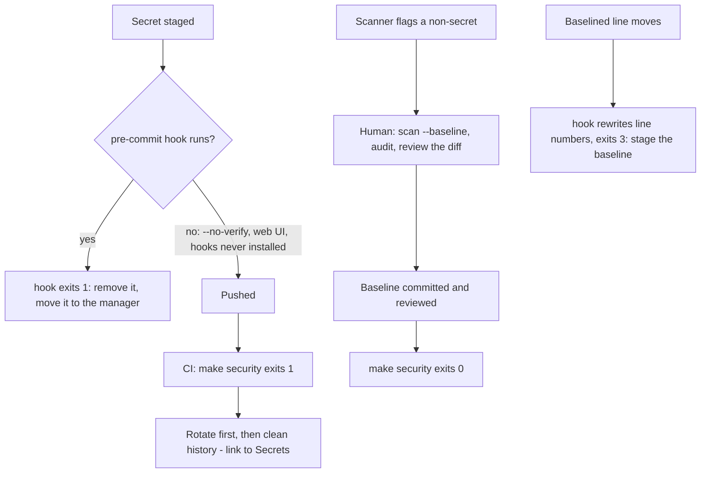

# Python Tooling Refresh and Project Profiles - Plan

## Goal Capsule

- **Objective:** An adopter who follows `code/python-standards.md` gets a working project with one interpreter tool. A committed secret fails their pre-commit hook and their CI. A tooling/ops repo can adopt the standard without silently deviating from it.
- **Means:** one pass over `code/python-standards.md`:
  - uv manages interpreters (KTD1).
  - Secret scanning is a tool-neutral requirement with detect-secrets as the default (KTD5).
  - A Project Profiles section, and one `SRC_DIR` Makefile variable that CI reaches through `make` (KTD9, KTD10).
- **Authority:** issue #29's acceptance criteria, then the Key Decisions below, then this plan, then the implementer's judgment. Where this plan goes beyond #29's wording, the governing Key Decision or KTD says why.
- **Stop conditions:** stop and report instead of improvising in these cases:
  - A command the standard would state cannot be run, or cited to a versioned primary source.
  - The documented secret scan cannot be made to fail on a planted secret while leaving `.secrets.baseline` unchanged.
  - A change would contradict Configuration Management > Secrets (#46), #31 or #47.
- **Execution profile:** Markdown edits to three standards documents. Every command block the standard states is proven in throwaway scratch projects. No repository script changes.
- **Finishing:** `ce-work` implements on branch `29-python-tooling-and-profiles`, and the PR must pass `check-docs`, `check-template-kit` and `check-secret-refs`. Merging stays with the user.

---

## Product Contract

### Summary

Replace pyenv with uv as the interpreter manager, and state that the `.python-version` pin is committed while interpreters are not. Restate secret scanning as a requirement:
- a pre-commit scan;
- a CI scan of the full tree that fails on any unreviewed finding;
- a reviewed false-positive workflow.

detect-secrets is the named default and gitleaks a sanctioned alternative. The rewrite also fixes three defects research reproduced in the current detect-secrets instructions. Add a Project Profiles section for packaged projects and for tooling/ops repos. Layout-dependent commands then take their source path from one variable whose value each profile sets.

### Problem Frame

The standard mandates pyenv in 15 lines, including a shell-profile edit and a `brew`/`curl | bash` install. uv, already mandatory, now does that job. The Tool Stack section says the Python version is "not committed", yet the Standard Layout commits `.python-version`.

Checking the secret-scanning text against detect-secrets 1.5.0 showed it is not just vendor-specific but broken:
- `detect-secrets scan --baseline .secrets.baseline`, the command behind `make security` and the CI "Security scan" step, exits 0 and writes any new secret into the baseline. The scan can never fail.
- No documented command creates the first baseline. The hook exits 2 without one.
- The pre-commit hook is pinned at `v1.4.0`, while the dev dependency resolves to 1.5.0. The 1.4.0 hook crashes on a baseline written by 1.5.0.

The CI matrix is also a no-op: with `.python-version` committed, `uv sync` uses the pin on every leg, whatever `actions/setup-python` installed. Finally, every example assumes one src-layout package, so an ops repo that runs from its checkout deviates from the standard without guidance.

### Key Decisions

- **No new top-level document and no splitting of existing files.** Profiles live inside `code/python-standards.md`. (session-settled: user-directed — chosen over a new document or a folder of topic files: this repo's recurring failure is drift across surfaces, not file length.) Governs R10.
- **pyenv is removed from the stack, with one line on how it coexists with uv.** (session-settled: user-approved — chosen over keeping pyenv as a documented second path: two interpreter managers is the ceremony #29 removes.) Governs R1, R3.
- **"Is an agent operating this repo?" is not a profile axis; the profiles link to Configuration Management > Secrets.** (session-settled: user-approved — chosen over a third profile dimension: #46 already made tier 3 a per-repository choice, made by committing no `secret-refs.env`, so a profile axis would restate it.) Governs R13.
- **Layout-dependent commands take their source path from one variable set per profile.** (session-settled: user-approved — chosen over leaving the examples library-shaped with a note: a note is exactly the silent deviation #29 describes.) Governs R11, R12.
- **The tooling/ops profile is defined by shape, not by dependencies: flat layout, not packaged, run from the checkout. Runtime dependencies are allowed and often absent.** (session-settled: user-approved 2026-09-25 — chosen over requiring stdlib-only code, which leaves a checkout-run service with one third-party dependency in neither profile, and over a third profile.) Governs R10, KTD11.
- **The default profile is named "packaged project (library, CLI or service)".** #29 names it "packaged library/CLI", but the standard's Configuration Management and Docker sections are written for services, and the web-app backend follows this standard. Governs R10.

### Requirements

**Interpreter management**

- R1. uv is the only interpreter manager the standard names: `uv python pin <version>` writes the pin, and `make setup` runs `uv python install`, which installs the pinned version.
- R2. The standard states that `.python-version` is committed and interpreters are not, in Tool Stack > Development Environment and the Standard Layout alike.
- R3. One line says what still works for pyenv users, and claims only this: pyenv reads the same `.python-version`, and uv prefers its own managed interpreter unless `UV_PYTHON_PREFERENCE=only-system` is set.
- R4. Each CI matrix leg runs on the interpreter that leg names, not on the pin.

**Secret scanning**

- R5. Secret scanning is stated as a requirement with four parts:
  - A pre-commit hook scans staged changes.
  - CI scans the whole tree and fails on any finding not in a reviewed, committed allowlist.
  - No automated step adds a finding to the allowlist.
  - The scanner's version has one source.
- R6. detect-secrets is the named default, and every command the standard gives for it creates, checks or updates the baseline as that command's description says.
- R7. The false-positive workflow is a human step: scan, then audit, then review the baseline diff. `secret-refs.env` and `example.env` findings go to the baseline, never to a pragma or an exclusion.
- R8. gitleaks is a sanctioned alternative. The standard gives its pre-commit hook, the CI command that scans the tree (the hook scans only staged changes), and its false-positive mechanism, each cited with version and date.
- R9. The standard says a secret that reached a commit is rotated first and cleaned from history second, and links to Configuration Management > Secrets.

**Profiles**

- R10. A Project Profiles section inside `code/python-standards.md` covers two profiles: packaged project (library, CLI or service), and tooling/ops repo (flat layout, not packaged, run from the checkout; runtime dependencies allowed, often none). For each convention that differs, it says whether the convention applies as written or is relaxed.
- R11. The Makefile's coverage, lint, format and type-check commands take their source path from one variable whose value each profile gives.
- R12. CI reaches those commands through `make`, so the variable has one source.
- R13. The profiles link to Configuration Management > Secrets and restate none of it.

**Consistency**

- R14. `code/README.md` and the `code/web-application-standards.md` pre-commit note stop naming pyenv and detect-secrets as mandatory. The note stops calling pip-audit a pre-commit hook.
- R15. The Example Project Setup runs from an empty directory through the first commit with no step left unstated.

### Acceptance Examples

- AE1. **Covers R5, R6.** Given a clean project with a committed baseline, when a token is committed with `--no-verify` and `make security` runs, then it exits non-zero, and `git diff --exit-code .secrets.baseline` passes.
- AE2. **Covers R7.** Given `secret-refs.env` flagged by the Keyword detector, when the developer follows the false-positive workflow, then `make security` exits 0, the baseline diff shows one audited entry per line, and `check-secret-refs.mjs` still passes.
- AE3. **Covers R4.** Given `.python-version` = `3.11` and a matrix leg of `3.13`, when that leg runs `make test`, then pytest reports Python 3.13.
- AE4. **Covers R11.** Given the tooling profile's `SRC_DIR` value, when `make lint format-check typecheck test security` runs on a flat-layout project with no runtime dependencies, then every target exits 0, and coverage measures the package, not `tests/`.

### Scope Boundaries

- The #46 deferrals in the same file are out of scope: the CSI `/mnt/secrets` example, and secrets on a `docker run -e` line.
- #31 (publication leak gate) and #47 (starter kit `Bash(uv:*)`) are out of scope. So is `check-secret-refs.mjs`, which checks reference files and is not a scanner.

### Deferred to Follow-Up Work

Each of these gets its own issue when the PR opens.
- Refreshing the supported versions to 3.12–3.14, including "Python Version Support (early 2025)". The pin and matrix examples keep 3.11–3.13, which KTD2 makes consistent with each other.
- The Dockerfile's base image ignores the pin.
- Moving the dev dependencies from `[project.optional-dependencies]` to `[dependency-groups]`, and `uv sync --locked` in CI.
- How the monorepo wires the secret-scanning hook across `services/backend` and the JavaScript tree. R14 fixes only the note's false statements.

### Sources

- uv docs at tag `0.8.17`: `docs/concepts/python-versions.md` (sections "Python version files", "Installing a Python version": a no-argument `uv python install` installs the version in `.python-version`) and `docs/guides/install-python.md`. `uv python pin 3.12` and `uv python install 3.12` were also run with uv 0.8.17 on 2026-09-24.
- pyenv README (master, fetched 2026-09-24; latest release v2.8.6): reads `.python-version` from the working directory and its parents.
- detect-secrets 1.5.0 and 1.4.0 (via `uvx`), run 2026-09-24. These runs reproduced the Problem Frame's defects and the behaviour KTD6–KTD8 rely on, including exit codes 0, 1, 2 and 3.
- gitleaks README and `.pre-commit-hooks.yaml` (master, fetched 2026-09-24; README pins v8.24.2). Not run.
- `astral-sh/setup-uv` README: its `python-version` input sets `UV_PYTHON`.
- Learnings:
  - `docs/solutions/best-practices/prove-a-check-fails-before-trusting-it-passes.md`: the scan that cannot fail.
  - `docs/solutions/best-practices/a-corrected-claim-is-not-a-verified-claim.md`: the pyenv line and the gitleaks claims.
  - `docs/solutions/best-practices/a-check-must-read-a-file-the-way-its-consumer-does.md`: pragmas in `*.env` files.

---

## Planning Contract

### Key Technical Decisions

- KTD1. **uv installs and pins interpreters.** `make setup` runs `uv python install` with no argument, and Example Project Setup runs `uv python pin 3.11`. The pyenv prerequisite, its shell-profile block and the `pyenv install` step are deleted. The R3 line sits in Tool Stack > Development Environment. Implements the pyenv Key Decision (R1, R3).
- KTD2. **The pin holds the lowest supported minor version (`3.11`), matching `requires-python`.** uv refuses a pin below `requires-python`, and CI covers the higher versions (KTD3). A minor-only pin lets patch levels differ between machines; the standard says so in one clause and does not require patch pins.
- KTD3. **The CI matrix selects the interpreter with job-level `env: UV_PYTHON: ${{ matrix.python-version }}`, and `actions/setup-python` is removed.** `UV_PYTHON` overriding the pin was reproduced. Installing uv moves from `curl | sh` to `astral-sh/setup-uv@v4`, the version `code/web-application-standards.md` already uses. The implementer confirms at that tag that uv then downloads the leg's interpreter.
- KTD4. **The secret-scanning requirement (R5) is owned by Security > Secret Detection.** The tooling table, the pre-commit section and CI link to it. The heading keeps its slug `secret-detection`, and no new heading may slug to `secrets`, `security` or `testing`, which already exist.
- KTD5. **detect-secrets is the default, and gitleaks is presented as a delta.** The delta names what changes (hook, CI command, allowlist store, install) rather than repeating the requirement.
- KTD6. **detect-secrets runs as a `repo: local` pre-commit hook: `entry: uv run detect-secrets-hook`, `args: ['--baseline', '.secrets.baseline']`, `language: system`.** The version then lives only in `pyproject.toml`/`uv.lock`, and `make update-hooks` cannot reopen the mismatch. Chosen over the remote `Yelp/detect-secrets` hook, whose separate `rev` crashed on a 1.5.0 baseline.
- KTD7. **`make security` calls the scanner directly on tracked files: `uv run detect-secrets-hook --baseline .secrets.baseline $$(git ls-files)`, then the baseline review check (KTD13), then `uv run pip-audit`.** Routing it through `pre-commit run` breaks a service in a monorepo subdirectory: pre-commit runs hooks from the git root, so the hook looks for `.secrets.baseline` there and exits 2. The direct call resolves paths from the Makefile's directory in both layouts and keeps the version in `uv.lock`. The hook exits 1 on a new finding. It exits 3 when it rewrote the baseline without adding a finding: when line numbers moved, or when the installed detect-secrets version differs from the baseline's `version`. The standard presents both as normal. In CI, exit 3 means the committed baseline is stale. A commit that upgrades detect-secrets runs `make security` locally and includes the rewritten baseline.
- KTD8. **The baseline lifecycle is spelled out, and no `make` target creates, updates or audits it.**
  - Create: stage the files, then `uv run detect-secrets scan $(git ls-files) > .secrets.baseline`, then audit. `scan` with no path reads only files git already tracks, and reads nothing from a git subdirectory.
  - Update: `uv run detect-secrets scan --baseline .secrets.baseline $(git ls-files)`, then `uv run detect-secrets audit .secrets.baseline`, then a reviewed diff.
  - Audit marks every entry as a false positive before the baseline is committed. KTD13 enforces this.
  - `audit --report` prints flagged values in plain text, so it never runs in CI or behind a `make` target.
  - An inline `# pragma: allowlist secret` is allowed only in test code, never in a `*.env` file. There it breaks `check-secret-refs.mjs`, and a `nextline` pragma blinds the scanner.
- KTD9. **One Makefile variable, `SRC_DIR`, holds exactly one directory or package.** `--cov=$(SRC_DIR)`, `ruff check $(SRC_DIR) tests`, `ruff format` and `mypy $(SRC_DIR)` use it. `--cov` takes one path per flag, and a file path collects nothing. `[tool.coverage.run] source` is removed so the value is not repeated.
- KTD10. **CI calls `make` targets, and the Makefile owns `SRC_DIR` and the coverage thresholds.** CI YAML cannot read a Make variable. Chosen over moving the paths into pyproject tool config (`[tool.coverage.run] source`, `[tool.mypy] files`) with bare commands, which spreads the value over two tables. The test targets add `--cov-report=xml` so CI can upload coverage. CI's `COVERAGE_MIN_*` env block goes, and `make check`'s "CI equivalent" note becomes true, apart from `test-integration`, which CI runs as its own step. Implements the one-variable Key Decision (R11, R12).
- KTD11. **The tooling/ops profile keeps its code in one top-level package directory.**
  - `SRC_DIR` is that directory.
  - pytest sets `pythonpath = ["."]`. The flat layout fails at collection without it.
  - There is no `[build-system]`, `[project.scripts]`, `py.typed` or Docker.
  - `pyproject.toml` holds `[project]` metadata, any runtime dependencies, dev dependencies and tool configuration. With no `[build-system]`, uv treats it as a virtual project and installs the dependencies without building the directory.
  - Configuration comes from `os.environ`, loaded by the runner or `uv run --env-file`, not python-dotenv.
  - `PROJECT_ROOT` is computed for the layout and must never resolve above the checkout.
- KTD12. **`make setup` does not run tests.** A new project has none, and pytest exits 5 when it collects nothing, which fails the Example Project Setup.
- KTD13. **`make security` fails when any `.secrets.baseline` entry is not audited as a false positive (`"is_secret": false`).** The hook subtracts every baseline entry, so an unaudited entry, or one audited as a real secret, would otherwise pass CI. The check reads only the baseline, which holds hashes and audit flags, so it prints a file and line number and never a value. It makes R5's "reviewed allowlist" something CI enforces rather than something a reviewer must spot in a JSON diff. Implemented as a short `uv run python -c` over the baseline's `results`.

### High-Level Technical Design

The secret-scanning lifecycle the rewritten sections must describe (directional, not text to paste):

The profile table the Project Profiles section carries (rows are conventions; the implementer may trim rows that do not differ):

| Convention | Packaged project | Tooling/ops repo |
|---|---|---|
| Layout | `src/project_name/` | one top-level package in the checkout |
| `SRC_DIR` | `src/project_name` | the package directory |
| `[build-system]`, `[project.scripts]`, `py.typed` | as written | omitted |
| Runtime dependencies | as needed | allowed, in `[project] dependencies`; often none |
| pytest | as written | adds `pythonpath = ["."]` |
| Config loading | `config.py` with python-dotenv | `os.environ`, loaded by the runner |
| Docker | as written | not applicable |
| Secrets, pin, scanning, CI | as written | as written |

### Assumptions

- The `language: system` local hook receives the staged files at commit time and fails on a staged secret. The U2 verification proves this. If it does not, the stop condition applies.
- `astral-sh/setup-uv@v4` plus `UV_PYTHON` works without `setup-python`. U5 verifies this against the setup-uv README at that tag. If it fails, keep `setup-python` for the interpreter download and state the reason.

### Sequencing

U1 → U2 → U3 → U4 → U5 → U6 → U7. U2 and U4 both edit the Makefile block, and U5 depends on the targets U4 settles. U6 runs the finished text end to end.

### Risks & Dependencies

| Risk | Mitigation |
|---|---|
| gitleaks cannot be installed here, so its commands stay unrun | Label them "from the README, not run (2026-09-24)", as #46 did for `op run`. |
| Removing `setup-python` changes CI behaviour that adopters copy | The AE3 scratch run proves the leg's version. KTD3 names the fallback. |
| A new heading shadows an inbound anchor (`#secrets`, `#configuration-management`) | Scan the headings in U7. `check-docs` resolves anchors. |
| A second fenced block starting `# example.env` or `# secret-refs.env` breaks `check-secret-refs --standard` | No unit adds one. The tooling profile links to the existing blocks. |

---

## Implementation Units

### U1. Make uv the interpreter manager and settle the pin

- **Goal:** pyenv leaves the stack, and the pin's commit status is unambiguous.
- **Requirements:** R1, R2, R3 (KTD1, KTD2).
- **Files:** `code/python-standards.md`. Sections:
  - Tool Stack > Core Tools and Development Environment
  - Project Structure > Standard Layout (tree comment)
  - Development Environment Setup > Prerequisites and Project Setup
  - Makefile Targets (`setup`)
  - Documentation > README.md Template
  - References > Tools
- **Approach:**
  - Delete the pyenv row, the Prerequisites pyenv block and the pyenv References entry.
  - Rewrite the Development Environment bullet as: pin committed, interpreters installed by uv, plus the R3 line.
  - Write a real `setup` recipe: `uv python install`, `uv sync --all-extras`, `uv run pre-commit install`, then the existing `.env` copy from Configuration Management > Makefile Integration. No test run (KTD12).
  - The README template line becomes "Python 3.11+ (installed by `make setup`)". The line sits inside a four-backtick fence, so keep the fence intact.
- **Test scenarios:** a scratch project with the new `setup` recipe, pin `3.11`, a package `__init__.py` and the standard's `example.env`. `make setup` exits 0. `uv run python --version` reports 3.11. `.python-version` holds `3.11` and is tracked by git.
- **Verification:** `grep -n pyenv code/python-standards.md` returns only the R3 line.

### U2. Restate secret scanning and fix the detect-secrets instructions

- **Goal:** the scan fails on a committed secret, and the false-positive workflow is reviewable.
- **Requirements:** R5, R6, R7, R9 (KTD4, KTD6, KTD7, KTD8, KTD13).
- **Files:** `code/python-standards.md`. Sections:
  - Tool Stack > Core Tools (row names the requirement and the default)
  - Makefile Targets (`security`)
  - Pre-commit Hooks > Configuration, Setup and Usage, and Secrets Baseline
  - Security > Secret Detection
  - Best Practices > Security
  - References > Tools
- **Approach:**
  - Secret Detection opens with R5's four-part requirement. Then it gives the detect-secrets default, the baseline lifecycle (KTD8), the review check (KTD13), exit codes 1 and 3 (KTD7), and the rotate-first paragraph linking `#secrets`.
  - Secrets Baseline shrinks to the create command and a link.
  - The pre-commit block swaps the Yelp remote hook for the local hook (KTD6).
  - The `--no-verify` line says CI is the backstop.
- **Execution note:** prove the scan fails before trusting that it passes. Run the planted-secret scenario before writing the false-positive text.
- **Test scenarios:** a scratch project built from the final text.
  - Happy path: clean tree, `make security` exits 0.
  - Planted secret committed with `--no-verify`: `make security` exits non-zero, and `git diff --exit-code .secrets.baseline` passes (AE1).
  - False positive: a `secret-refs.env` with two `op://` lines, taken through the workflow. `make security` exits 0, and `node scripts/check-secret-refs.mjs secret-refs.env --config example.env` exits 0 (AE2).
  - Stale baseline: add a line above a baselined entry. The hook exits 3 and rewrites only line numbers.
  - Missing baseline: the create command produces one, and the hook then exits 0.
  - Unreviewed entry: a planted real secret added through the Update step and left unaudited makes `make security` exit non-zero. The same entry audited as a real secret also exits non-zero (KTD13).
  - Version bump: a baseline written by detect-secrets 1.4.0, checked by the pinned 1.5.0 on an unchanged tree, exits 3 and changes only `version`.
  - Subdirectory: AE1 repeated with the project in a git subdirectory (`services/backend/`) gives the same exit codes.
  - Output: the planted-secret failure names the file, line and detector but not the value. `Bash(make:*)` pre-approves `make security` for agents, so a value in its output would reach a transcript.
- **Verification:** every detect-secrets command in the section appears in the scratch transcript with the exit code the text claims.

### U3. Add gitleaks as a sanctioned alternative

- **Goal:** an adopter can swap scanners without losing the CI backstop.
- **Requirements:** R8 (KTD5).
- **Files:** `code/python-standards.md`: Security > Secret Detection, and References > Tools.
- **Approach:** a short "Using gitleaks instead" delta:
  - Hook: repo `https://github.com/gitleaks/gitleaks`, id `gitleaks`.
  - CI: a pinned binary running `gitleaks dir .`, because the hook passes no filenames and scans only staged changes.
  - False positives: `.gitleaksignore` fingerprints, added and reviewed by a human. A `gitleaks:allow` comment follows KTD8's pragma rule: test code only, never a `*.env` file, where it would also fail `check-secret-refs.mjs`.
  - `gitleaks-action` needs `GITLEAKS_LICENSE` for organization accounts.
  - Each claim cites the README version and date.
- **Test scenarios:** if a gitleaks release binary can be installed here:
  - `pre-commit run gitleaks --all-files` passes on a checkout with a committed secret, which proves the gap.
  - `gitleaks dir .` exits non-zero on that checkout.
  - After a `.gitleaksignore` entry for a false positive, it exits 0.
  - Otherwise, each claim is labelled unrun, with the date.
- **Verification:** each gitleaks claim is marked either run, with a version, or README-sourced, with a date.

### U4. Add Project Profiles and the `SRC_DIR` variable

- **Goal:** a tooling/ops repo knows which conventions bind it.
- **Requirements:** R10, R11, R13 (KTD9, KTD11).
- **Files:** `code/python-standards.md`:
  - New `## Project Profiles`, after Project Structure.
  - Makefile Targets: `SRC_DIR ?= src/project_name`, used by test, test-integration, test-all, lint, format, format-check and typecheck.
  - Testing > Coverage Requirements (`[tool.coverage.run] source` removed).
  - Code Quality > Ruff Configuration (`src` note).
  - Configuration Management > Loading Environment Variables: one sentence on `PROJECT_ROOT` depth, linking the profile.
  - When to Deviate: the "Library or command-line applications" assumption points to Project Profiles.
  - Overview: its project-type description is aligned with the profiles.
- **Approach:** a short intro, the profile table from the High-Level Technical Design, and one paragraph on setting `SRC_DIR`. Secrets get a single link (R13).
- **Test scenarios:**
  - A flat scratch repo with no runtime dependencies (`opstool/`, `tests/`, no `[build-system]`, `SRC_DIR=opstool`). Every `make` target in AE4 exits 0, and the coverage report lists only `opstool/` files.
  - The same repo with one runtime dependency added to `[project] dependencies`: `make setup` installs it without building the project, and `make check` exits 0.
  - The packaged scratch project from U2 still passes `make check` with the default `SRC_DIR`.
- **Verification:** `grep -n 'src/project_name\|src/ tests/\|mypy src/' code/python-standards.md` shows no layout path outside these: `SRC_DIR`'s default, the layout tree, Directory Conventions, the `py.typed` guideline, the `config.py` and `__main__.py` example comments, and Best Practices > Code Organization.

### U5. Point CI at `make` and select the interpreter per leg

- **Goal:** CI tests each matrix version and uses the same commands as a developer.
- **Requirements:** R4, R12 (KTD3, KTD10).
- **Files:** `code/python-standards.md`: CI/CD with GitHub Actions > Workflow Configuration and CI Best Practices; Testing > Coverage Requirements ("make targets and CI" wording).
- **Approach:**
  - Job `env: UV_PYTHON`, `astral-sh/setup-uv@v4`, `uv sync --all-extras`.
  - Steps run `make lint`, `make format-check`, `make typecheck`, `make test`, `make test-integration` and `make security`.
  - The upload reads `coverage.xml`.
- **Test scenarios:**
  - With pin `3.11` and `UV_PYTHON=3.13`, `make test` reports Python 3.13 (AE3).
  - Confirm from the setup-uv README at `v4` that it installs uv on PATH for later steps. If the README cannot be read, label the claim unverified.
- **Verification:** the YAML parses (`python -c 'import yaml,sys; yaml.safe_load(sys.stdin)'` on the extracted block). Every `run:` step names a `make` target the Makefile block defines.

### U6. Make the Example Project Setup run end to end

- **Goal:** R15.
- **Requirements:** R15 (KTD1, KTD8, KTD12).
- **Files:** `code/python-standards.md`: Example Project Setup.
- **Approach:**
  - `uv python pin 3.11` replaces the `echo` and `pyenv install` lines.
  - The structure step also creates `src/my_project/__init__.py` and `py.typed`. Without them, the hatchling build that `uv sync` runs inside `make setup` fails.
  - The Makefile, pre-commit and `example.env` steps say to copy the standard's blocks instead of `touch`. `make setup` copies `example.env` to `.env`.
  - After `make setup`: `git add .`, create and audit the baseline (KTD8), `git add .secrets.baseline`, then the first commit. A baseline created before staging is empty, and the first commit then fails on `example.env`'s local credentials.
  - Remove the duplicated "Initialize git" comment.
- **Test scenarios:** run the finished block verbatim in an empty scratch directory. Copy in the standard's Makefile, pre-commit and `example.env` blocks, with `project_name` substituted. The audit prompts are answered by piping input. The first `git commit` succeeds with all hooks passing, and `make check` exits 0 once one unit test exists.
- **Verification:** the scratch transcript shows the commit hash.

### U7. Align the other documents and check the whole change

- **Goal:** no other document contradicts the rewrite.
- **Requirements:** R14 (KTD4).
- **Files:**
  - `code/README.md`: the "Tool stack" and "Security" bullets.
  - `code/web-application-standards.md`: Tech Stack > "Note on pre-commit hooks in the monorepo".
- **Approach:**
  - The README bullets name uv (packages and interpreters), and secret scanning with detect-secrets as the default.
  - The web-app note links to Secret Detection, drops `pip-audit` from the hook list, and says the scan covers the whole repository.
  - The monorepo wiring stays deferred.
- **Test expectation:** none. Wording only, covered by the repository checks.
- **Verification:** the repository checks in the Verification Contract pass. `grep -rn 'pyenv\|detect-secrets' code/ README.md process/ ai/ templates/` shows only the R3 line and default-named mentions.

---

## Verification Contract

| Gate | Command or evidence | Proves |
|---|---|---|
| Docs check | `node scripts/check-docs.mjs` | links and anchors resolve, including `#secrets` and `#secret-detection` |
| Template kit | `node scripts/check-template-kit.mjs` | starter-kit claims still hold |
| Secret refs | `node scripts/check-secret-refs.mjs --standard` | exactly one `# example.env` and one `# secret-refs.env` block, both valid |
| Library scratch run | U1, U2, U6 scenarios, using uv 0.8.17 and detect-secrets 1.5.0 | R1, R5–R7, R15; AE1, AE2 |
| Tooling scratch run | U4 scenario | R10, R11; AE4 |
| Matrix run | U5 scenario | R4; AE3 |
| gitleaks run or labels | U3 scenario | R8 |
| Leftover sweep | U1 and U7 greps | R1, R14 |

Scratch projects live in the session scratchpad, not the repository. The PR description states their commands and exit codes.

## Definition of Done

- All five #29 acceptance criteria are met, each traced to R1–R15.
- Every command block the standard now states was run in a scratch project, or is labelled unverified with a date. None is asserted from memory.
- The three repository checks pass locally and in CI on the PR head.
- The follow-up issues named under Deferred to Follow-Up Work are filed and linked from the PR.
- No scratch artifacts, abandoned text or TODO markers are left in the diff.
