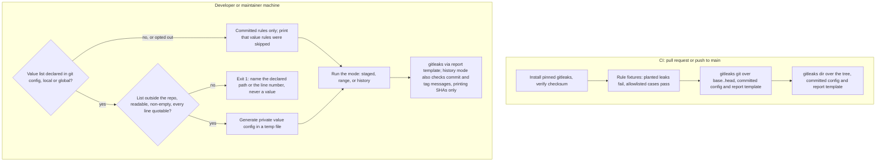

# Repository Baseline Standard - Plan

## Goal Capsule

- **Objective:** A team setting up any repository, public or private and in any language, can tell from one document which of LICENSE, CONTRIBUTING, SECURITY, issue and PR templates and a leak gate it needs today. A leak of a credential, a personal path or a private value fails a check before it reaches the default branch, and where a check cannot see a leak, the standard says so.
- **Means:** a new process standard whose items each carry a trigger (KD1, KD2), and a leak gate built on gitleaks, a pinned single binary that any ecosystem may run (KTD1, KTD2).
- **Authority:** issue #31's acceptance criteria as reframed by KD1, then the Key Decisions below, then this plan, then implementer judgment.
- **Stop conditions:** stop and report in any of these cases:
  - a GitHub or gitleaks behavior the standard states cannot be cited to its documentation or shown by a run (label it unverified instead of asserting it);
  - a rule cannot be made to fail on a planted leak;
  - any output path could print a matched value or a private pattern into CI;
  - a change would contradict `docs/solutions/tooling-decisions/adopter-checks-ship-in-the-adopters-ecosystem.md`.
- **Execution profile:** Markdown standards, a gitleaks configuration, one POSIX `sh` wrapper, one new CI workflow, and a handful of repository files (`SECURITY.md`, `CONTRIBUTING.md`, `.github/` templates). No Node or Python for the gate. No repository settings changes: the owner makes those (R19).
- **Finishing:** `ce-work` or a human implements, shipped as one PR closing #31.

---

## Product Contract

### Summary

Add `process/repository-standards.md`, a baseline for every repository. Each item is tagged with the condition that makes it apply: always, when the repository is public, when it accepts outside contributions, or when others use the code. It covers the license decision, CONTRIBUTING, SECURITY with the reporting channel that fits the repository's visibility, issue and PR templates, DCO as an option, and a leak gate.

The leak gate is gitleaks. A committed `.gitleaks.toml` extends gitleaks' default credential rules with check 6's home-path rule, which moves out of `scripts/check-docs.mjs`. CI runs it, with redacted output, over the pull request's commits and the tree. Private values stay in a plain list outside the repository. `scripts/leak-gate.sh` turns that list into gitleaks rules on the developer's machine only, for staged changes, a pull request's commits, or all of history. This repository then gains the files its own standard asks for, and the starter kit gains skeletons of them.

### Problem Frame

Nothing in `process/` or `code/` says what a repository needs beyond its code. This repository is public, has an MIT `LICENSE`, and nothing else the issue lists: no `SECURITY.md`, no `CONTRIBUTING.md`, no issue or PR templates, and GitHub's private vulnerability reporting is off. It also runs no credential scanner. The standards repository does not meet the standard it is missing.

The leak half is not hypothetical. An external review found a private repository name, a dead private URL and an absolute home-directory path in this repository's documents. #26 removed them and added check 6, which catches the path shape in Markdown only. Its plan (`docs/plans/2026-09-21-2043-fix-scrub-private-references-plan.md`, KD3 and D3) deliberately left the value-based half to this issue, because a committed list of private values is itself the leak.

The issue was written as a *public* repository standard. The owner reframed it: most of these items do not depend on visibility, and a private repository leaks too, to contractors, vendor tools, forks, and to itself the day it is opened up.

Since #29 closed, a check that an adopting project runs must ship in that project's ecosystem or as a single static binary (`docs/solutions/tooling-decisions/adopter-checks-ship-in-the-adopters-ecosystem.md`). A baseline that applies to every repository therefore cannot hand adopters a Node or Python gate.

### Key Decisions

- KD1. **The standard applies to public and private repositories alike, with each item gated by a trigger rather than by visibility alone.** (session-settled: user-directed — chosen over a public-repository-only standard: most items depend on who contributes or who uses the code, not on visibility.) Governs R1, R2.
- KD2. **Required and recommended are decided per trigger, starting from the smallest required set.** The issue's own lower-risk framing, and the repository's "start minimal" philosophy. Governs R2, R3–R9.
- KD3. **This repository comes into compliance in the same PR rather than being only assessed.** A standard its own repository fails reads as advice. Governs R16–R18.
- KD4. **DCO is documented as an option and not adopted here.** Reversible by the owner; see A2. Governs R6, R17.
- KD5. **The starter kit ships skeletons of the new files.** Part of the scope the owner confirmed before research, since the standard now applies to every repository an adopter creates. Governs R20.
- KD6. **The leak gate is built on gitleaks rather than a script this repository writes.** (session-settled: user-directed — chosen over a Node gate for this repository only and over a Python standard-library gate: a baseline for every repository needs a gate every ecosystem can run, and gitleaks is the single binary the Python standard already sanctions.) Governs R8, R11–R15, R18.

### Requirements

**The standard**

- R1. `process/repository-standards.md` is the single owner of the repository baseline: every other document that mentions a baseline item links to it rather than restating it.
- R2. Each item names its trigger from one fixed set (always, public, outside contributions, distributed) and says whether it is required or recommended under that trigger. A trigger table in the style of `process/issue-tracking.md` § Label Strategy states the set once.
- R3. License: a recorded license decision is always required. A `LICENSE` file is required when public or distributed. The standard states that a public repository with no license grants no reuse rights, cited to GitHub's documentation.
- R4. SECURITY: a public repository requires `SECURITY.md` pointing reporters to GitHub private vulnerability reporting, and requires that feature enabled before the file points at it. A private repository is recommended to have one pointing to an internal channel, since GitHub's feature is not available there. A private repository whose code is distributed publishes its reporting channel where its users can see it, because they cannot see the repository. Every variant says which versions are supported.
- R5. CONTRIBUTING is required when accepting outside contributions and recommended always. It covers setup, the checks to run before a PR, and the commit and PR conventions, linking to `process/git-branching-strategy.md` rather than restating them.
- R6. DCO is an option under outside contributions, with its trade-offs stated: no CLA paperwork against a sign-off on every commit; a squash merge that concatenates commit messages leaves earlier sign-offs mid-body rather than in the trailer block; and sign-off is a human attestation, so an AI co-author trailer does not replace it and a bot commit cannot carry one.
- R7. Templates: a PR template is recommended always. An issue template chooser config (`.github/ISSUE_TEMPLATE/config.yml`) is recommended, and when public with a `SECURITY.md` its contact link sends security reports away from public issues. Templates may auto-apply only labels defined in `process/issue-tracking.md` § Label Strategy.
- R8. Leak gate: the standard names three rule categories, what each scans for and its trigger.
  - Credentials are always required. A repository whose language standard names a scanner follows it; any other repository uses gitleaks' default rules.
  - Shape rules are always required.
  - Value rules are required when public or when the repository may become public.
  
  It names the categories that actually leaked here: a private repository name, a private URL, an absolute home-directory path. It points adopters to this repository's `.gitleaks.toml` and `scripts/leak-gate.sh` as the files to copy, and to the pinned, checksum-verified install the Python standard already documents.
- R9. The standard says where each category runs. Credential and shape rules run in CI and locally. Value rules run locally only, because CI logs are readable by anyone who can read a public repository and the value list must never reach them. Every gitleaks run prints findings only through a report template that names rule, file, line and commit, never the matched text or its surrounding line. A pass means "no known pattern matched", not "safe to publish".
- R10. The standard settles the relationship to `scripts/check_secret_refs.py` explicitly: two checks, and why (KTD1).
- R21. The standard states what the gate cannot see, and the mitigation for each:
  - Commits made anywhere but a value holder's machine: outside pull requests, web edits, and commits made by CI such as this repository's `claude.yml` Action. Before merging, the maintainer fetches the pull request's head and runs the value rules over its commits from the default branch's own checkout. That way the default branch's wrapper, configuration and `.gitleaksignore` apply, never the pull request's copies, which it can edit while the maintainer's machine holds the value list. In a public repository this keeps a value off the default branch, but a hit at that point is already published and follows the published-leak remediation.
  - Commit messages and PR bodies: gitleaks scans file content and paths only. No mitigation ships in this plan beyond R22's one-off sweep. A `commit-msg` hook is deferred.
  - Files on gitleaks' default path allowlist, such as lock files, images and vendored paths, are not scanned by the credential or shape rules. The value rules do scan them, because their configuration does not extend the defaults.
  - A pull request can weaken its own CI run by editing `.gitleaks.toml`, adding a `.gitleaksignore` entry, or editing the workflow. Every gitleaks call passes `--ignore-gitleaks-allow`, so an inline `gitleaks:allow` comment suppresses nothing. The three files get required review, for example through CODEOWNERS.
- R22. The standard gives a going-public procedure for a repository changing from private to public. Making a repository public publishes its whole history, including pull request refs that a rewrite cannot remove. So the procedure:
  - fetches every pull request head;
  - runs every rule over all refs, and checks commit messages and annotated tag messages for values;
  - states that issues, PR bodies, comments and Actions logs are published too and cannot be swept locally;
  - then either flips visibility or, when the sweep finds anything or that GitHub-side content is unreviewed, seeds a fresh public repository from a clean tree.
  
  Private vulnerability reporting is enabled after the flip.

**The leak gate**

- R11. CI scans every commit a pull request or push adds, so a leak added and removed within a branch still fails, and also scans the whole tree, so content that predates a rule is checked against it. Rules apply to file paths as well as content.
- R12. The shape rule catches an absolute home-directory path as check 6 does today, with the same allowlist of non-identifying user directories, in every tracked file outside gitleaks' default path allowlist rather than in Markdown only.
- R13. Value rules come from a plain list of literal values outside the repository, named by a declaration on the user's machine. With a declaration naming a list, the gate fails when that list is absent, empty or unreadable. With no declaration, or an explicit opt-out, it runs shape and credential rules only and says so, so an outside contributor is never blocked by a file they cannot have. A declared list inside the repository fails in every case, without being read.
- R14. No gate output, in CI or locally, contains a matched value or a value from the list. Findings name rule, line and commit, and name the file except where the file's path matches a value. A malformed entry in the list is rejected by line number before gitleaks sees it.
- R15. Each rule is shown to fail on a planted leak, and to pass its allowlisted cases, on every CI run, with fixtures built at run time so no committed file matches a rule.

**This repository**

- R16. This repository ships `SECURITY.md` using private vulnerability reporting, and an issue chooser config whose contact link points there.
- R17. This repository ships `CONTRIBUTING.md` and a PR template, and records its license decision (MIT, inbound equals outbound).
- R18. CI runs the committed gitleaks rules, credential and shape, on every pull request and push to `main`, whatever paths changed.
- R19. The PR lists the repository settings the owner must change and the settings this plan could not observe, rather than changing any.
- R20. The starter kit in `templates/` ships skeletons of `SECURITY.md` (public and private variants), `CONTRIBUTING.md`, the PR template and the chooser config.

### Scope Boundaries

- No code of conduct, CODEOWNERS or funding file. None is in #31, and each is a governance choice a baseline should not force. The standard may mention them as out of its scope. It does recommend required review of `.gitleaks.toml` (R21).
- No git history rewrite and no change to anything already published. #26's KD2 reasoning stands. CI scans only the commits a change adds, so the path #26 removed, which is still in history, does not fail every run.
- No repository settings changes (R19).
- The gate does not scan commit messages or PR bodies (R21), except in R22's one-off sweep. This repository's history carries `Claude-Session:` trailers holding login-gated URLs. Whether those count as the "private URL" category is the owner's call, raised in the PR rather than decided here.
- No Node or Python in the gate. This repository's own Node checks stay Node, per the ecosystem learning's exemption.

#### Deferred to Follow-Up Work

- Issue forms (`.yml` templates) for this repository. Nothing validates them and no label they would apply is missing, so the chooser config alone meets R7 here.
- A hook installer. The standard shows the one-line pre-commit hook that calls the wrapper; installing it is per-clone.
- A `commit-msg` hook applying value rules to commit messages (R21).

### Sources

- `docs/solutions/tooling-decisions/adopter-checks-ship-in-the-adopters-ecosystem.md` — the ecosystem rule KD6 follows.
- `code/python-standards.md` § Using gitleaks Instead — the pinned, checksum-verified install and CI step, with gitleaks 8.24.2 run on 2026-09-25 and 2026-09-26.
- A gitleaks 8.24.2 spike run on 2026-09-27 against a scratch repository and this repository's `main`:
  - A custom rule with a non-lookbehind prefix, a secret group and a rule allowlist reproduces check 6. The allowlisted directory passed and unlisted names failed.
  - `--redact` masked only each finding's own match. With `-v`, the finding's surrounding line context printed unredacted, including a second secret on the same line, and a path-rule finding printed the file path. Without `-v`, gitleaks printed only a count. A report template with `--report-path -` printed only the fields it named. These were confirmed in round-two review.
  - An error (missing config, bad path, bad range) and a found leak both exit 1 by default; `--exit-code 3` separates them.
  - `.gitleaksignore` in the scanned directory is read even when `--gitleaks-ignore-path` points elsewhere, and an inline `gitleaks:allow` suppresses a finding unless `--ignore-gitleaks-allow` is passed.
  - The default path allowlist, which an extending config inherits, hid a home path in `package-lock.json`, `yarn.lock`, `go.sum` and an `.svg`.
  - A second config with `useDefault = false` applied private rules on their own.
  - `gitleaks git --log-opts=<range>` caught a leak added and removed within a branch, which a tree scan missed.
  - `gitleaks git --staged` caught a staged leak.
  - A `path`-only rule matched a value in a file name.
  - Commit messages were not scanned.
  - A malformed regex made gitleaks exit 2 and print the pattern.
  - A missing config exited with an error.
  - Over `main`'s tree, the default rules plus the shape rule found only the accented-name example in check 6's comment. Over `main`'s history they also found the path #26 removed.
- `docs/plans/2026-09-21-2043-fix-scrub-private-references-plan.md` KD3, KTD2, D3, A7 — the deferred value-based half and the Markdown-only limit.
- `docs/solutions/best-practices/prove-a-check-fails-before-trusting-it-passes.md`, `a-check-must-read-a-file-the-way-its-consumer-does.md`, `a-corrected-claim-is-not-a-verified-claim.md`, `pin-an-accepted-risk-with-a-fixture-that-fails-when-the-risk-is-gone.md`.
- `rmorison/buzai`: `scripts/publish_gate.py` (in-repo generic patterns plus a private pattern file outside the repository), `docs/dev/PUBLIC-SEED.md`, `SECURITY.md`, `CONTRIBUTING.md`. Its gate prints the matched pattern, which R14 forbids, and it has no issue or PR templates.
- GitHub documentation on private vulnerability reporting, `SECURITY.md` locations, issue template `config.yml` `contact_links`, PR template locations, and licensing a repository. The implementer re-fetches each and cites it with a date, per the Stop conditions.

---

## Planning Contract

### Key Technical Decisions

- KTD1. **Two checks: the gitleaks gate and `scripts/check_secret_refs.py`.** The gate is a denylist over every file and commit. `check_secret_refs.py` is an allowlist over one dotenv file type, reading lines the way python-dotenv does and checking duplicate and shared keys. They have nothing to merge. The duplication #31 feared is avoided because the gate absorbs check 6 and brings credential scanning with it, so this repository ends with one gate configuration instead of a third scanner. Governs R10, R11.
- KTD2. **One committed `.gitleaks.toml` extends gitleaks' default rules with the home-path rule.** The rule uses a character-class prefix in place of check 6's lookbehind, which gitleaks' regex engine lacks, a secret group for the user directory, and a rule allowlist for the non-identifying directories. The spike showed it matches the same cases. Check 6 and check 6b leave `scripts/check-docs.mjs`, and their scope reasoning moves into comments in the configuration, written so the configuration matches none of its own rules. Governs R8, R12.
- KTD3. **Private values are a plain list of literals. The wrapper turns each into two gitleaks rules, content and path.** Each literal is wrapped as a case-insensitive quoted literal, `(?i)\Q…\E`, so no value is ever parsed as a regex. The wrapper rejects, by line number only, any line containing `\E` or `'''`, which would break the quoting, and any line that is not valid UTF-8 or holds a control character other than tab, which would break the generated TOML. This closes the spike's finding that a malformed regex prints itself. The list is split on CRLF, CR or LF, a byte-order mark is dropped, and blank and `#` lines are skipped. The generated configuration sets `useDefault = false`, is written to a private temporary file and deleted on exit. Governs R13, R14.
- KTD4. **The value list is per user by default, with a per-repository override.** Private values usually belong to a person or team and apply to every repository they touch. The exception is the repository a value names, which would fail on every mention of itself; that repository points at a different list or opts out. Governs R13.
- KTD5. **The declaration is a git config key holding the list's path, set globally and overridable per clone.** A committed default runs the same way in every clone, so it cannot both demand the list from the maintainer and spare the outside contributor. A value holder sets the key with `git config --global`, so every clone on their machine requires the list, including a fresh re-clone. A `--local` value overrides it with another path or an explicit opt-out. A declared path to a missing, empty or unreadable list fails. An opt-out behaves as no declaration. Undeclared at every scope, the wrapper runs the committed rules only and prints that value rules were skipped. CI never runs the wrapper's value mode. Rejected alternatives: failing whenever a list is absent, which blocks every outside contributor; and a `--local`-only declaration, which a fresh clone silently lacks. Governs R9, R13.
- KTD6. **The wrapper is POSIX `sh`.** Anything that runs git hooks already has a POSIX shell, so `sh` adds no ecosystem to any adopter, which is the test the ecosystem learning sets. The wrapper does only what gitleaks cannot:
  - read the declaration and validate the list;
  - generate the value configuration;
  - pick the scan for each mode: `staged` for pre-commit, `range <base>..<head>` for pre-push and pre-merge, `history` for going public;
  - print findings per KTD11;
  - fail when the scanned repository's `.gitleaksignore` names a value rule, since value rules have no legitimate in-tree suppression.
  
  It finds the repository with `git rev-parse --show-toplevel`. A maintainer's pre-merge run happens in the default branch's own checkout, over a range ending at the fetched pull request head, so gitleaks reads the default branch's ignore file and configuration. Governs R13, R14, R21, R22.
- KTD11. **Findings print only through a committed report template.** Every gitleaks call runs without `-v`, with `--redact --no-color --ignore-gitleaks-allow` and `--report-format template --report-path -`. Verbose output prints the surrounding line context, which can hold a second secret, and the file path, which can hold a value. The committed template names rule ID, file, start line and commit. For value rules, the wrapper runs the path rules first. A path-rule hit prints `file name matches value <N>` in place of the file. When any path rule fired, content findings from that run print without file names. Governs R9, R14.
- KTD7. **CI runs gitleaks twice, over the added commits and over the tree, from a pinned, checksum-verified binary.** A commit-range scan catches a leak added and removed within a branch. A tree scan catches existing content that a new rule now matches. The range is the pull request's base to head, or the push's before to after, never all history, since history holds the path #26 removed. The install mirrors the Python standard's step, linked rather than restated. This repository has no pre-commit config to read the version from, so the version is pinned in the workflow. Governs R11, R18.
- KTD8. **Each rule proves itself on every CI run.** A workflow step builds fixture files under the runner's temporary directory, with values assembled from shell variables so no committed file contains a match. It asserts that gitleaks finds each planted leak and passes each allowlisted case, and that the wrapper fails on a declared-but-missing list and on a list inside the repository. Planted-leak runs pass `--exit-code 3` and assert exactly 3, because gitleaks also exits 1 on a configuration, path or range error, so a bare failure proves nothing. Each fixture also asserts that the planted text is absent from the output. Expected failures are captured as `rc=0; cmd || rc=$?` rather than with `!`, per the `bash -e` trap #60 recorded. The range fixture has a paired clean range that must exit 0. Governs R15.
- KTD9. **Repository files use GitHub's recognized locations.** `SECURITY.md` and `CONTRIBUTING.md` at the repository root, templates under `.github/`. Links inside them to the standards use repository-relative paths, since `scripts/check-docs.mjs` checks every `.md` file. Skeletons under `templates/` follow the existing `templates/CLAUDE.md` rule of absolute URLs to the standards, because they are read after being copied elsewhere. Governs R16, R17, R20.

### High-Level Technical Design

Where each rule category runs:

The trigger model the standard states, as a matrix. The R-IDs own the rules; this table is how a reader will scan them:

| Item | Always | Public | Outside contributions | Distributed |
|---|---|---|---|---|
| License decision recorded | required | | | |
| `LICENSE` file | | required | | required |
| `SECURITY.md` | recommended (internal channel) | required (private vulnerability reporting) | | required when private (channel published where users see it) |
| `CONTRIBUTING.md` | recommended | | required | |
| DCO sign-off | | | option | |
| PR template, issue chooser config | recommended | contact link required with `SECURITY.md` | | |
| Credential scanning | required | | | |
| Leak gate shape rules | required | | | |
| Leak gate value rules | | required, or when it may become public | | |

### Assumptions

- A1. Private vulnerability reporting is available for public repositories only. External research found this in GitHub's documentation wording. The implementer re-verifies and cites it before the standard asserts it.
- A2. This repository does not adopt DCO. Its history carries AI `Co-Authored-By` trailers and no `Signed-off-by`. It merges mostly by squash, though merge commits and rebase merges are also enabled. It has had no outside contributor.
- A3. The allowlist of non-identifying home directories moves unchanged. Widening it is not in scope.
- A4. gitleaks 8.24.2, the version the Python standard pins, is the version this repository pins. The spike ran that version.

### Sequencing

U1 adds the configuration and CI before it removes check 6, in the same unit, so shape coverage never lapses. U2 adds the wrapper and its fixtures. U3 writes the standard once both behave as described, because R8, R9, R21 and R22 describe them. U4 and U5 apply the standard. U6 registers everything last so every link target exists.

### Risks & Dependencies

- **A denylist reads as complete.** A longer value list feels like more safety. R9 makes the standard say a pass is not a publication clearance.
- **The value list is a sensitive file on disk.** It holds the very values it guards. The standard tells users to keep it outside any repository and never give it to CI. It also warns that a config directory kept in a dotfiles repository puts the list inside a repository.
- **gitleaks output format and flags may change between versions.** The version is pinned, and the fixtures in KTD8 fail on an upgrade that stops a rule from firing.
- **The Python standard's gitleaks CI step does not pass `--redact`.** Today it prints only a count, so nothing leaks, but adding `-v` to see which file failed would print secrets and their line context into public CI logs. U6 aligns it with KTD11 so the two standards agree.

---

## Implementation Units

### U1. Commit the gitleaks rules and run them in CI

- **Goal:** credential and shape rules run on every pull request and push, whatever changed, and check 6 has moved into them.
- **Requirements:** R11, R12, R15, R18; KTD1, KTD2, KTD7, KTD8, KTD11.
- **Dependencies:** none.
- **Files:** create `.gitleaks.toml`, `scripts/gitleaks-report.tmpl`, `.github/workflows/leaks.yml`; modify `scripts/check-docs.mjs`, `process/documentation-standards.md`.
- **Approach:**
  1. Write `.gitleaks.toml`: extend the default rules; add the home-path rule and its allowlist per KTD2; carry check 6's scope comments, with the accented-name example reworded and every example written with a metavariable.
  2. Write the report template per KTD11.
  3. Write `.github/workflows/leaks.yml`, on `pull_request`, push to `main` and `workflow_dispatch`, with no path filter, `contents: read`, and full fetch depth. Steps: install per KTD7; the fixture step per KTD8; the range scan; the tree scan. Every gitleaks call uses KTD11's flags. Carry `docs.yml`'s "never `pull_request_target`, never secrets" comment.
  4. Remove check 6, check 6b and the `skipPaths: false` universe from `scripts/check-docs.mjs`, updating its header list, closing summary and the paragraph about check 6's inverted conventions.
  5. In `process/documentation-standards.md` Automated Checks, move the home-path row to the new job, add a credential row, and add a paragraph on the workflow.
- **Execution note:** Run the fixture step locally against a stub configuration with the rule removed and watch it fail, per `docs/solutions/best-practices/prove-a-check-fails-before-trusting-it-passes.md`. Then plant a home path in a tracked `.py` file on a scratch branch, add and remove it across two commits, and confirm the range scan fails where the tree scan passes.
- **Patterns to follow:** the gitleaks CI step in `code/python-standards.md` § Using gitleaks Instead; the `check-secret-refs` job's file-mode step in `.github/workflows/docs.yml`, for fixtures in `$RUNNER_TEMP` and the `if` form.
- **Test scenarios:** the fixture step asserts:
  - A home path under an unlisted name exits 3, and the name is absent from the output.
  - The same path under `runner`, `linuxbrew` or `user` passes, including with a sentence-ending period.
  - A relative `home/` link, `~/home/x`, and a URL containing `/home/` pass.
  - A credential in gitleaks' default format exits 3.
  - One line carrying both a credential and an unlisted home path exits 3, and neither the credential text nor the name appears in the output.
  - A line carrying `gitleaks:allow` next to a planted leak still exits 3.
  - A leak added in one commit and removed in the next exits 3 on the range scan, and a paired clean range exits 0.
- **Verification:** both scans pass on this repository, and `scripts/check-docs.mjs` still passes its remaining checks. No committed file matches a rule.

### U2. Build the local wrapper for value rules

- **Goal:** a value holder runs value rules on staged changes, a commit range or all of history, and nobody else is blocked.
- **Requirements:** R13, R14, R21, R22; KTD3, KTD4, KTD5, KTD6, KTD11.
- **Dependencies:** U1.
- **Files:** create `scripts/leak-gate.sh`; modify `.github/workflows/leaks.yml` (wrapper fixtures).
- **Approach:**
  1. Resolve the repository root and read the declaration: the local value, else the global value; an opt-out value ends value rules.
  2. Validate the list per KTD3 and R13. Reject a list inside the repository by comparing real paths, before reading it.
  3. Generate the value configuration into a `mktemp` file with owner-only permissions, removed by a trap on exit.
  4. Modes:
     - `staged`: `gitleaks git --staged`.
     - `range <base>..<head>`: `gitleaks git` over that log range.
     - `history`: `gitleaks git` over all refs, then commit messages checked per value with `git log --all -i -F --grep`, and annotated tag messages with `git for-each-ref refs/tags`, printing matching commit or tag SHAs only.
     
     Each mode runs the committed configuration, then the value configuration when declared.
  5. With no declaration, print one line saying value rules were skipped, and run the committed configuration only.
- **Test scenarios:** CI runs the wrapper against fixture repositories under `$RUNNER_TEMP`:
  - Declared list with a planted value in a file: exits non-zero, and the value is absent from the output.
  - Planted value only in a file name: exits non-zero, printing `file name matches value <N>`, and the value is absent from the output.
  - Planted value in content inside a value-named directory: exits non-zero, and the value is absent from the output.
  - `.gitleaksignore` in the scanned repository naming a value rule: fails.
  - A list line that is not valid UTF-8, or holds a control character: fails, citing the line number only.
  - Declared but missing list: fails, naming the declared path.
  - Declared list inside the repository: fails without reading it.
  - List with only comments and blanks: fails as empty.
  - List with a line containing `\E`: fails, citing the line number and not the value.
  - CRLF list with a byte-order mark: same result as its LF twin.
  - No declaration: passes on a clean fixture and prints the skipped line.
  - Local opt-out overriding a global declaration: behaves as undeclared.
  - `history` mode: a value in an old commit fails, and a value in a commit message or annotated tag message prints that object's SHA and not the message.
- **Verification:** every scenario behaves as listed. The wrapper passes `sh -n`, and runs under `dash` as well as `bash`.

### U3. Write the repository standard

- **Goal:** `process/repository-standards.md` owns the baseline for every repository.
- **Requirements:** R1–R10, R21, R22.
- **Dependencies:** U1, U2 (R8, R9, R21 and R22 describe them).
- **Files:** create `process/repository-standards.md`.
- **Approach:**
  1. Open with scope and ownership, then the trigger table (R2) with a "Reading the Trigger column" paragraph and a note that a repository which may become public adopts the public triggers now, because a leak in history cannot be retracted.
  2. One section per item (R3–R8), each stating trigger, required or recommended, what it must contain, and a link to its skeleton under `templates/`.
  3. A leak gate section:
     - the three categories and where each runs;
     - the files to copy and the install to follow (R8);
     - the value list format, the global and per-clone declaration, and the dotfiles warning;
     - the pre-commit hook line and the pre-merge run;
     - what the gate cannot see and each mitigation (R21);
     - remediation: redact a non-credential forward-only; rotate a credential and consider a history rewrite, per #26's KTD6;
     - why it is separate from `scripts/check_secret_refs.py` (R10).
  4. A going-public procedure (R22).
  5. A short "What a pass means" paragraph (R9).
  6. Cite each GitHub and gitleaks behavior with a checked date, or label it unverified.
- **Patterns to follow:** `process/issue-tracking.md` § Label Strategy for the table and its reading paragraph; `code/python-standards.md` § Secret Detection for stating tool behavior with a run date.
- **Test scenarios:**
  - `scripts/check-docs.mjs` passes on the new file, including every relative link and anchor.
  - The U1 scans pass on it. Example home paths are written with a metavariable.
- **Verification:** a reader can classify a private, internal-only repository and a public library from the trigger table alone, and every acceptance criterion in #31 maps to a section.

### U4. Bring this repository into compliance

- **Goal:** this repository meets its own standard.
- **Requirements:** R16, R17, R19; KTD9.
- **Dependencies:** U3.
- **Files:** create `SECURITY.md`, `CONTRIBUTING.md`, `.github/pull_request_template.md`, `.github/ISSUE_TEMPLATE/config.yml`.
- **Approach:**
  1. `SECURITY.md`: supported version is `main`; report privately through the Security tab; what counts as a security problem for a documentation repository, such as a starter-kit permission rule that auto-approves something unsafe or a check that passes a leak; link the Security Fixes section of `process/technical-work-workflow.md`.
  2. `CONTRIBUTING.md`: MIT inbound equals outbound, no DCO (A2); the checks to run locally; a maintainer section with the declaration and the pre-merge run (R21); commit and PR conventions by link.
  3. PR template: the PR Description fields from `process/git-branching-strategy.md`, the issue-closing line, and a maintainer checkbox for the pre-merge value run (R21).
  4. `config.yml`: blank issues enabled, one contact link to the private vulnerability report page.
- **Patterns to follow:** buzai's `SECURITY.md` and `CONTRIBUTING.md` for tone and length.
- **Test scenarios:**
  - `scripts/check-docs.mjs` passes on the new Markdown files.
  - The U1 scans pass on all four files.
- **Verification:** each item in the trigger table that applies to this repository (public, distributed, may accept outside contributions) is present or is listed as an owner action.

### U5. Ship skeletons in the starter kit

- **Goal:** an adopter copies ready skeletons rather than writing the files from scratch.
- **Requirements:** R20; KTD9.
- **Dependencies:** U3.
- **Files:** create `templates/SECURITY.md`, `templates/CONTRIBUTING.md`, `templates/.github/pull_request_template.md`, `templates/.github/ISSUE_TEMPLATE/config.yml`; modify `templates/README.md`.
- **Approach:** `templates/SECURITY.md` carries a public variant and a private variant, marked to delete one. Placeholders are angle-bracket metavariables. Links to the standards are absolute URLs. `templates/README.md` lists the new files, says they are optional, and points to the standard for which apply and to `.gitleaks.toml` and `scripts/leak-gate.sh` by absolute URL for the gate.
- **Test scenarios:**
  - `scripts/check-docs.mjs` passes on the skeletons.
  - `scripts/check-template-kit.mjs` still passes; the new files must not change its result.
- **Verification:** each skeleton maps to one section of the standard, and no skeleton names this repository.

### U6. Register the standard and reconcile the Python standard

- **Goal:** a reader who starts anywhere in the corpus finds the standard, and no standard prints a secret into CI.
- **Requirements:** R1, R9.
- **Dependencies:** U2, U3, U4, U5.
- **Files:** modify `README.md`, `ai/CLAUDE.md`, `templates/CLAUDE.md`, `process/technical-work-workflow.md`, `code/python-standards.md`.
- **Approach:**
  1. `README.md`: a Process Standards entry, and `SECURITY.md` and `CONTRIBUTING.md` in Repository Structure. Update the `scripts/` line to mention the wrapper.
  2. `ai/CLAUDE.md` Quick Links and `templates/CLAUDE.md` Standards References: one line each.
  3. `process/technical-work-workflow.md` Security Fixes: link the private channel to the SECURITY item of the standard.
  4. `code/python-standards.md` § Using gitleaks Instead: give the CI step's `gitleaks dir` call KTD11's flags and template, and link the leak gate section for shape and value rules.
- **Test expectation:** none for items 1–3, which are link-only; `scripts/check-docs.mjs` verifies every new link and anchor. Item 4 is checked by running the edited step against a planted credential and asserting that the credential's text is absent from the output while its file and rule are present.
- **Verification:** every document that mentions a baseline item links to the standard rather than restating it.

---

## Verification Contract

| Gate | Command | Applies to |
|---|---|---|
| Documentation checks | `node scripts/check-docs.mjs` (after `npm ci` in `scripts/`) | U1, U3–U6 |
| Committed rules | the fixture and range steps of `.github/workflows/leaks.yml`, run locally with the pinned gitleaks; the tree step run over an export of the tracked files (`git archive HEAD` into a temporary directory), because `gitleaks dir .` also reads untracked files and a worktree's `.git` file | U1, all later units |
| Wrapper | the wrapper fixture step, and `scripts/leak-gate.sh history` on a scratch repository with a temporary declared list | U2 |
| Template kit | `node scripts/check-template-kit.mjs` | U5 |
| Secret references | `python scripts/check_secret_refs.py --standard` | regression only |

Planted leaks and temporary value lists live under temporary directories or scratch branches and never enter a commit. No real private value is used as a planted value.

## Definition of Done

- Every gate in the Verification Contract passes, and each planted leak was seen to fail.
- Every acceptance criterion in #31 maps to a section of the standard or a file in this PR, and the PR body says which.
- The PR body lists the owner actions:
  - Enable private vulnerability reporting before merge, because `SECURITY.md` and the chooser config point at it and it is off today.
  - Confirm secret scanning and push protection.
  - Add the leak gate workflow to branch protection if checks are required.
  - Give `.gitleaks.toml`, `.gitleaksignore` and `.github/workflows/leaks.yml` required review.
  - Answer the `Claude-Session:` trailer question from Scope Boundaries.
- No file in the diff contains a home-directory path, a private value, or a matched value in a fixture.
- No abandoned experiment remains in the diff: stubs, planted leaks and temporary lists are gone.
