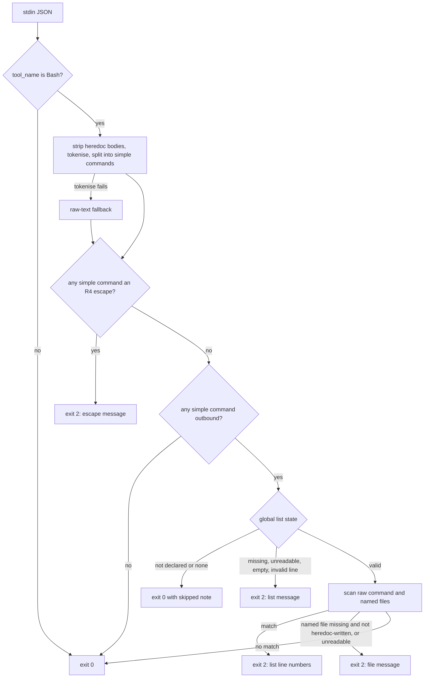

# Claude Code Leak Hook - Plan

## Goal Capsule

- Objective: an agent session on a machine that holds a private value list cannot post a listed value to GitHub through `gh`, and cannot reach for the usual flags that switch off the git-side leak gate. When it is refused, the message tells it what to do instead.
- Means: one user-scope Claude Code `PreToolUse` hook on the `Bash` tool, written in Python with the standard library only, that parses the whole command (KTD1, KTD2), scans the outbound text and the files it names against the global list (KTD3, KTD4), and denies with exit 2 (KTD5).
- Authority: #74 and its four comments are the spec. Rod's point-1 answer (issuecomment-5983544970) and the point 2–4 answers (issuecomment-5983616426), confirmed in the last comment, override the issue body where they differ. Where this plan and the issue disagree, the issue wins and the disagreement goes on the issue as a question.
- Execution profile: new `scripts/claude_leak_hook.py` and `scripts/test_claude_leak_hook.py`; the "Prove the rules and the wrapper fire" step of `.github/workflows/leaks.yml` only; a new subsection of `process/repository-standards.md` after § Running It Locally, plus one clause in each of two § What the Gate Cannot See bullets. No edits to § Running It Locally, § Adopting the Gate, the install step of `leaks.yml`, `scripts/leak-gate.sh`, `templates/`, or `pm-trial/`.
- Stop conditions: stop and comment on #74 if a fixture does not fail against the stub it is meant to fail against (U2), if the list parser and `leak-gate.sh` disagree on a list and the fix would change `leak-gate.sh`, or if the hook cannot deny without also auto-approving.
- Finishes the work: `ce-work` on branch `74-claude-leak-hook`, one PR that closes #74 except criterion 6's install run. That run happens after review, on Rod's go, and its pass/fail goes on #74. It merges after #75's piece 3. Rod merges.

---

## Product Contract

### Summary

Add a hook script that Claude Code runs before every Bash command. It denies a `gh` write whose text, or whose `--body-file`, `-F` or `--input` file, contains a value from the list declared by `git config --global leakgate.values`, naming the list line only. It denies `--no-verify`, `git commit -n`, a `core.hooksPath` override and the `SKIP=` prefix. With no list it allows and says value rules were skipped. With a broken list it denies outbound calls. Ship it with canary-fixture tests run in CI and an install section in the repository standard.

### Problem Frame

The leak gate checks what goes into git. It never sees what a session posts to GitHub directly: PR titles and bodies, issue bodies, comments and review text. When several agent sessions work on public repositories from one machine, that text is the largest unscanned way to publish a private value, and nobody reviews it before it goes live. A session that the git-side hook refuses also tends to retry with `--no-verify` or `SKIP=`, which turns the gate off. Rod's point-1 answer frames the gate as a guard against the list holder's own mistakes, including their agents' mistakes, and not against someone who means to leak (rmorison/buzai#15, "Known residual risk").

### Requirements

**Outbound text**

- R1. A Bash command containing `gh pr|issue create|edit|comment`, `gh pr|issue close|reopen` with `--comment`, `gh pr review`, `gh release create|edit`, or a writing `gh api` call is denied when its text, or the contents of a file it passes as the body, contains a listed value. Matching is literal and case-insensitive.
- R2. The same commands with clean text are allowed, and the hook adds no permission approval of its own.
- R3. Only the global list is read (`git config --global leakgate.values`). A clone's `--local` setting, including `none`, does not apply. The text goes to GitHub, not into the clone, and `gh -R` can target any repository.

**Gate escapes**

- R4. The hook denies `--no-verify` on a git command, `git commit -n`, `git -c core.hooksPath=…`, a `git config` write of `core.hooksPath`, and a `SKIP=` assignment on a git or pre-commit command. The message says why.
- R5. Abbreviated long options (`--no-veri`), combined short flags (`-nm`), config set through `GIT_CONFIG_*` variables, and editing or deleting hook files are known residuals. They are documented, not denied. The first three are pinned by accepted-risk fixtures; hook-file edits have no command form to pin.

**Fail-safe behaviour**

- R6. With no global list declared, or `none`, outbound calls are allowed and the hook says value rules were skipped.
- R7. With a declared list that is missing, unreadable, empty or holds an invalid line, outbound calls are denied with the reason. A line is invalid exactly when `leak-gate.sh` would reject it. Escape checks do not depend on the list and run in every state.

**Output**

- R8. Every message names list line numbers and never a value, the command text or file contents. Every denial ends with what to do: "remove the value from the text, or fix the list; don't bypass".

**Documentation**

- R9. A new subsection after § Running It Locally gives the install steps. It says the hook reads the global list only, that each OS account running agent sessions installs it and declares its own list, that GitHub MCP writes are not scanned yet, and lists the R5 residuals.
- R10. The install was run on one machine and the result is recorded on #74 as pass or fail only. This is a step after review, on Rod's go.

### Acceptance Examples

- AE1. **Covers R1, R8.** Given a fixture list whose line 3 holds a canary, when the hook receives `gh pr create --title t --body-file F` and F contains the canary in upper case, then it exits 2 and its output names "list line 3" and does not contain the canary in any case.
- AE2. **Covers R1.** Given the same list, when the command is `cat > F <<'EOF'` on one line, the canary on the next, `EOF` alone on the third, and `gh pr create --body-file F` on the fourth, then it is denied. F does not exist yet when the hook runs, and the heredoc text is scanned as part of the command. The same holds with `&& gh pr create --body-file F` on the opening line.
- AE3. **Covers R3.** Given a global list and a scratch repository whose local config sets `leakgate.values none`, when the hook's `cwd` is that repository and the command posts the canary, then it is denied.
- AE4. **Covers R4.** When the command is `gh issue comment 1 --body "never run git commit --no-verify"`, then it is allowed: the flag sits inside a quoted argument, not on a git command.
- AE5. **Covers R6, R7.** Given a declared list path that does not exist, when the command is `gh issue view 1`, then it is allowed (not outbound); when it is `gh issue comment 1 --body hi`, then it is denied; when it is `git commit -n`, then it is denied for the escape.

### Scope Boundaries

- GitHub MCP write tools: no GitHub MCP server runs on the agent host today, and CI reviews use the action's own MCP, which a user-scope hook never sees (point 3).
- Content committed to git: `leak-gate.sh` `staged` and `range` cover it.
- Text produced at run time by another command or a variable (`--body "$(cat f)"`, `--body "$X"`, a pipe into `--body-file -`), commands run through `xargs` or `find -exec`, other clients of the GitHub API such as `curl`, and `gh` subcommands outside R1 such as `gh gist create`, `gh repo edit --description` and `gh pr merge --body`. These are documented as not scanned.
- Text a human posts through the web UI, or from a machine without the hook.

### Deferred to Follow-Up Work

- Denying merges and settings writes for worker sessions: #76.
- Scanning GitHub MCP writes: a follow-up issue, filed when a GitHub MCP server is added.

---

## Planning Contract

### Key Technical Decisions

- KTD1. **Python 3.10+, standard library only, in `scripts/claude_leak_hook.py`.** The hook must parse JSON on stdin and split a shell command into words, and `json` and `shlex` do both. POSIX `sh` has neither, and `jq` would be a new dependency. The ecosystem rule in `docs/solutions/tooling-decisions/adopter-checks-ship-in-the-adopters-ecosystem.md` binds checks an adopting project runs on its own files. This hook runs on the agent host instead, which already needs `python3` for the starter kit's hooks (`templates/.claude/settings.json`). The 3.10 floor matches `scripts/check_secret_refs.py`. The script sits beside `leak-gate.sh`, as the readiness check proposed.
- KTD2. **Parse the whole command, then judge each simple command.** A prefix rule cannot constrain flags that come later (#74, Notes). The parser removes heredoc bodies, then backslash-newline continuations outside single quotes. It tokenises with `shlex` in POSIX mode with `whitespace=' \t\r'`, `punctuation_chars=';&|()<>\n'`, `whitespace_split=True` and `commenters=''`, and splits at `;`, `&`, `&&`, `||`, `|`, newline tokens and parentheses. shlex's defaults would treat a newline as whitespace, merging a command on the next line into the one before it, and would read `#` inside a word as a comment. For each simple command it records leading `VAR=value` assignments and skips the wrappers `env`, `command`, `exec`, `nohup`, `time`, `nice`, `sudo` and `timeout`, with their options and `timeout`'s duration. It descends into the string argument of `bash -c`, `sh -c`, `zsh -c` and `eval`, and tracks a literal `cd <dir>` so later relative paths resolve. Programs match by basename, so `/usr/bin/gh` counts. Removing heredoc bodies first keeps a PR body that mentions `git commit -n` from reading as a command (AE4). If tokenising fails, as with an unbalanced quote, the hook falls back to the raw text: a command containing `gh` is treated as outbound, and a regex for the R4 forms denies an escape.
- KTD3. **What counts as outbound, and what text is scanned.** A simple command is outbound when it is `gh` followed by one of the R1 subcommands, after any leading flags, with `new` read as `create` for pr, issue and release (gh's built-in alias). `close` and `reopen` count when they carry `--comment` or `-c`. Options are recognised in separated, `--opt=value` and attached short (`-XPATCH`) forms. `gh api` counts when it has `-X`/`--method` other than `GET`, or any of `-f`, `-F`, `--field`, `--raw-field` or `--input`. When any simple command is outbound, the hook scans the whole raw command, heredoc bodies included, the decoded shlex tokens joined by spaces (so `O'\''Brien` is seen as `O'Brien`), plus every file named by `--body-file`, `-F` (the short form on pr, issue and release commands), `--notes-file`, `gh api -F key=@file`, `gh api --input file`, and a `<` redirect, for `-` arguments. Paths expand `~` and environment variables and resolve against the input's `cwd` plus any tracked `cd`. A named file that does not exist denies, unless an earlier simple command in the same call writes that path from a heredoc, the AE2 shape. An earlier `cp`, an untracked `cd` or a variable can make the file exist when `gh` runs, so skipping it would post unscanned text. The message says to write the file in one step and post in the next. A named file that exists but cannot be read denies.
- KTD4. **The list is read the way `leak-gate.sh` reads it, and matched more broadly.** The parser ports `leak-gate.sh`'s rules line by line, citing each: a byte-order mark is dropped, CRLF and lone CR end lines, ASCII whitespace is trimmed, blank and `#` lines are skipped. A line is rejected for a non-ASCII space at either end, invalid UTF-8, a control character other than tab, `\E` or `'''`, or fewer than 4 bytes. Bytes, because Debian's `sh` is dash, whose `${#value}` counts bytes. Where `sh` is bash, as on macOS, `${#value}` counts characters under a UTF-8 locale, so the parity test runs `leak-gate.sh` with `LC_ALL=C`. A test runs both on the same lists (U2), following `docs/solutions/best-practices/a-check-must-read-a-file-the-way-its-consumer-does.md`. Matching uses `str.casefold()` on both sides. That folds at least what gitleaks' `(?i)` folds, so the hook can deny more than the gate, never less. File contents decode as UTF-8 with replacement characters.
- KTD5. **Deny with exit 2 and a stderr message. Never emit `permissionDecision: "allow"`.** Exit 2 blocks the tool call whatever JSON is printed, and Claude Code shows stderr to the model as the reason (code.claude.com/docs/en/hooks, Exit Code Semantics). An `allow` decision would approve the call past the user's permission prompt, so an allowed call exits 0 with no decision and continues through the normal permission flow. The "value rules skipped" note (R6) goes out as JSON `systemMessage` for the user and `hookSpecificOutput.additionalContext` for the model, on outbound calls only.
- KTD6. **The hook fails closed when it cannot run.** The settings command is `python3 "$HOME/.claude/hooks/claude_leak_hook.py" || exit 2`. A missing interpreter or script, or an uncaught exception, then denies every Bash call instead of silently allowing. Claude Code treats other non-zero exits as non-blocking errors. Inside the script, a top-level handler turns an unexpected error into a denial that says the hook failed and names no input. Malformed stdin JSON denies too. A `tool_name` other than `Bash` exits 0. No `timeout` is set: a timed-out hook does not block, and the 600-second default is far above the script's run time.
- KTD7. **`--no-verify` is denied on every git subcommand, not just commit and push.** `git merge`, `git am` and `git rebase` accept it too, and one rule is simpler than a per-subcommand table. `-n` is denied only on `commit`, since `git push -n` is a dry run. The `git config` check denies when `core.hooksPath` (compared case-insensitively, as git compares keys) appears with a value or with `set`, `--add` or `--replace-all`. A read (`--get`, `--get-all`, `get`, the key alone) and `--unset` are allowed. `--config-env=core.hooksPath=…` is denied with `-c`, at no extra cost. `SKIP=` is denied as a leading assignment on `git` or `pre-commit`, after `env`, and in `export SKIP=…`.
- KTD8. **Install copies the script out of the clone.** The hook runs a copy at `~/.claude/hooks/claude_leak_hook.py`, taken from the default branch's checkout. A checked-out PR branch therefore cannot change what guards the machine, the same reasoning as the pre-merge check in § Running It Locally. The settings entry is a JSON snippet merged by hand into `~/.claude/settings.json`, not a script that rewrites the user's settings.

### High-Level Technical Design

Directional only. It shows the decision order, not code.

### Assumptions

- `python3` 3.10 or later is on `PATH` for every account that runs agent sessions. CI runs the tests on the runner's `python3`, which is newer, so the 3.10 floor rests on the script using nothing newer, checked by reading the code.
- Claude Code passes Bash calls to user-scope `PreToolUse` hooks in subagents as well (hooks docs, Subagent execution). Criterion 6's install run checks this on the real machine.

### Risks

- A false positive denies a legitimate command, for example `SKIP=` on a git alias, or a value that appears in a file named by `--body-file` for a good reason. The message says to fix the text or the list. A list entry that is too broad is the list holder's fix.
- Fail-closed install (KTD6) means a broken `python3` stops every Bash call on that account. The install section says how to recover: fix the interpreter, or remove the settings entry.
- #75 is rewriting § Running It Locally and may edit § What the Gate Cannot See. Expect to rebase over its piece 3.

---

## Implementation Units

### U1. The hook script

- **Goal:** `scripts/claude_leak_hook.py` implements R1–R8 as KTD1–KTD7 decide.
- **Requirements:** R1, R2, R3, R4, R6, R7, R8.
- **Dependencies:** none.
- **Files:** `scripts/claude_leak_hook.py` (new).
- **Approach:** a module docstring in the style of `scripts/check_secret_refs.py` and `scripts/leak-gate.sh`'s header, stating the rule's owner (`process/repository-standards.md`), what it denies, the list rules and the residuals. Small functions with a single owner each: read input, parse the command (KTD2), classify escapes (KTD7), classify outbound and collect text (KTD3), read the list (KTD4), decide and print (KTD5). The global list comes from `git config --global --get leakgate.values`, which honours `GIT_CONFIG_GLOBAL`, so tests never touch the real one. `~/` expands the way `leak-gate.sh` expands it. Messages are composed from fixed strings and line numbers only.
- **Execution note:** test-first. Write U2's fixtures against two stubs and watch them fail, then build the hook. Against a stub that allows everything, every denial fixture must fail. Against a stub that denies everything and echoes the command and every named file's contents to stderr, every allow fixture and every no-canary assertion must fail.
- **Test scenarios:** owned by U2, which tests this unit through its stdin and exit-code interface.
- **Verification:** U2 passes, and every U2 fixture was seen failing against the stub it is meant to fail against.

### U2. The test harness

- **Goal:** `scripts/test_claude_leak_hook.py` proves each matcher fires, each lookalike passes, each residual is still allowed, and no output carries a canary.
- **Requirements:** R1–R8, AE1–AE5.
- **Dependencies:** U1, written against U1's stub first.
- **Files:** `scripts/test_claude_leak_hook.py` (new).
- **Approach:** runs the hook as a subprocess with JSON built by `json.dumps`, in a temporary directory, with `GIT_CONFIG_GLOBAL` pointing at a temporary file, `GIT_CONFIG_NOSYSTEM=1` and `HOME` set to a temporary directory, so no real list is read. Canary values are assembled at run time, as in `scripts/test-leak-gate.sh`. Each fixture asserts the exit code, a fragment of the message, and that neither stdout nor stderr contains any canary under `casefold()`. It prints a pass/fail count and exits non-zero on any failure. The list-parity fixtures run `scripts/leak-gate.sh staged` in a scratch `git init` repository holding copies of `.gitleaks.toml` and `scripts/gitleaks-report.tmpl`, with `GITLEAKS=true` and `LC_ALL=C`. `leak-gate.sh` then exits 0 for an accepted list and 2 only for a rejected one, on any machine, with or without gitleaks. It never runs `pre-commit install`, writes `.git/hooks`, or sets `core.hooksPath`.
- **Test scenarios:**
  - Values denied (AE1, AE2): `gh pr create --body-file F`; `gh issue comment 1 --body "…canary…"`; `gh api -X PATCH repos/o/r/issues/1 -f body=…canary…`; the canary in `--title` only; upper-cased canary; `gh api -F body=@F`; `gh api --input F`; `gh pr comment 1 --body-file - < F`; a heredoc that writes F before `gh … --body-file F`; `cd sub && gh pr comment 1 -F rel.md`; `bash -c 'gh issue comment 1 --body canary'`; `/usr/bin/gh issue comment 1 --body canary`; `gh release create v1 --notes-file F`; `gh pr review 1 --comment -b canary`; `gh issue new --title t --body canary`; `gh issue close 1 --comment canary`; `gh pr reopen 1 -c canary`; `timeout 60 gh issue comment 1 --body canary`; `gh pr create --body-file=F`; `gh api --input=F`; `gh api -XPATCH repos/o/r/issues/1 --raw-field=body=…canary…`; `gh api --method=PATCH repos/o/r/issues/1 --field=body=…canary…`; a canary holding an apostrophe, posted with `'\''` quoting. Each names the right list line.
  - Multi-line commands (KTD2): the AE2 heredoc with `gh` on its own line after `EOF`; `gh pr create \` with `--body-file F` on the continuation line. Both denied.
  - Missing body file: `cp src F && gh pr comment 1 --body-file F` with F absent is denied with the write-then-post message; the AE2 heredoc form with clean text is allowed.
  - Two values on lines 2 and 5 in one body: both line numbers named.
  - Clean versions of each denied form are allowed, print no `permissionDecision`, and exit 0 (R2).
  - Not outbound, so allowed even with the canary: `echo canary`, `gh issue view 1`, `gh api repos/o/r/issues`, `git log --grep canary`.
  - `gh issue close 1` with no `--comment` is not outbound: allowed with a declared but missing list.
  - A named file that exists but cannot be read is denied, skipped when the tests run as root.
  - Global only (AE3): a local `leakgate.values none` in the input's `cwd` does not stop the denial.
  - List states (AE5): not declared and `none` both allow outbound with the skipped note in `systemMessage`; declared but missing, a directory, unreadable, empty, and comments only are each denied for outbound and allowed for non-outbound.
  - List parity: each invalid-line kind (under 4 bytes, `\E`, `'''`, control character, invalid UTF-8, leading no-break space, trailing ideographic space) makes both the hook and `leak-gate.sh` exit 2 naming the same line. A 2-character value of 4 UTF-8 bytes is accepted by both. CRLF, lone-CR, BOM and inner-tab lists are accepted by the hook, which matches the value on the right line.
  - Escapes denied (R4): `git commit --no-verify`; `git commit -n -m x`; `git push --no-verify`; `git merge --no-verify x`; `git -C d commit --no-verify`; `cd d && git commit -n`; `git -c core.hooksPath=/dev/null commit`; `git -c CORE.HOOKSPATH=x commit`; `git --config-env=core.hooksPath=V commit`; `git config core.hooksPath /dev/null`; `git config --global core.hooksPath x`; `git config set core.hooksPath x`; `SKIP=leak-gate git commit`; `SKIP=x pre-commit run`; `env SKIP=x git commit`; `export SKIP=x`; `sh -c 'git commit -n'`; `timeout 60 git commit -n`; `git status` then `git commit -n` on the next line; `cd d` then `git commit -n` on the next line; `git commit -m fix#1 --no-verify`. Each is denied with no list declared, and with a broken list.
  - Lookalikes allowed (AE4): `git commit -m "don't use --no-verify"`; a heredoc body containing `git commit -n`; `git config --get core.hooksPath`; `git config --unset core.hooksPath`; `git push -n`; `git log -n 5`; `echo SKIP=1`.
  - Residuals still allowed (R5), as accepted-risk fixtures per `docs/solutions/best-practices/hold-a-stated-risk-with-a-fixture-that-fails-when-the-risk-is-gone.md`: `git commit --no-veri`, `git commit -nm x`, and `GIT_CONFIG_COUNT=1 GIT_CONFIG_KEY_0=core.hooksPath GIT_CONFIG_VALUE_0=/dev/null git commit`. A failure says the residual is now denied and names the residual list in `process/repository-standards.md` to update.
  - Fallback (KTD2): an unbalanced quote with `gh` and the canary is denied; one with `git commit --no-verify` is denied.
  - Hook input: malformed JSON is denied; `tool_name` `Write` exits 0 silently.
- **Verification:** `python3 scripts/test_claude_leak_hook.py` passes. Against the two stubs in U1's execution note, every fixture fails as described there, and the output goes in the PR body.

### U3. CI wiring

- **Goal:** CI runs U2 on every pull request.
- **Requirements:** R1–R8 (keeps them proven).
- **Dependencies:** U2.
- **Files:** `.github/workflows/leaks.yml`, the "Prove the rules and the wrapper fire" step only.
- **Approach:** the step's `run` becomes two lines, `sh scripts/test-leak-gate.sh` then `python3 scripts/test_claude_leak_hook.py`, and its comment gains one sentence naming the hook. The install step is ES-pins' and stays untouched.
- **Test expectation:** none beyond U2, whose fixtures are proven against the two stubs. The PR's first CI run shows both scripts' output.
- **Verification:** the PR's Leak gate job runs both scripts and passes.

### U4. Documentation

- **Goal:** an adopter can install the hook from the standard alone and knows what it does not cover.
- **Requirements:** R5, R9.
- **Dependencies:** U1, since the doc names its messages and behaviour.
- **Files:** `process/repository-standards.md`.
- **Approach:** a new `### Guarding Agent Sessions` subsection between § Running It Locally and § What the Gate Cannot See. It covers what the hook scans and denies, linking R-level behaviour rather than restating the script, and states that it reads the global list only. It notes that each OS account installs it and declares its own list, and that GitHub MCP writes are not scanned yet. The install steps are a copy command (KTD8) and the settings JSON snippet (KTD6), followed by how to recover from a broken install and the R5 residuals with the Scope Boundaries' unscanned forms. Check the hooks docs on whether a project's `disableAllHooks: true` turns a user-scope hook off in that clone, and list it as a residual if so. One sentence says the two `--no-verify` uses § Running It Locally describes (a fixup on a branch you did not write, and removing the gate on purpose) are done by a person outside an agent session, because the hook denies them inside one. It also carries the companion guidance to post GitHub text with `--body-file`. In § What the Gate Cannot See, one clause each: "`--no-verify` skips it anywhere" gains that the hook denies it in agent sessions, and "nothing checks pull request bodies" becomes "only the agent-session hook checks pull request bodies, and only for the `gh` commands it covers on its machine", linking the new subsection.
- **Test expectation:** `node scripts/check-docs.mjs` passes. The copy command and snippet are proved from the document's own text under a scratch `HOME`, per `docs/solutions/best-practices/prove-a-pasted-command-from-the-docs-own-text.md`: extract, run under bash and `bash -i`, feed the installed hook one denied and one allowed input, and record zsh and macOS as not run. The output goes in the PR body.
- **Verification:** the subsection exists in its own place, and § Running It Locally is byte-identical to `origin/main`.

---

## Verification Contract

| Command | Proves | When |
|---|---|---|
| `python3 scripts/test_claude_leak_hook.py` | U1 and U2: every matcher, lookalike, residual, list state, parity case and output check | Every change to the hook or tests; CI |
| The same command against the allow-everything stub and the deny-and-echo stub | Each denial fixture, allow fixture and no-canary assertion can fail | Once, before trusting U2; output in the PR body |
| `sh scripts/test-leak-gate.sh` | The leak gate's own fixtures still pass | Before opening the PR; CI |
| `node scripts/check-docs.mjs` | The new subsection's links, anchors and fences | Before opening the PR; CI |
| Extracted install text run under a scratch `HOME` | U4's commands work as pasted | Once, output in the PR body |
| Leak gate job on the PR | U3 wiring | On push |

No `pre-commit install`, no write under `.git/hooks`, no `core.hooksPath` change and no install at user scope on this machine during development.

## Definition of Done

- U1–U4 are complete, and each unit's verification has passed.
- Every new fixture was seen to fail before it was trusted. The commands and output are in the PR body.
- The PR body maps each of #74's criteria 1–5 to fixtures, marks the MCP case out of scope by Rod's point-3 answer, and leaves criterion 6 open for the post-review install run.
- No real list value appears anywhere in the diff, the PR or CI logs. Fixtures use canaries only.
- No abandoned experiments remain in the diff.
- The PR is rebased onto `main` after #75's piece 3 merges, and the docs check still passes.
