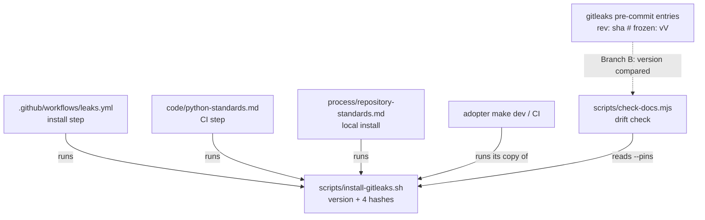

# Keep the gitleaks Pin in One Place - Plan

## Goal Capsule

- Objective: an adopter of the leak gate, buzai first, copies one file that holds the gitleaks version and every pinned SHA-256. Their `make dev` and their CI install gitleaks from that file, unattended. An upgrade here tells them exactly what to re-copy, and a copy in this repository that falls out of step fails CI.
- Means: a committed `scripts/install-gitleaks.sh` that is the only home of the pins (Key Decision 1, KTD1, KTD2), every install in this repository and in the standards calls it (U2, U3, U4), and a drift check in `scripts/check-docs.mjs` guards the copies that remain (KTD4).
- Authority: #70 and #71 with their comments, including the buzai lead's hand-over on #70 and its proposed criterion, are the spec. Where this plan and an issue disagree, the issue wins and the disagreement goes on it as a question. #75's answer to "which gitleaks does the pre-commit framework entry run?" chooses between Branch A and Branch B below.
- Execution profile:
  - New files: `scripts/install-gitleaks.sh` and `scripts/test-install-gitleaks.sh`.
  - Edits: `.github/workflows/leaks.yml`, `.github/workflows/docs.yml`, `scripts/check-docs.mjs`, `code/python-standards.md` § Using gitleaks Instead, `process/repository-standards.md` § Adopting the Gate (the install blocks and the upgrade paragraph), `process/documentation-standards.md` § Automated Checks, and `CONTRIBUTING.md`.
  - Only if Q3 is answered as recommended: the "Copy these files" list in § Adopting the Gate, the leak-gate copy list in `templates/README.md`, and the review-list comment in `leaks.yml`.
  - Branch B only: the `update-hooks` recipe in `code/python-standards.md`'s Makefile and the `pre-commit autoupdate` lines in its Setup and Usage, following Q2.
  - No edits to `scripts/leak-gate.sh`, `scripts/test-leak-gate.sh`, § Leak Gate's opening, § Running It Locally, or the CODEOWNERS paragraph. #75 owns all of them.
- Stop conditions:
  - No unit is built until Rod signs off on #75's gitleaks answer (Q1).
  - Stop and ask on #70 if a drift-check mutation does not fail, or if the install script cannot be made to fail closed on a hash mismatch.
  - Also stop if the release's checksums file disagrees with a hash computed from its tarball, or with a hash already pinned.
- Finishes the work: `ce-work` on branch `70-gitleaks-pin-drift`. It is rebased after #75's documentation piece merges, and in Branch A after #75's framework-entry piece too. It ships as one PR that closes #70 and #71. Rod merges.

---

## Product Contract

### Summary

Move the gitleaks version and the tarball SHA-256s out of the three hand-kept copies into one script, `scripts/install-gitleaks.sh`. It picks the tarball for the machine it runs on, checks the pinned hash, and installs into a directory it is given. `leaks.yml`, the Python standard's CI step, and the local install in § Adopting the Gate all call it. Add the linux_arm64 hash. Add a check that fails when anything outside the script restates a pin. It also fails when a version the script cannot own, a gitleaks pre-commit `rev` if one survives #75, differs from the script's.

### Problem Frame

After #69 the version and the linux_x64 hash are kept by hand in `.github/workflows/leaks.yml`, in the Python standard's CI step, and in the local install command. The macOS block holds two more hashes, and `CONTRIBUTING.md` and § Adopting the Gate repeat the version in prose. Each copy fails closed alone, but nothing keeps them in step, so an upgrade that misses one leaves CI and the standard on different versions.

buzai copies the result into rmorison/buzai#19 once. It needs a place and format for the pins that will not move later. Its `make dev` and its CI both need to install gitleaks without a person present. A copyable block would give buzai two more hand-kept copies, one in its Makefile and one in its workflow, which this repository's drift check cannot see.

#71 asks to pin the gitleaks pre-commit hook by commit SHA. Done naively, that breaks the Python standard's CI step, which reads the version out of `rev: v8.24.2` with `sed`. Whether that hook survives at all depends on #75.

### Key Decisions

- **A committed script, not a copyable block, is the one place for the pins.** It turns three copies into one. buzai copies the file whole and keeps no copy of its own that can drift, and its `make dev` and CI run the same command. A block would leave buzai two copies that no check here can reach. Governs R1, R2, R3, R4.
- **Add the linux_arm64 hash.** #70's third criterion asks for this decision. The script picks the tarball from `uname`, so a missing platform is a hard failure, not a silent skip. arm64 Linux includes Linux containers on Apple silicon, a likely `make dev` host. It costs one line. The hash is computed from the downloaded tarball and checked against the release's checksums file. The install is not run on arm64 hardware, and the standard says so, as it does for macOS. Governs R5.
- **Plan both answers to #75 now.** Branch A applies if no tracked standard keeps a `repo: https://github.com/gitleaks/gitleaks` pre-commit entry. Branch B applies if any does, whether in the Python standard's hook or in #75's own framework entry. Governs R10, R11.

### Requirements

**One place for the pins**

- R1. The gitleaks version and the SHA-256 of each supported tarball (linux_x64, linux_arm64, darwin_x64, darwin_arm64) are written only in `scripts/install-gitleaks.sh`, in a block whose format the standard states as stable.
- R2. `sh scripts/install-gitleaks.sh [DIR]` installs the pinned gitleaks unattended. It never prompts. It exits non-zero on a failed download, a hash mismatch, or an unsupported platform, and then installs nothing. It never pipes `curl` into a shell and writes nothing into the working tree.
- R3. CI installs through the script, both in this repository's `leaks.yml` and in the Python standard's CI step, and runs the binary it installed, not one found elsewhere.
- R4. § Adopting the Gate replaces the Linux and macOS install blocks with the one script command, which an adopter's `make dev` can call.
- R5. The script carries a linux_arm64 hash. The standard says which platforms were run and which were only checked against the release's checksums file.

**Drift check**

- R6. A check in `scripts/check-docs.mjs` fails when a 64-hex-digit literal or a versioned tarball name (`gitleaks_<V>_…`) appears in a tracked file outside the script and the history directories. It also fails when a version copy the script cannot own differs from the script's version (R10). It never prints a literal that is not a current pin.
- R7. The check runs on every pull request and push that touches the script, a workflow, anything under `scripts/`, or a Markdown file.
- R8. Each mutation of a copy is seen to fail the check before the check is trusted, and the commands and output go in the PR body.

**Upgrade instructions**

- R9. One upgrade paragraph, in § Adopting the Gate, lists every place that changes here and says what a downstream adopter updates: re-copy `scripts/install-gitleaks.sh`, and in Branch B also move the hook's `rev`.

**Branch-dependent (#75)**

- R10. Branch B only: every gitleaks pre-commit entry in the standards pins `rev` by commit SHA in pre-commit's frozen form, `rev: <sha>  # frozen: v<V>`, and `make update-hooks` keeps it frozen. The Python standard's CI step still resolves the version: it fails with a message naming both versions, and saying what to do, when the hook's frozen version differs from the script's. This is proven under `bash -e`, as the section's last paragraph proves the current step.
- R11. Branch A only: no tracked standard keeps a `repo: https://github.com/gitleaks/gitleaks` entry. #71 closes as not needed, with a comment on #71 saying why.

### Scope Boundaries

- The drift check does not read version numbers in prose. After this change the only prose versions left are dated evidence ("gitleaks 8.24.2 was run on 2026-09-25 …"), which records what was run and stays true after an upgrade. Evidence about text this PR deletes, such as the 2026-09-27 run of the old CI step, is replaced instead (U4). Evidence that would change the call: a prose version line that states a current pin and is not dated.
- Considered and not built: skipping the download when `DIR/gitleaks` already reports the pinned version. A repeat download in `make dev` is slow, not harmful, and the skip would accept a binary without checking its hash. Evidence that would change the call: adopters find `make dev` too slow or unusable offline.
- Considered and not built: a script mode that downloads the release's checksums file and compares every pin at upgrade time. Upgrades are rare, and the upgrade paragraph already gives the manual comparison. Evidence that would change the call: an upgrade that pins a wrong hash.
- Considered and not built: a check in an adopter's repository that their copy of the script matches this one. It cannot be enforced from here, and the upgrade paragraph names the re-copy.
- No change to what the rules match, to `scripts/leak-gate.sh`, or to how the wrapper finds gitleaks (`PATH` or `GITLEAKS`).

### Deferred to Follow-Up Work

- Freezing every hook in the Python standard by SHA, beyond gitleaks, if Rod answers Q2 with "gitleaks only".

### Open Questions

- Q1 (blocking, for Rod on #75): which gitleaks does the pre-commit framework entry run? The answer picks Branch A or Branch B. U3 (whose upgrade paragraph differs by branch) and U4 depend on it, and no unit is built before it.
- Q2 (Branch B only, for Rod): two parts.
  - `pre-commit autoupdate` without `--freeze` rewrites a frozen `rev` back to a tag. Should `make update-hooks` become `autoupdate --freeze` for every hook, or freeze gitleaks alone with a second line? Recommended: freeze every hook. It is one flag, the R10 CI check catches a missed freeze either way, and it gives every hook the protection #71 asks for gitleaks.
  - `autoupdate` moves the gitleaks `rev` to the newest release, ahead of the adopter's copied script, and R10 then fails their CI. Editing the copied script's pins would create the drifting copy Key Decision 1 removes, and `autoupdate` cannot leave one repository out. Recommended: the script is the source of truth and the `rev` follows it. R10's failure message says to set the `rev` back to the script's version, or to re-copy the script once this repository pins the newer one. The upgrade paragraph says the same. This cost of keeping a `rev` at all is worth weighing in Q1.
- Q3 (for the lead): adopters must copy the script and its test file, because `leaks.yml` will run both. They join the "Copy these files" list in § Adopting the Gate, beside `leaks.yml` as `scripts/test-leak-gate.sh` is, and the leak-gate copy list in `templates/README.md`. The install script decides which binary CI runs, so it also belongs with the files that get required review. The copy lists are outside both #75's paragraphs and this ticket's, and the review list is in #75's CODEOWNERS paragraph. Recommended: this PR adds both files to both copy lists and to the review-list comment in `leaks.yml`. ES-gate, the session building #75, adds the install script to the CODEOWNERS paragraph.

---

## Planning Contract

### Key Technical Decisions

- KTD1. **Script interface.** POSIX `sh`, needing only `curl`, `tar`, `uname`, `mktemp`, `install`, and `sha256sum` or `shasum -a 256`, so it fits [the adopter-ecosystem rule](../solutions/tooling-decisions/adopter-checks-ship-in-the-adopters-ecosystem.md) like `leak-gate.sh` does.
  - The argument is the install directory, defaulting to `$HOME/.local/bin`. The script names the version and directory before downloading.
  - It maps `uname -s` and `uname -m` to the release's asset names (`x86_64`→`x64`, `aarch64` and `arm64`→`arm64`). On anything else it exits non-zero, naming the platform and saying no hash is pinned for it.
  - It downloads into a `mktemp -d` directory removed on exit, verifies, then installs `DIR/gitleaks`. It always downloads and verifies.
  - On success it prints the installed path. It keeps today's warning when `command -v gitleaks` resolves elsewhere and tells the user to put the directory on `PATH` or set `GITLEAKS`.
- KTD2. **Pin format and how checks read it.** The script opens with plain assignments and nothing computed: `GITLEAKS_VERSION=` and one `SHA256_<platform>=` per platform. This block is the stable format buzai copies. A `--pins` argument prints `version <V>` and `<platform> <sha>` lines and exits. The drift check and the Branch B CI step read the pins through `sh scripts/install-gitleaks.sh --pins`, so they see what `sh` sees, as [a check must read a file the way its consumer does](../solutions/best-practices/a-check-must-read-a-file-the-way-its-consumer-does.md) requires.
- KTD3. **CI runs the binary it installed.** A CI step installs into `"$RUNNER_TEMP/gitleaks-bin"`, and the script never writes `GITHUB_PATH`, so it has no CI-only branch.
  - In `leaks.yml`, the install step appends that directory to `$GITHUB_PATH`. The scans are later steps, so they find it on `PATH`. This replaces the inline install and the `GITLEAKS_VERSION` and `GITLEAKS_SHA256` env entries.
  - The Python standard's CI step is one step, and a `$GITHUB_PATH` entry reaches only later steps. It calls `"$RUNNER_TEMP/gitleaks-bin/gitleaks"` by path, as today's step does. This replaces the `sed` read, the hash literal and the download.
- KTD4. **What the drift check checks.** It is check 6 in `scripts/check-docs.mjs`.
  - Tracked files outside `scripts/install-gitleaks.sh` and the history paths (`docs/plans/`, `docs/solutions/`, `agent-transcripts/`, `archive/`) may hold no 64-hex-digit literal and no `gitleaks_<digits>.<digits>.<digits>_` tarball name.
  - Today every 64-hex literal outside those paths is a gitleaks pin, so the rule needs no allowlist. A future unrelated one gets a named exemption in the check.
  - A stale copy of an old hash fails too, which a check comparing only against the current hashes would miss.
  - In Branch B, the version in every `repo: https://github.com/gitleaks/gitleaks` entry's frozen `rev` comment, found by pattern in tracked Markdown, must equal the script's.
  - Messages name the file and line, and the platform when the literal equals a current pin. Any other 64-hex literal is reported without printing it, because it may be a secret and the log is public.
- KTD5. **The check runs where copies can appear.** `docs.yml`'s `pull_request` and `push` path filters gain `scripts/**` and `.github/workflows/**`. Markdown is already covered. The check scans every tracked file, so a narrower trigger would let a pin restated in a script or workflow land, then fail the next unrelated pull request. `check-docs.mjs`'s header records the same trap for the home-path rule in #31.
- KTD6. **Branch B rev form.** Use `rev: <40-hex sha>  # frozen: v<V>`, the form `pre-commit autoupdate --freeze` writes, so the tool keeps it up to date. #71's example comment `# v8.24.2` is not what pre-commit writes. The Python standard's CI step compares that comment with `--pins` before installing.
- KTD7. **The script gets its own test file, run in `leaks.yml`.** `scripts/test-install-gitleaks.sh` puts shim `curl`, `uname`, `sha256sum` and `shasum` commands on a controlled `PATH` in a temporary directory, so the failure paths and platform selection need no network. The real happy path on linux_x64 is the `leaks.yml` install step, which runs on every change. `scripts/test-leak-gate.sh` belongs to #75 and is not touched.

### High-Level Technical Design

Where the version and hashes live after this change. Branch B adds the dashed edge.

### Assumptions

- The gitleaks release names its assets `gitleaks_<V>_<os>_<arch>.tar.gz`, with `linux_arm64` among them, as it does for the three platforms already pinned. Check this against 8.24.2's checksums file in U1.

### Risks & Dependencies

- #75's piece 1 (documentation) merges first. In Branch A, its piece 2 (the pre-commit framework entry) must also merge before U4's hook-row change, because U4 links to it. Rebase after the lead says each has merged, and check `origin/main` yourself first.
- ES-gate's missing-gitleaks message for #75 will name `sh scripts/install-gitleaks.sh`. If this PR changes that path, ES-gate's text breaks, so the path is fixed by this plan.
- A pull request can edit the script and so change which binary its own CI run uses, as it can already do with `leaks.yml`. Q3 covers required review. This is the footgun threat model #75 states, not a new exposure.

---

## Implementation Units

### U1. The install script and its tests

**Goal:** `scripts/install-gitleaks.sh` installs the pinned gitleaks on the four platforms and fails closed everywhere else.

**Requirements:** R1, R2, R5

**Dependencies:** Rod's sign-off on #75 (Q1)

**Files:** `scripts/install-gitleaks.sh`, `scripts/test-install-gitleaks.sh`

**Approach:**
- Write the pin block (KTD2), then the platform map, download, verify and install (KTD1).
- Download `gitleaks_8.24.2_checksums.txt`. Confirm its linux_x64, darwin_x64 and darwin_arm64 lines equal the three hashes carried over, so a release republished since 2026-09-28 is caught. Then take the linux_arm64 hash from the downloaded tarball, compare it with the file's line, and record both checks in the PR body.
- Chain each step so a failure stops the script under plain `sh`, not only under `bash -e`.

**Execution note:** write each failure fixture first and watch it fail against a deliberately broken script before trusting it. For the hash checks, that means a script that ignores the exit status of `sha256sum`, and separately of `shasum`.

**Patterns to follow:** `scripts/leak-gate.sh` for POSIX style and exit codes, and the current install blocks in `process/repository-standards.md` § Adopting the Gate for the verify-then-install order.

**Test scenarios:**
- A shim `curl` serving a tarball with one changed byte: the script exits non-zero, and `DIR/gitleaks` does not exist.
- The same tampered tarball with `sha256sum` absent from `PATH` and a `shasum` shim present, as on macOS: non-zero exit, nothing installed.
- A shim `uname` reporting `Linux aarch64`: the shim `curl` logs a request for `gitleaks_<V>_linux_arm64.tar.gz`.
- A shim `uname` reporting `Darwin arm64` and then `Darwin x86_64`: the requests name the matching darwin tarballs.
- A shim `uname` reporting `FreeBSD amd64`: non-zero exit, and the message names the platform.
- A shim `curl` that exits 22, as `curl -f` does on a 404: non-zero exit, nothing installed.
- `--pins` prints exactly one `version` line and four platform lines.
- No `DIR` argument, `HOME` set to a temporary directory, and a shim `curl` that fails: the output names `$HOME/.local/bin` as the target, and nothing is installed.

**Verification:** `sh scripts/test-install-gitleaks.sh` passes. A real run on this x86_64 machine, into a fresh directory, installs a binary whose `gitleaks version` matches the pin.

### U2. `leaks.yml` installs through the script

**Goal:** this repository's CI installs gitleaks with the script and proves the script before trusting the scan.

**Requirements:** R3

**Dependencies:** U1

**Files:** `.github/workflows/leaks.yml`

**Approach:**
- Replace the Install gitleaks step's body with a run of the script into `$RUNNER_TEMP/gitleaks-bin` plus the `GITHUB_PATH` line (KTD3). Remove `GITLEAKS_VERSION` and `GITLEAKS_SHA256` from `env`.
- Add a step running `scripts/test-install-gitleaks.sh` next to the existing proof step.
- Rewrite the env comment's upgrade text into a pointer to the upgrade paragraph (U3).
- If Q3 is answered as recommended, add the install script to the comment's list of files a pull request can weaken its own run with.

**Test expectation:** none in this unit. The workflow is proven by its own CI run on the PR, which must install and pass.

**Verification:** the PR's Leak gate run installs through the script, and the existing scans pass.

### U3. Repository standard, template README and CONTRIBUTING

**Goal:** an adopter reads one install command, one stable pin format and one upgrade paragraph.

**Requirements:** R1, R4, R5, R9

**Dependencies:** U1, Q1

**Files:** `process/repository-standards.md`, `templates/README.md`, `CONTRIBUTING.md`

**Approach:**
- In § Adopting the Gate, replace the Linux and macOS blocks and their run notes with `sh scripts/install-gitleaks.sh`, the default directory, the `PATH` note, and which platforms were run. Remove "The CI job pins 8.24.2".
- State that the pin block (the `GITLEAKS_VERSION=` and `SHA256_<platform>=` assignments) and the `--pins` output are a stable format adopters can rely on across upgrades.
- If Q3 is answered as recommended, add both scripts to the copy list in § Adopting the Gate and in `templates/README.md`, with the test file beside `leaks.yml`.
- Rewrite the upgrade paragraph per R9:
  - What changes here: the script's pin block, plus the frozen `rev` entries in Branch B.
  - How to take each hash and compare it with the release's checksums file.
  - Re-run `scripts/test-leak-gate.sh` on the new version.
  - What an adopter updates, including Q2's answer for a `rev` that `make update-hooks` moved.
- In `CONTRIBUTING.md`, replace "gitleaks 8.24.2 installed as …" with installing it through the script.

**Patterns to follow:** [prove a pasted command from the document's own text](../solutions/best-practices/prove-a-pasted-command-from-the-docs-own-text.md). Run the command as the document prints it.

**Test scenarios:**
- The command copied from the rendered section, run with a scratch `HOME` and a `PATH` without `~/.local/bin`, installs gitleaks and prints the `PATH` note.

**Verification:** `node scripts/check-docs.mjs` passes, and the section holds no version or hash literal.

### U4. Python standard § Using gitleaks Instead

**Goal:** the Python standard's CI step installs through the script, and the hook pin follows #75's answer.

**Requirements:** R3, R10 or R11

**Dependencies:** U1, Q1. In Branch A, also #75's piece 2 merged and this branch rebased onto it.

**Files:** `code/python-standards.md`

**Approach:**
- Both branches:
  - The CI step runs the copied script into `$RUNNER_TEMP/gitleaks-bin` and calls `"$RUNNER_TEMP/gitleaks-bin/gitleaks" dir . --redact` by path (KTD3).
  - The Install row and the hash bullet say the pins live in `scripts/install-gitleaks.sh`, which the project copies.
  - In the evidence paragraph, replace the 2026-09-27 sentence about the old CI step with the new runs and their date. Keep the 2026-09-25 tool claims.
- Branch A:
  - Replace the hook row with whatever #75 settles. ES-gate supplies the entry text, and this section links to it rather than restating it.
  - Remove the `rev`-reading text. Comment on #71 that it is not needed.
- Branch B:
  - The hook row shows `rev: <sha>  # frozen: v<V>` (KTD6).
  - The CI step compares the frozen comment with `--pins` before installing. On a mismatch it fails with a message naming both versions and Q2's remedy.
  - The `update-hooks` recipe and the Setup and Usage `autoupdate` lines follow Q2's answer.

**Execution note:** prove the CI step's text under `bash -e`, as the section's last paragraph did for the current step. Use a `PATH` that leaves out `~/.local/bin`, so a gitleaks already installed on this machine cannot stand in for the one the step installs.

**Test scenarios:**
- Both branches: in a scratch directory with the script copied in, the step's text run under `bash -e` with `RUNNER_TEMP` and `GITHUB_WORKSPACE` set installs gitleaks and exits 1 on a planted token.
- Branch B: the frozen comment matches the script, and the step proceeds.
- Branch B: the frozen comment names 8.24.0 while the script pins 8.24.2. The step fails before downloading, and the message names both versions.
- Branch B: a tag-only `rev: v8.24.2`, as a plain `autoupdate` writes, fails with a message saying to freeze it.
- Branch B: in a scratch repository, `pre-commit autoupdate --freeze --repo https://github.com/gitleaks/gitleaks` writes the KTD6 form, confirming the format.

**Verification:** the evidence paragraph records each run above with its date.

### U5. Drift check

**Goal:** a copy that falls out of step, or a pin restated outside the script, fails CI.

**Requirements:** R6, R7, R8

**Dependencies:** U1, U2, U3, U4

**Files:** `scripts/check-docs.mjs`, `.github/workflows/docs.yml`, `process/documentation-standards.md`

**Approach:**
- Add check 6 per KTD4. Read the pins with `--pins` (KTD2), and list the tracked files with `git ls-files`.
- Update the header comment's check list.
- Widen the path filters (KTD5).
- Add a row to § Automated Checks.

**Execution note:** run each mutation below against the finished tree and record the failing output for the PR body before trusting the passing run.

**Test scenarios:**
- Unmodified tree: passes.
- The linux_x64 hash pasted back into `leaks.yml`: fails, naming `leaks.yml`, the line and `linux_x64`.
- An old hash (one changed digit) in `process/repository-standards.md`: fails, naming the file and line, and the output does not contain the literal.
- The same literal in `scripts/test-install-gitleaks.sh`: fails, which shows a non-Markdown copy is caught.
- `gitleaks_8.24.2_linux_x64.tar.gz` written into `code/python-standards.md` prose: fails.
- Branch B: a frozen comment edited to `v8.24.0`: fails, naming both versions.
- Branch B: the script's version edited to `8.24.3` with the frozen comments left alone: fails.
- A 64-hex literal under `docs/plans/`: passes, because history is exempt.
- The script made unreadable to `sh`, for example with a syntax error: the check fails rather than passing on empty pins.

**Verification:** every mutation fails with a message naming the file, and the clean tree passes.

---

## Verification Contract

Node is not installed on the machine this will be built on. Install Node 22, the version `docs.yml` pins, before starting U3.

| Gate | Command | Applies to |
|---|---|---|
| Install script fixtures | `sh scripts/test-install-gitleaks.sh` | U1, U2 |
| Leak gate fixtures, unchanged | `sh scripts/test-leak-gate.sh` | every unit |
| Documentation checks, including the drift check | `npm ci --prefix scripts && node scripts/check-docs.mjs` | U3, U4, U5 |
| Drift-check mutations | each U5 scenario applied by hand, output recorded in the PR body | U5 |
| CI step under `bash -e` | scratch-directory runs from U4, recorded in § Using gitleaks Instead | U4 |
| Hook tests | only in scratch repositories created under the scratchpad with `git init`. Never `pre-commit install`, `.git/hooks/*` or `core.hooksPath` in this clone | U4 Branch B |
| Fixtures | canary values only. The real value list is never read | every unit |

## Definition of Done

- Every R in the Product Contract that applies to the chosen branch holds, and its proof is in the PR body.
- `sh scripts/test-leak-gate.sh` and `node scripts/check-docs.mjs` pass before the PR opens, and the PR's Leak gate and Documentation checks runs pass.
- No version or hash literal remains outside `scripts/install-gitleaks.sh`, the history paths, the dated evidence, and (Branch B) the frozen `rev` entries.
- The PR body says "Closes #70" and "Closes #71". In Branch A, #71 has a comment saying why it is not needed. In Branch B, R10 does what #71 asks.
- ES-gate has the script's path for #75's missing-gitleaks message.
- No abandoned-approach code or stray scratch files in the diff.
