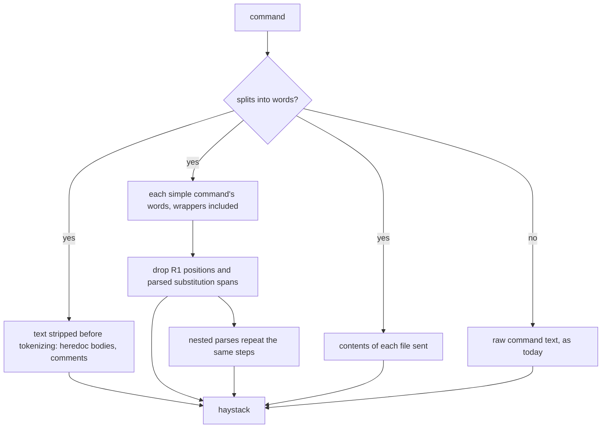

# Agent-Session Hook Path False Positive and In-Place Editors - Plan

## Goal Capsule

- Objective: an agent session on a host whose absolute paths contain a listed value can post clean text to GitHub from a scratchpad or worktree path in one try, whether it names the body file by absolute path or after a `cd` or `pushd` in the same command. A listed value in the text GitHub receives is still denied. A body file edited in place by `sed -i` or `perl -i` in the same command is denied, not scanned as it was before the edit.
- Means: stop matching words that only name a file (KTD1), follow the working directory the way the shell does (KTD5), and count in-place editors as same-command writes (KTD3).
- Authority: #84 and #87 are the spec, with the buzai lead's evidence on #84 (issuecomment-6009081223). The lead's handoff folds #87 into this work. Where this plan and an issue disagree, the issue wins and the disagreement goes on the issue as a question.
- Execution profile: `scripts/claude_leak_hook.py`, `scripts/test_claude_leak_hook.py`, and § Guarding Agent Sessions in `process/repository-standards.md`. No edits to `scripts/leak-gate.sh`, `templates/`, `pm-trial/`, or `.github/workflows/leaks.yml` (its test step already runs the fixtures).
- Stop conditions: stop and comment on #84 if a new deny fixture does not fail against the hook or stub it is meant to fail against, if narrowing would drop coverage an existing fixture holds, or if a `gh` flag in the outbound list turns out to send a path's own text.
- Finishes the work: `ce-work` on branch `84-hook-path-false-positive`, one PR whose only closing lines are "Closes #84" and "Closes #87". The operator merges. ES-policy's #76 cross-link to § Guarding Agent Sessions lands after this merges.

---

## Product Contract

### Summary

Narrow the hook's value match on a parsed command so it skips the words that only name a file or a directory: the file operands of the outbound `gh` command, redirect targets, and `cd`/`pushd` targets. Everything else the command says is still matched, including the text the parser strips before splitting words, plus the contents of every file sent. Follow `cd` to a glob and `pushd`, as the shell does, and say in the denial when a directory change could not be followed. Treat `sed -i` and `perl -i` in all their spellings as same-command writes of every file they name.

### Problem Frame

The hook (#77, from #74) matches the value list against the whole command text. On the first install host, absolute paths contain a listed value, and Claude Code's per-session scratchpad paths embed the home directory. So every outbound `gh` command that names a file under one by absolute path, or `cd`s into one first, is denied, though the path never reaches GitHub (#84). buzai workers post from such paths. The buzai lead needed three tries for one clean post. The second failed with "does not exist yet" because the `cd` target was a glob, which the hook kept as a literal directory name, so the relative body file resolved to nowhere. Separately, `sed -i … body.md && gh … --body-file body.md` is allowed: the hook reads `body.md` before `sed` changes it, so text the edit adds is never scanned (#87). Both are the mistake-shaped cases the threat model covers.

### Requirements

**What is matched (#84)**

- R1. On a parsed command, these words are not matched:
  - the operand of `--body-file`, `-F` (pr/issue), `--notes-file` and `--input` on an outbound `gh` command;
  - the rest of a `gh api -F`/`--field` value whose text after its first `=` starts with `@`, as gh reads it;
  - redirect targets and heredoc delimiters;
  - the operand of `cd` or `pushd`.
- R2. Everything else is still matched: every other word of every simple command, including wrappers and their options, all text the parser strips before splitting words (heredoc bodies and `#` comments), here-string text, and the contents of every file sent. A `$(...)`, backtick or `sh -c`/`eval` script that the hook parses is matched through its own parse, with R1 applied there. One it does not parse, past the depth limit, is matched as written.
- R3. Every fail-closed behaviour stays: an unsplittable command still matches its raw text, and a missing, unreadable, non-regular, oversized, or same-command-written body file is still denied.
- R4. A `gh` operand the hook does not exempt stays matched. Release asset operands stay matched, because gh sends each asset's file name and `#label` to GitHub.

**Following the working directory (#84 evidence)**

- R7. The hook follows a `cd` or `pushd` whose target is a glob matching exactly one directory, as the shell does, and stops following after `popd`. When it cannot follow a directory change, the "does not exist yet" denial also says that a directory change in the command could not be followed, without naming the path.

**In-place editors (#87)**

- R5. `sed` with `-i`, `-i<suffix>`, `--in-place` or `--in-place=<suffix>`, or a short-option cluster holding `i`, and `perl` with `-i`, `-i<ext>`, or a cluster holding `i` such as `-pi`, are same-command writes of every non-option operand. A body file they name, directly or through a glob, is denied with the existing "Write the file in one step, then post it in the next" message. An operand the hook cannot resolve, such as `"$F"`, denies every body file in the command the same way.

**Docs**

- R6. § Guarding Agent Sessions states what is not matched (R1), which other path words still are (with the relative-path workaround), the directory changes the hook follows (R7), the in-place editors now tracked, and the writers still not tracked.

### Scope Boundaries

- Considered and not built: matching only the text `gh` sends (the lead's lean). It would also stop matching the words of commands that feed `gh`, so `echo <value> | gh … --body-file -` and `X=<value>; gh … --body "$X"`, both denied today by the whole-command match, would pass. Evidence that would change the call: the operator or the lead accepting that loss for a narrower match.
- Considered and not built: exempting other path-shaped words, such as `git -C <path>`, `mkdir -p <path>` or `env -C <path>`, or any word that resolves to an existing path. The last would also exempt a path typed into `--body`, which GitHub receives. These stay matched, and R6 documents them.
- Considered and not built: tracking `awk -i inplace`, `ed`, `ex`, `sort -o`, `dd of=`, `truncate`, `patch`, `curl -o` and scripts that write the file. #87 names `sed` and `perl`. The rest go on the R6 list, and two are pinned as residuals (U2).
- Not built, documented: a shell expansion that produces a path at run time, such as `--body "Tested in $(pwd)"` after a `cd` into a directory holding a value. It is denied today only because the `cd` operand is in the command text. After R1 it passes, as the same expansion without a `cd` already does. R6 adds it to "What it does not see".
- Not touched: release asset contents, which the hook has never read. R6 adds them to "What it does not see".

---

## Planning Contract

### Key Technical Decisions

- KTD1. **Subtract path words; don't switch to sent-text-only.** The parsed-path haystack is the text stripped before tokenizing, plus each simple command's words before wrapper unwrapping, with R1's positions removed, plus file contents. That fixes #84's reported shapes and keeps every incidental catch the whole-command match makes today (Scope Boundaries). The raw command string leaves the haystack only on the parsed path; the unsplittable fallback keeps it (R3). Governs R1, R2, R3.
- KTD2. **The exemption list is proved from gh's source.** In gh v2.86.0, the version on the first install host, `--body-file` and `--notes-file` go through `cmdutil.ReadFile` (`pkg/cmdutil/file_input.go`, `pkg/cmd/release/create/create.go`), `--input` through `openUserFile` (`pkg/cmd/api/api.go`), and `-F` values through `magicFieldValue` (`pkg/cmd/api/fields.go`). That function reads a file only when the value after the first `=` starts with `@`, and it keeps the key. None sends the path. Release assets do send text derived from the path: `AssetsFromArgs` (`pkg/cmd/release/shared/upload.go`) names each asset by its base name and label, so asset operands stay matched (R4). The PR body cites these files at the tag. Governs R1, R4.
- KTD3. **In-place editors join `written_paths()` as "other" writes.** Every non-option operand of a matching `sed` or `perl` is treated as written. That also catches the script or `-e` text, which is harmless: it only matters when it equals a body file's path. A cluster holding `i` counts even where `i` would be read as a suffix or argument, as in perl's `-pie`, because over-denying a same-command write only asks for a two-step post. A glob operand is matched against each body file, and an unresolvable operand counts as writing every body file. Governs R5.
- KTD4. **Removal works on positions, never on text.** Path words are removed by their token position within one simple command. A parsed substitution or nested script is removed from its enclosing word by its span, as `substitutions()` locates it outside single quotes, because its own parse matches its contents. Text is never removed by searching for a path's string, so a body that quotes its own path is still matched. Governs R1, R2.
- KTD5. **Directory tracking matches the shell where it can, and says so where it can't.** `cd` and `pushd` to a glob resolve with the same single-match rule the shell applies to a `cd` argument. More than one match, a variable, `cd -` and `popd` leave the directory unknown, as today, and the denial says why. Governs R7.

### High-Level Technical Design

Directional sketch of the haystack after the change:

### Assumptions

- Narrowing by subtraction (KTD1) is acceptable in place of the lead's sent-text-only lean. The plan comment on #84 asks for sign-off on exactly this.
- The gh source at v2.86.0 is representative of the gh versions agent hosts run. The build re-reads `pkg/cmd/release/edit` and the pr/issue create paths at the same tag before citing them.

### Sequencing

U1, U2 and U4 touch different functions and can land in any order. U3 follows all three, because the doc states their final behaviour.

---

## Implementation Units

### U1. Match only non-path words (#84)

- **Goal:** an absolute body-file path, redirect target, or `cd`/`pushd` target that holds a listed value no longer denies a clean post.
- **Requirements:** R1, R2, R3, R4; KTD1, KTD2, KTD4.
- **Dependencies:** none.
- **Files:** `scripts/claude_leak_hook.py`, `scripts/test_claude_leak_hook.py`.
- **Approach:**
  1. Have `parse()` collect, at each depth, the heredoc bodies `strip_heredocs()` drops and the comment spans `strip_comments_and_continuations()` drops.
  2. Have `gh_outbound()` report the token positions of its file operands, and of `-F` values whose text after the first `=` starts with `@`, alongside the files.
  3. Build the scanned words per simple command from its words before `unwrap()`, skipping R1 positions. Redirect targets are already outside the words. Here-string text stays in, as the tokenizer leaves it a word.
  4. For a word holding a substitution, or an `sh -c`/`eval` script word, that the hook parses (depth below `MAX_DEPTH`), scan the word with those spans cut out. Past the limit, scan it whole.
  5. In `decide()`, match the stripped text, scanned words and file contents on the parsed path, and keep the raw command only in the fallback.
- **Patterns to follow:** the existing `option()` spellings (`--flag v`, `--flag=v`, `-Fv`), and the `denied` and `written` fixture tables.
- **Execution note:** add the fixtures first. Each new allow fixture fails against the hook at `cf50604` (it denies). Each new deny fixture that already passes there is shown to fail against an allow-everything stub through the harness's hook argument.
- **Test scenarios** (a directory under the sandbox whose name holds a canary, called the canary dir):
  - Allowed: `--body-file <canary dir>/clean.md` with clean contents.
  - Allowed: `cd <canary dir> && gh pr comment 1 --body-file clean.md`.
  - Allowed: `cat > <canary dir>/new.md <<'EOF'` with a clean body, then `gh pr create --body-file <canary dir>/new.md`.
  - Allowed: `--notes-file`, `--input`, `-F body=@…`, `-Fpath` and `--body-file - < …`, each with a canary-dir path and clean contents.
  - Allowed: `url="$(gh pr create --title t --body-file <canary dir>/clean.md)"`.
  - Allowed: `bash -c 'cd <canary dir> && gh pr comment 1 --body-file clean.md'`.
  - Denied: the canary inside `<canary dir>/dirty.md`, passed by absolute path.
  - Denied: the canary in `--title` or `--body` alongside a clean absolute body file.
  - Denied: the canary as the key in `gh api … -F <canary>=@clean.md`.
  - Denied: `gh api … -F body=see=@<canary dir>/clean.md`, which gh sends as written.
  - Denied: `gh issue comment 1 --body 'literal $(<canary>)'`, single-quoted substitution text.
  - Denied: a heredoc body holding the canary inside `--body "$(cat <<'EOF' … EOF)"`.
  - Denied: `gh pr comment 1 --body $'Fixed.\nIt\'s tested, part of #84.\nSeen at <canary>.'` and `gh pr comment 1 --body $(echo hi)#<canary>`, which the comment stripper cuts.
  - Denied: a here-string, `gh pr comment 1 --body-file - <<< "<canary>"`.
  - Denied: `echo <canary> | gh pr comment 1 --body-file -` and `X=<canary>; gh issue comment 1 --body "$X"`, which hold today's incidental catches.
  - Denied: `env -S "echo <canary>" | gh pr comment 1 --body-file -`, a wrapper option.
  - Denied: a release asset operand under the canary dir (R4).
  - Denied: `git -C <canary dir> status && gh pr comment 1 --body-file clean.md`, pinning a documented remaining false positive.
  - Denied: an unbalanced quote with a canary-dir path (R3 fallback).
  - Every existing `denied`, `written`, `unbounded` and residual fixture still passes unchanged.
- **Verification:** the suite passes, and the PR body shows each new fixture's failing run with its command and output.

### U4. Follow the working directory (#84 evidence)

- **Goal:** a post after `cd` or `pushd` into a scratchpad, written as a glob, finds its body file, and a directory change the hook cannot follow says so.
- **Requirements:** R7; KTD5.
- **Dependencies:** none.
- **Files:** `scripts/claude_leak_hook.py`, `scripts/test_claude_leak_hook.py`.
- **Approach:**
  1. In `parse()`, treat `pushd` like `cd`, and set the directory unknown after `popd`.
  2. Resolve a `cd`/`pushd` target holding glob characters to its single matching directory, or unknown when it matches none or several.
  3. Record when the directory became unknown, and add one constant sentence to the "does not exist yet" denial when it did.
- **Execution note:** each new allow fixture fails against the hook at `cf50604`.
- **Test scenarios:**
  - Allowed: `cd <canary dir glob> && gh pr comment 1 --body-file clean.md`, the glob matching one directory.
  - Allowed: `pushd <canary dir> && gh pr comment 1 --body-file clean.md`.
  - Denied: `pushd <dir> && gh pr comment 1 --body-file same.md`, where `<dir>/same.md` holds the canary and the session directory holds a clean `same.md`.
  - Denied, with the new sentence: `cd <glob matching two directories> && gh pr comment 1 --body-file clean.md`.
  - Denied, with the new sentence: `pushd <dir> && popd && gh pr comment 1 --body-file clean.md`.
  - The existing "cd, then a relative body file" fixture still passes.
- **Verification:** the suite passes, and the PR body shows each new allow fixture's failing run against `cf50604`.

### U2. Same-command writes by in-place editors (#87)

- **Goal:** a body file that `sed -i` or `perl -i` edits in the same command is denied.
- **Requirements:** R5; KTD3.
- **Dependencies:** none.
- **Files:** `scripts/claude_leak_hook.py`, `scripts/test_claude_leak_hook.py`.
- **Approach:**
  1. Extend `written_paths()` next to `tee` and `COPIERS`: an in-place `sed` or `perl` adds every non-option operand to the "other" written set, which `decide()` already turns into the existing deny.
  2. Keep glob operands and unresolvable operands from in-place editors, instead of dropping them. `decide()` matches a glob against each body file and treats an unresolvable one as writing them all.
- **Patterns to follow:** the `written` fixture table and its "write the file in one step" fragment.
- **Execution note:** each new deny fixture is seen failing against the hook at `cf50604`, as #87 asks.
- **Test scenarios** (each followed by `&& gh pr comment 1 --body-file reused.md`, denied with "written by the same command"):
  - `sed -i 's/a/b/' reused.md`
  - `sed -i.bak 's/a/b/' reused.md`
  - `sed --in-place 's/a/b/' reused.md` and `sed --in-place=.bak …`
  - `sed -Ei 's/a/b/' reused.md`
  - `sed -i '' 's/a/b/' reused.md` (BSD spelling)
  - `perl -i -pe 's/a/b/' reused.md`, `perl -pi -e …`, `perl -i.bak -pe …`
  - `sed -i 's/a/b/' *.md`
  - `F=reused.md; sed -i 's/a/b/' "$F"`
  - Allowed: `sed -n p reused.md && gh … --body-file reused.md`, which has no `-i`.
  - Allowed: `sed -i … other.md && gh … --body-file clean.md`, a different file.
  - Residual, allowed: `awk -i inplace … reused.md && gh …` and `sort -o reused.md reused.md && gh …`, pinned with `RESIDUAL_DOC`.
- **Verification:** the suite passes, and each new deny fixture's failing run against `cf50604` is in the PR body.

### U3. Update § Guarding Agent Sessions and the hook's docstring

- **Goal:** the standard says what the hook matches after U1, U2 and U4.
- **Requirements:** R6.
- **Dependencies:** U1, U2, U4.
- **Files:** `process/repository-standards.md`, `scripts/claude_leak_hook.py` (module docstring).
- **Approach:**
  1. In the outbound bullet, replace "The hook scans the whole command, heredocs included" with what is matched and what is not (R1, R2), and add `sed -i` and `perl -i` to the same-command writes.
  2. In "What it does not see", replace the `pushd` example with the directory changes still not followed (a variable, a glob with several matches, `cd -`, `popd`, a `cd` inside a subshell). Add the writers still not tracked, release asset contents, and run-time expansions that produce a path.
  3. State that any other path word holding a listed value is still matched (`git -C`, `env -C`, `mkdir -p`, and paths inside a script past the parse depth), and that a relative path or a separate step avoids it.
  4. Keep the residual-pin sentence in step with the new residual fixtures.
  5. In the install notes, say the copy must be refreshed for this change. The 2026-10-04 install proof stays as written.
- **Test expectation:** none, as this is prose. `node scripts/check-docs.mjs` passes.
- **Verification:** each doc claim maps to a fixture from U1, U2 or U4.

---

## Verification Contract

| Check | Command | When |
|---|---|---|
| Hook fixtures | `python3 scripts/test_claude_leak_hook.py` | U1, U2, U4 |
| Seen failing first | `python3 scripts/test_claude_leak_hook.py <hook at cf50604 or allow-all stub>` | before each new fixture meant to fail there is trusted |
| Docs | `. "$HOME/.nvm/nvm.sh" && (cd scripts && npm ci --no-audit --no-fund) && node scripts/check-docs.mjs` | U3 |
| Leak gate | `sh scripts/test-leak-gate.sh` | once, as a guard, since the list parity fixtures call it |
| CI | the `leaks.yml` conclusions on the PR head | after pushing; a local pass covers only local tool versions |

## Definition of Done

- U1–U4 merged in one PR whose only closing lines are "Closes #84" and "Closes #87", with `closingIssuesReferences` checked after opening.
- Each new fixture's failing run against `cf50604` or the allow-all stub, as its unit's execution note says, is in the PR body with its command and output. New residual fixtures, which allow at both, are shown passing.
- CI conclusions are green on the head commit.
- No abandoned-attempt code left in the diff.
