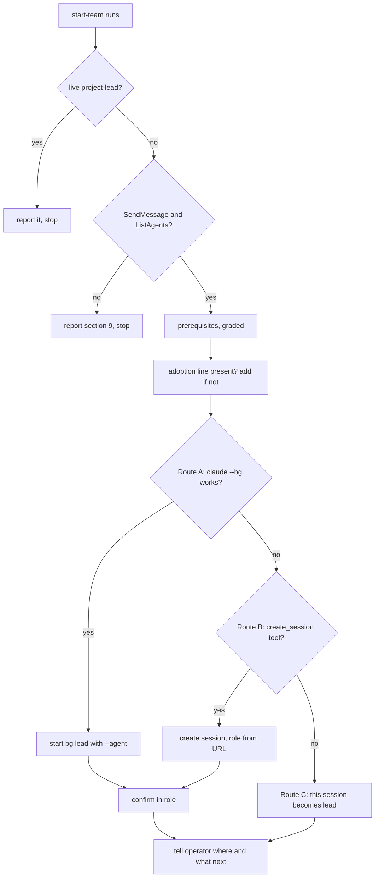

# Start an Agent Team in One Step - Plan

## Goal Capsule

- Objective: an operator, from any session in their project, says "start an agent team" and gets a lead running in its role, with the project's adoption line in place and a clear statement of where the lead is and what happens next. Where the host can't start sessions, the current session becomes the lead and says so.
- Means: a Claude Code plugin, `agent-team`, shipped from this repository. It holds a `start-team` skill and two role files that load into a whole session with `claude --agent` (D1, D3, D5).
- Authority: #101 is the spec. The five decisions below are **PROPOSED** and wait for the operator's sign-off on #101. Where this plan and a sign-off comment disagree, the sign-off wins.
- Execution profile: new `plugins/agent-team/` and `.claude-plugin/marketplace.json`; a new ADR-0002; extensions to `scripts/check-template-kit.mjs` and `.github/workflows/docs.yml`; edits to `process/agent-team-workflow.md` § 8, "Starting a team" and § 10, `ai/claude-code/README.md` and `ai/CLAUDE.md`. `README.md` only after #106 merges. No hook changes, no `templates/` changes, nothing under `pm-trial/`.
- Stop conditions: stop and comment on #101 if a role fails to load in a scratch run, if a plugin agent can't be started with `--agent` on the Claude Code version CI or the operator runs, or if any route needs a settings write the policy hook refuses.
- Finishes the work: `ce-work` on branch `101-start-team`, one PR that closes #101, opened after the operator signs off. The operator merges.

---

## Product Contract

### Summary

Ship the agent team as an installable plugin. `/agent-team:start-team` (or "start an agent team") checks the prerequisites, adds the adoption line, and starts `<project>-lead` in the lead role by the best route the host offers. The lead starts each worker in the worker role the same way. An adopter who declines the team installs nothing and gets no files.

### Problem Frame

Starting a team today is manual: read the workflow, paste the adoption line, open a session, type the opening prompt from "Starting a team", then start each worker. Each lead and worker is only as good as its first instruction, since nothing loads a role's rules. #104 wrote the steps down; #101 automates them and packages the roles. It supersedes #49's role-agents spike and § 10's "packaged lead role" item.

### Requirements

**Entry point**

- R1. The entry point runs from a session in the adopter's project and reports each missing prerequisite from § 9, with § 9's fallback where one exists.
- R2. It adds the § 8 adoption line to the project's `CLAUDE.md` or `AGENTS.md` when neither carries it, and says which file it changed. It does not commit.
- R3. It starts a session named `<project>-lead` in the lead role, pointed at the workflow document, or, where the host can't start sessions, turns the current session into the lead and says so.
- R4. It tells the operator where the lead is, how to reach it, and what it does next (the "Starting a team" walkthrough).
- R5. A second run in a project whose lead is already live reports that lead and starts nothing.

**Roles**

- R6. Lead and worker role definitions ship in the plugin and carry the workflow's rules by reference (a link to the workflow document and its sections), not by copy.
- R7. The lead starts each worker in the worker role, or hands the operator the worker's start command and handoff where it can't.

**Records and docs**

- R8. The five decisions are recorded: forms and detection in this plan, the six-layer placement in ADR-0002.
- R9. `process/agent-team-workflow.md` § 8 offers the entry point as the quick start and keeps the manual start.
- R10. The README Quickstart from #106 offers the entry point as the way to start an agent team, with the manual start as the fallback.
- R11. Every agent file the repository ships, in `templates/` or in a plugin, passes `check-template-kit.mjs`, including check 10's frontmatter check.

**Proof**

- R12. In a scratch project, on a host that can start sessions and on one that can't: the lead comes up in role, a worker it starts is in role, and the fallback works. The commands, the Claude Code version and the output go in the PR body.

### Actors

- A1. Operator: installs the plugin, runs the entry point, signs off, merges.
- A2. The invoking session: the session the operator is in when the entry point runs.
- A3. Lead: `<project>-lead`, started by A2 or, in the fallback, A2 itself.
- A4. Worker: started by A3 per ticket.

### Key Flows

- F1. Start a team
  - **Trigger:** the operator runs `/agent-team:start-team`, or asks for an agent team.
  - **Steps:** look for a live `<project>-lead` (R5); check prerequisites (R1); add the adoption line (R2); pick a route (D2) and start the lead; confirm it is up and in role; report (R4).
  - **Outcome:** a reachable lead in role, or the current session acting as lead.
- F2. Start a worker
  - **Trigger:** the operator signs off a sprint.
  - **Steps:** the lead writes the handoff, starts the worker by the same route table, checks it is reachable by name.
  - **Outcome:** a worker in role, or a start command and handoff given to the operator.

### Acceptance Examples

- AE1. Covers R3. Given a local Claude Code CLI in a trusted project, when start-team runs, then `claude agents --json` lists a background session named `<project>-lead`, and that session answers with its role.
- AE2. Covers R3. Given `claude --bg` refuses (untrusted workspace, or no CLI), and no session-start tool, when start-team runs, then the current session states it is now the lead and prints the command that starts a role-loaded lead later.
- AE3. Covers R5. Given `<project>-lead` is listed and not exited, when start-team runs again, then it reports that lead's name, state and how to reach it, and starts nothing.
- AE4. Covers R2. Given `AGENTS.md` already carries the adoption line pinned to a commit, when start-team runs, then neither file changes.

### Scope Boundaries

- Not built: Done-gate checks as code, the budget and health monitor, any hook change (#101 Out of scope).
- Not built: per-agent GitHub identities, or any role that may merge.
- Not changed: `templates/`. The kit stays free of agent-team files, so an adopter who declines gets none (D5).
- Considered and not built: start-team editing the adopter's settings to enable the plugin for every session in the project. It is a settings write, which the operator owns; the plugin README gives the command instead. Revisit if cloud workers can't load the role any other way.

#### Deferred to Follow-Up Work

- Route B proof (a host's `create_session` tool) on a cloud host without this machine's plugins installed. Built and documented here; proved where the operator has such a host (see Open Questions).

### Open Questions

- Deferred: whether a cloud session created with `create_session` sees the plugin. The bridge sessions on this machine share the user's installed plugins; a pure cloud session may not. Route B therefore loads the role by reading it from its URL (KTD4), which works either way. Prove at build on whichever cloud host the operator names; if none, the PR says Route B was not run.

---

## Planning Contract

### Decisions (PROPOSED for the operator's sign-off)

Each decision cites the scratch runs in the Appendix. All runs used Claude Code 2.1.288 on Linux, 2026-10-07.

**D1. The entry point is a skill, `start-team`, in the `agent-team` plugin.** The operator runs `/agent-team:start-team` or asks for an agent team; the skill's description triggers on that request. A script can't make the current session the lead or call a host's session tools, and a slash command is a skill in current Claude Code. Evidence: E4 (a plugin skill ran from `--plugin-dir`).

**D2. Starting a session: try three routes in order, and fall back to the current session.**

| Route | Detect | Start | Confirm |
|---|---|---|---|
| A. Local CLI | `claude` on PATH and `claude agents --json` succeeds | `claude --bg --agent agent-team:lead -n <project>-lead "<opening prompt>"` from the project root | the name appears in `claude agents --json` and in ListAgents; the lead answers a SendMessage with its role |
| B. Host session tool | a `create_session` tool is in the session's tool list (Claude Code on the web, Remote Control) | `create_session` titled `<project>-lead`, prompt telling it to load the lead role from its URL (KTD4) | ListAgents shows it; record its address, since the title becomes its ListAgents name only after a delay (E6) |
| C. Fallback | neither route works | the current session reads the lead role and acts as the lead for the rest of the session | it says so, renames itself if it can, and prints the Route A command for a role-loaded lead later |

Messaging is checked first: without SendMessage and ListAgents, the skill reports § 9's "sessions can't message each other" and stops, as § 8's walkthrough already does. Route A refuses in an untrusted workspace (E3); the skill reports why and moves to the next route rather than retrying. Evidence: E3, E5, E6.

**D3. Roles are subagent-format definitions loaded into a whole session with `--agent`.** `claude --agent <name>` runs a session as that agent: the role's prompt loads, and so do the project's `CLAUDE.md`, skills, the Agent tool and the user-scope hooks (E1, E2, E7).

| Form | What loads, when | Verdict |
|---|---|---|
| Subagent definition via `--agent` (start-time option) | role prompt for the whole session, from the first turn; `CLAUDE.md` and hooks still apply | chosen |
| Project `CLAUDE.md` section | every session in the project, lead and worker alike | rejected: workers would carry the lead's rules |
| Output style via `--settings '{"outputStyle":...}'` | replaces the coding instructions unless the style keeps them | not run; rejected because `--agent` already does this with less to configure |
| `--append-system-prompt` | text pasted into the start command | rejected: a copy, not a reference |
| Workers as subagents of the lead | inside the lead's context | rejected by #101: the team runs as sessions |

Subagent nesting matters only if workers ran as subagents, which they don't. For the record, a subagent's own tool list included Agent under 2.1.288 (E2); CE's review skills run inside each session, not inside a subagent of the lead.

**D4. Roles are an orchestration pattern over the six layers, not a layer.** Recorded in a new ADR-0002. Every layer applies inside each role's session: a role is how one session is configured, not a new kind of context. The files reuse existing formats (a Layer 2 skill, Layer 3's agent file format) without changing what those layers mean. Widening Layer 3 would blur "perspectives dispatched inside a session" with "who a whole session is". A seventh layer would claim a context-cost principle roles don't have. A new ADR, rather than an amendment, because ADR-0001's decision stands unchanged.

**D5. The files live in this repository, as a plugin, and nowhere in `templates/`.** `plugins/agent-team/` holds the plugin; `.claude-plugin/marketplace.json` at the root makes the repository a marketplace. An adopter runs `claude plugin marketplace add rmorison/engineering-standards` and `claude plugin install agent-team@engineering-standards`. One who declines installs nothing and gets no files. Evidence: E8 (marketplace add and install from a scratch HOME).

### Key Technical Decisions

- KTD1. **Re-run safety.** Before anything else, start-team reads the lead record (KTD9) and looks up `<project>-lead` in `claude agents --json --all` and ListAgents. The record matters because a Route B lead may be listed under another name for a while (E6), and a Route C lead may not have renamed itself. A live lead is reported, with the command to reach it; nothing starts (R5). An exited one is named, and start-team starts a fresh lead that resumes from the board path in the record.
- KTD2. **Project name.** The repository name from `gh repo view --json name`, else the basename of the main checkout (`git rev-parse --git-common-dir`'s parent), never the worktree directory. Route A starts the lead from that main checkout. A found session counts as this project's lead when its directory is the main checkout or one of its worktrees; a session of that name anywhere else is a collision: report and stop.
- KTD3. **Permission mode of a started session.** A background session in manual mode blocks on its first prompt with no one attached (E5). The starting session passes its own permission mode when it is `auto` or `acceptEdits` and the hook prerequisite passed; otherwise it passes the default mode and tells the operator `claude attach <id>`. It never passes `bypassPermissions`. The rule covers every start: the lead by Route A (`--permission-mode`) and Route B (`create_session`'s `permission_mode`, set explicitly rather than inherited), and each worker the lead starts (KTD7). A session started in the default mode counts as up once it is listed, even if `blocked`; its in-role check waits until the operator attaches. When the starting session can't tell its own mode, it uses the default.
- KTD4. **By reference.** The role files say what the role is and link to the workflow document's sections; they quote no rule. The workflow URL is read from the project's adoption line, so a pinned commit is honoured; the plugin's default URL applies only when there is no line. start-team passes the resolved URL in the opening prompt and in every worker start. Route B and C sessions load the role by reading `agents/lead.md` from the installed plugin, else from its GitHub URL at the plugin's own ref (its `plugin.json` version tag or marketplace ref), never the adoption line's ref, which may predate the plugin.
- KTD5. **Role files can be dispatched as subagents too.** Any session with the plugin sees `lead` and `worker` as subagents. Their descriptions say "a session role: start a session with it; never dispatch it as a subagent". Nothing enforces this.
- KTD6. **Prerequisite checks are read-only and graded.** Stop: no messaging. Warn and continue: hooks missing or not runnable (a settings entry naming a script that doesn't exist, or a command without the exit-2 guard), CE not installed, no scheduled wake (§ 9's "status?" fallback), `gh` not authenticated. start-team edits no settings and installs nothing.
- KTD7. **Workers.** The lead starts a worker with `claude --bg --agent agent-team:worker -n <PREFIX>-<role> "<handoff>"` from the main checkout; the handoff, not the start command, names the branch and worktree, as § 4's template already does. The lead asks the operator for the project's PREFIX once and records it on its board. Workers start under KTD3's permission rule.
- KTD8. **Checks.** Check 10 walks `plugins/*/agents/` as well as the kit, with its empty-walk failure per root. A new check 11 parses `.claude-plugin/marketplace.json` and each `plugins/*/.claude-plugin/plugin.json`, checks each marketplace `source` exists and each plugin's `name` matches its directory, and requires `name` and `description` frontmatter on each `skills/*/SKILL.md`. `docs.yml` adds `plugins/**` and `.claude-plugin/**` to both path filters. Links inside plugin files that an adopter follows are absolute GitHub URLs, since an installed plugin holds only its own directory.
- KTD9. **Lead record and board path.** On the first run start-team asks the operator where the lead keeps its board, log and handoffs (§ 8 step 4), offering a default outside the repository tree. It writes the answer, the route used and the lead's actual address to an untracked file under the main checkout's git common directory. Every later run reads that file, passes the board path in the opening prompt, and uses the address for KTD1.

### High-Level Technical Design



### Output Structure

```text
.claude-plugin/
  marketplace.json
plugins/
  agent-team/
    .claude-plugin/plugin.json
    README.md
    agents/lead.md
    agents/worker.md
    skills/start-team/SKILL.md
docs/engineering/adr/0002-agent-team-roles.md
```

### Assumptions

- The operator wants the plugin route (D5) over copying files into projects; #101 asks only that decliners get no files.
- Adopters run Claude Code at a version with `--agent`, `--bg` and plugin agents; 2.1.288 has all three. The plugin README names the version it was proved on.
- The marketplace name is `engineering-standards`, from the repository name.

### Risks & Dependencies

- `--bg`, `claude agents` and plugin `--agent` names are recent CLI surfaces; flags can move between versions. Each claim names the version it was seen on (`docs/solutions/best-practices/a-local-pass-proves-only-the-tool-versions-it-ran-on.md`).
- A bridge or cloud session's title becomes its ListAgents name only after a delay (E6), and other hosts may not apply it at all. Workers' pings must reach the lead, so the lead records its own address on its board and puts it in every handoff.
- #106 restructures `README.md`; U7 waits for its merge and a rebase.

---

## Implementation Units

### U1. Plugin and marketplace manifests

- **Goal:** the repository is a marketplace offering `agent-team`.
- **Requirements:** R6, D5.
- **Dependencies:** none.
- **Files:** `.claude-plugin/marketplace.json`, `plugins/agent-team/.claude-plugin/plugin.json`, `plugins/agent-team/README.md`.
- **Approach:** the README gives the install and uninstall commands, the pin (`marketplace add` with a ref), the Claude Code version proved on, and links the workflow document by absolute URL.
- **Test scenarios:**
  - In a scratch HOME, `claude plugin marketplace add <worktree path>` then `claude plugin install agent-team@engineering-standards` succeeds and `claude plugin list` shows it enabled.
  - The same from `rmorison/engineering-standards` at the PR branch, once pushed.
- **Verification:** both installs succeed; nothing is written outside the scratch HOME.

### U2. Lead and worker roles

- **Goal:** two role files that make a session the lead or a worker, by reference (KTD4, KTD5).
- **Requirements:** R6, R7.
- **Dependencies:** U1.
- **Files:** `plugins/agent-team/agents/lead.md`, `plugins/agent-team/agents/worker.md`.
- **Approach:**
  1. Frontmatter: `name` (`lead`, `worker`, no colon), the KTD5 description.
  2. Lead body: you are `<project>-lead`; read the workflow at the URL in the opening prompt, § 1-§ 9; your first moves are "Starting a team"; start workers per KTD7 and D2's table; quiet mode per § 6.
  3. Worker body: your handoff is your first message; § 4's rules apply; ping the lead at the address in the handoff.
- **Test scenarios:**
  - `claude -p --plugin-dir plugins/agent-team --agent agent-team:lead` in a scratch project names its role and the workflow sections it will follow.
  - The same for `worker`, given a canary handoff.
  - A grep of both bodies finds no rule text copied from the workflow document; only links and section names.
- **Verification:** both roles come up in role; check 10 passes on them (U4).

### U3. The start-team skill

- **Goal:** F1 end to end (R1-R5, D2, KTD1-KTD3, KTD6).
- **Requirements:** R1, R2, R3, R4, R5.
- **Dependencies:** U2.
- **Files:** `plugins/agent-team/skills/start-team/SKILL.md`.
- **Approach:** the skill is instructions plus shell the session runs; it adds no new runtime (`docs/solutions/tooling-decisions/adopter-checks-ship-in-the-adopters-ecosystem.md`). It follows the flowchart above. The adoption line is the exact § 8 text; a line in either file linking the workflow, at any ref, counts as present. With neither file, it creates `CLAUDE.md`. The opening prompt is § 8's, with the resolved workflow URL and the lead's address rule (Risks).
- **Execution note:** prove each route in a scratch project before writing its prose (E-runs, Appendix).
- **Test scenarios:**
  - Covers AE1. Trusted scratch project with the plugin installed: a background `<project>-lead` appears, answers a SendMessage with its role, and the report names `claude attach <id>`.
  - Covers AE2. `claude --bg` refused (untrusted scratch directory): the current session says it is the lead and prints the Route A command.
  - Covers AE3. Run twice: the second run reports the first lead and starts nothing.
  - Covers AE3. A Route C lead, then a second run: the lead record finds it, and nothing starts.
  - Invoked from a worktree of the project: the lead starts from the main checkout, and a second run from the main checkout reports it rather than calling it a collision.
  - Invoking session in the default mode: the lead is reported as started and waiting for `claude attach <id>`; start-team does not wait on a SendMessage answer.
  - Board path: the first run asks for it and records it; a run after the lead exited passes the same path to the fresh lead.
  - Covers AE4. Adoption line pinned in `AGENTS.md`: no file changes.
  - Neither `CLAUDE.md` nor `AGENTS.md`: `CLAUDE.md` is created with the line.
  - Hooks missing in a scratch HOME: the report warns and names § 9.
  - Messaging tools absent: the report stops with § 9's text.
- **Verification:** every scenario above recorded with its output in the PR body.

### U4. Checks for plugin files

- **Goal:** a plugin agent, skill or manifest that Claude Code would skip fails CI (KTD8).
- **Requirements:** R11.
- **Dependencies:** U1, U2, U3.
- **Files:** `scripts/check-template-kit.mjs`, `.github/workflows/docs.yml`.
- **Approach:** extend check 10's roots; add check 11; update the header comment, which numbers each check and says why it exists. Read files the way Claude Code does (`docs/solutions/best-practices/a-check-must-read-a-file-the-way-its-consumer-does.md`).
- **Execution note:** see each fixture fail before trusting the check (`docs/solutions/best-practices/prove-a-check-fails-before-trusting-it-passes.md`).
- **Test scenarios:**
  - A plugin agent with no frontmatter fails check 10, naming the file.
  - A plugin agent whose `name` contains a colon fails.
  - An empty `plugins/agent-team/agents/` fails as an empty walk.
  - A `marketplace.json` that doesn't parse, or whose `source` doesn't exist, fails check 11.
  - A `plugin.json` whose `name` differs from its directory fails.
  - A `SKILL.md` without `description` fails.
  - The shipped files pass.
- **Verification:** each planted defect fails with its message; CI on the PR head runs both jobs on a JSON-only change.

### U5. ADR-0002 and the architecture docs

- **Goal:** record D4 and link it where the layers are described.
- **Requirements:** R8.
- **Dependencies:** none.
- **Files:** `docs/engineering/adr/0002-agent-team-roles.md`, `ai/claude-code/README.md`, `ai/CLAUDE.md`.
- **Approach:** ADR-0001's header and sections (Decision, Context, Consequences). ADR-0001 is not edited. `ai/claude-code/README.md` gets a row in "Where things live" and the plugin in Getting started step 5; `ai/CLAUDE.md` one line under Architecture.
- **Test expectation:** none -- documentation; `check-docs.mjs` covers links and anchors.
- **Verification:** `check-docs.mjs` passes.

### U6. The workflow document

- **Goal:** § 8 offers the entry point first and keeps the manual start (R9).
- **Requirements:** R9.
- **Dependencies:** U3.
- **Files:** `process/agent-team-workflow.md`.
- **Approach:**
  1. § 8 "To adopt": install the plugin and run start-team as the quick start; the existing steps stay as the manual start.
  2. "Starting a team": one paragraph on what start-team does, then the existing opening prompt as the manual route.
  3. § 8 "To decline or stop": add uninstalling the plugin.
  4. § 10: remove the "packaged lead role" item, which this delivers.
- **Test expectation:** none -- documentation.
- **Verification:** `check-docs.mjs` passes; a reader can start a team from § 8 alone by either route.

### U7. README Quickstart

- **Goal:** the Quickstart's "Run an agent team" step offers start-team, manual start as fallback (R10).
- **Requirements:** R10.
- **Dependencies:** #106 merged; rebase first.
- **Files:** `README.md`.
- **Approach:** edit only the step #106 created; link § 8 for the manual route.
- **Test expectation:** none -- documentation.
- **Verification:** `check-docs.mjs` passes on the rebased head.

### U8. Proof runs

- **Goal:** R12 on two hosts, recorded.
- **Requirements:** R12.
- **Dependencies:** U1-U3.
- **Files:** none in the repository; results go in the PR body.
- **Approach:** a scratch project inside a trusted directory, plugin installed from the branch. Check that a worker the lead starts is not left `blocked` when the lead runs in `auto` or `acceptEdits`. Host that can start sessions: this machine's CLI (Route A). Host that can't: a session whose `claude --bg` is refused (Route C). Route B where a cloud host is available (Open Questions). For each: lead in role, a worker it starts in role, and the fallback. Stop every scratch session afterwards.
- **Test expectation:** none -- this unit is the proof.
- **Verification:** the PR body carries each command, its output and the Claude Code version.

---

## Verification Contract

| Gate | Command | Applies to |
|---|---|---|
| Docs | `. "$HOME/.nvm/nvm.sh" && (cd scripts && npm ci --no-audit --no-fund) && node scripts/check-docs.mjs` | U1-U7 |
| Kit and plugin | `node scripts/check-template-kit.mjs` | U2, U4 |
| Planted defects | each U4 fixture, seen to fail | U4 |
| Scratch proof | U8's runs, version recorded | U2, U3, U8 |
| CI | conclusions green on the pushed head | all |
| Closing references | `closingIssuesReferences` is exactly [101] | PR |

## Definition of Done

- Every R1-R12 is met and each AE has a recorded run. R10 is met only after #106 merges and this branch rebases onto it; until then the PR is not ready to merge.
- The operator's sign-off comment is on #101 before the build starts.
- The PR description opens with At a glance; CE plan and code review dispositions are in its body.
- No scratch session, scratch plugin install or scratch file is left on the machine or in the diff.

---

## Appendix

### Scratch runs (Claude Code 2.1.288, Linux, 2026-10-07)

- E1. `claude -p --agent team-lead` with a project agent file carrying a canary: the session gave the role canary and the `CLAUDE.md` canary, and listed Agent, Skill, SendMessage and ListAgents among its tools.
- E2. A main session dispatched a `helper` subagent; the subagent's reply listed Agent among its own tools (self-reported).
- E3. `claude --bg` in a directory that was never trusted: "Workspace not trusted. Run `claude` in <dir> once and accept the trust prompt, then retry." Inside a trusted tree it started.
- E4. `--plugin-dir` with a scratch `agent-team` plugin: `--agent agent-team:lead` gave the plugin role's canary; `/agent-team:start-team` ran the plugin skill.
- E5. `claude --bg --agent team-lead -n scratchproj-lead`: listed by `claude agents --json` (kind background) and by ListAgents; banner showed `@team-lead`; it printed its canary. Under a model without auto mode it fell to manual mode and showed state `blocked` while idle.
- E6. A SendMessage from this session reached `scratchproj-lead`, which replied with its canary by SendMessage. This session was started by `create_session` with title ES-roles. About a minute in, ListAgents still gave it the bridge-generated name; about an hour later it listed it as ES-roles.
- E7. `--agent team-lead --permission-mode bypassPermissions` asked to run `gh pr merge` on a canary repository: the user-scope policy hook blocked it.
- E8. In a scratch HOME: `claude plugin marketplace add <dir>` and `claude plugin install agent-team@es-scratch --scope user` succeeded; the settings written were the scratch HOME's.
