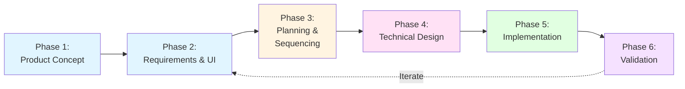

# Feature Development Workflow

*Spec-driven agile development for feature work*

## Overview

This workflow defines the process for **feature work driven by product and business stakeholders**. It follows a spec-driven approach: **Intent → Spec → Plan → Execute → Validate**. Each phase produces lightweight documentation that serves as the source of truth for the next phase.

**For engineering-driven work** (bugs, tech debt, infrastructure, security), see [Technical Work Workflow](./technical-work-workflow.md).

### Workflow Diagram



## Guiding Principles

1. **Specifications before code** - Clarify intent and surface questions early
2. **Small, scoped changes** - Break work into reviewable increments
3. **Continuous validation** - Test against specs throughout development
4. **Document decisions** - Capture context and rationale, not implementation details
5. **Stay lightweight** - Only create documentation that provides value

---

## Phase 1: Product Concept

**Goal**: Articulate the problem and opportunity

**Process**: Identify the problem, define target users, articulate value proposition, consider constraints

**Output**: `docs/product/concepts/feature-name.md`

**Time**: Hours to days

**Example**:
```markdown
# Feature Concept: User Notification System

## Problem
Users miss important account activities because we only show updates
when they log in. Critical events go unnoticed for days.

## Opportunity
Real-time notifications via email, SMS, and mobile push to keep users
informed of important account activities.

## Value
Increase user engagement and reduce security incidents by notifying
users of suspicious activity immediately.

## Constraints
- Must respect user notification preferences
- High signal-to-noise ratio required to avoid notification fatigue
```

---

## Phase 2: Product Requirements & UI Design

**Goal**: Define what to build and how users interact with it

**Process**:
1. Write product spec: intent, functional/non-functional requirements, success criteria
2. Design UI/UX: user flows, wireframes (HTML mockups preferred), interaction patterns
3. Define acceptance criteria: behaviors, edge cases, performance targets

**Output**: `docs/product/features/feature-name.md` with wireframes

**Time**: Days to a week

**Checkpoint**: Review spec with stakeholders before proceeding

**Example**:
```markdown
# Feature Spec: User Notification System

## Intent
Deliver timely notifications to users about important account activities.

## Functional Requirements
- FR1: Support email, SMS, and mobile push notification channels
- FR2: Users configure notification preferences per event type
- FR3: Notifications include event details, timestamp, and action links
- FR4: Users can snooze or disable specific notification types

## Non-Functional Requirements
- NFR1: Notification delivery latency <30 seconds from event
- NFR2: 99.9% delivery success rate for high-priority notifications
- NFR3: Support 1M+ active users with notification preferences

## UI Design
[HTML mockup: Notification preferences screen]
[HTML mockup: Notification message templates]

## Success Criteria
- 70% of users enable at least one notification channel
- <2% unsubscribe rate from notification channels
- 40% click-through rate on notification action links
```

---

## Phase 3: Project Planning & Sequencing

**Goal**: Break work into implementable increments with clear dependencies

**Process**:
1. Break down work into tasks (components, data models, APIs, infrastructure)
2. Estimate using story points (Fibonacci 1-13 scale, see [Project Planning Standards](./project-planning-standards.md))
3. Sequence tasks (identify dependencies, parallel tracks, critical path)
4. Identify risks (technical unknowns, external dependencies, constraints)

**Output**: `docs/planning/feature-name-implementation.md`

**Time**: Hours to days

**For detailed guidance on estimation, task breakdown, and risk management, see [Project Planning Standards](./project-planning-standards.md).**

**Example**:
```markdown
# Implementation Plan: User Notification System

Total: 30 story points

## Task Breakdown
- Define notification data schema (2 pts)
- Implement email notification channel (3 pts)
- Implement SMS notification channel (3 pts)
- Implement push notification channel (5 pts)
- Create notification routing service (5 pts)
- Build notification preferences API (3 pts)
- Implement preferences management UI (8 pts)
- End-to-end testing and validation (3 pts)

## Dependencies
- All notification channels depend on schema
- Routing service depends on channels
- UI depends on preferences API
- E2E testing depends on all components

## Risks
- SMS costs may exceed budget → implement rate limiting
- Push notification registration complexity → start with email/SMS MVP
- Notification fatigue if too noisy → conservative defaults
```

---

## Phase 4: Technical Design & Architecture

**Goal**: Specify how to implement the solution

**Process**:
1. Design system: components, data models, API contracts, data flow
2. Consider alternatives: what else was considered, why this approach, tradeoffs
3. Document key decisions: ADRs for significant technical choices
4. Define interfaces: API schemas (`.proto`, OpenAPI), service contracts

**Output**:
- `docs/engineering/designs/feature-name.md`
- `docs/engineering/adr/NNNN-decision-name.md` (when applicable)
- API schemas

**Time**: Days to a week

**Checkpoint**: Review design with technical team, validate against product spec

**Example**:
```markdown
# Technical Design: User Notification System

## Components
1. Event Processor Service - consume application events, trigger notifications
2. Notification Router Service - route to channels based on user preferences
3. Notification Preferences API - REST service for user preference CRUD
4. Channel Handlers - email, SMS, push notification implementations

## Data Models
[Schema definitions for NotificationPreference, NotificationEvent, DeliveryReceipt]

## Data Flow
App Events → Event Processor → Notification Router → Channel Handlers → External Services (SendGrid, Twilio, FCM)

## Key Decisions
- Use message queue vs direct calls (ADR-001): enables retry, handles bursts
- Separate routing from channel delivery: independent scaling, easier to add channels

## Testing Strategy
- Unit: preference matching logic with various configurations
- Integration: end-to-end notification flow with mock external services
- Load: 10k notifications/min sustained throughput
```

---

## Phase 5: Implementation

**Goal**: Write code that implements the spec

**Process**:
1. Work from specs - technical design is source of truth
2. Small, scoped PRs - focused on single components, include tests
3. Continuous validation - run tests, compare behavior against spec
4. Code review - matches spec? sufficient tests? docs current?

**Artifacts**: Working code, tests, updated docs (if needed)

**Time**: Per implementation plan story point estimates

---

## Phase 6: Validation & Iteration

**Goal**: Verify implementation meets requirements and success criteria

**Process**:
1. Test against acceptance criteria - functional, non-functional, edge cases
2. Validate with users (when applicable) - solves problem? actual UX?
3. Measure success criteria - collect metrics, compare actual vs expected
4. Iterate - capture feedback, identify improvements, update specs

**Artifacts**: Test results, user feedback, metrics, updated specs or new concepts

---

## Workflow Variations

### Small Features
For very small features (1-2 points), a detailed PR description may suffice:
- **What**: Brief feature description
- **Why**: User/business value
- **How**: Implementation approach (if non-obvious)
- **Testing**: How verified

Use judgment - if the feature needs stakeholder review or has UI implications, write a lightweight spec.

### Experiments or Spikes
For exploratory technical work, write a lightweight experiment brief:
- **Question**: What are we trying to learn?
- **Approach**: How will we explore this?
- **Success**: What outcome answers the question?
- **Timebox**: How long before deciding?

Document findings afterward to inform future decisions.

### Non-Feature Work
For bugs, tech debt, infrastructure, and security work, see [Technical Work Workflow](./technical-work-workflow.md).

---

## Anti-Patterns

- **Big upfront design** - Don't write exhaustive specs for uncertain features
- **Skipping specs entirely** - "Just coding" leads to rework and misalignment
- **Stale specs** - Update specs when implementation diverges, or remove them
- **Process for process** - If a phase adds no value, skip it (but be intentional)

---

## Integration with AI Development

This workflow works well with AI-assisted development:
- Specs provide context for AI agents
- Small scopes reduce AI errors
- Validation catches AI-generated bugs
- Iteration is cheaper with AI

When using AI coding tools:
- Provide product spec and technical design as context
- Generate code in small, testable increments
- Always review and test AI-generated code
- Update specs when AI reveals better approaches
