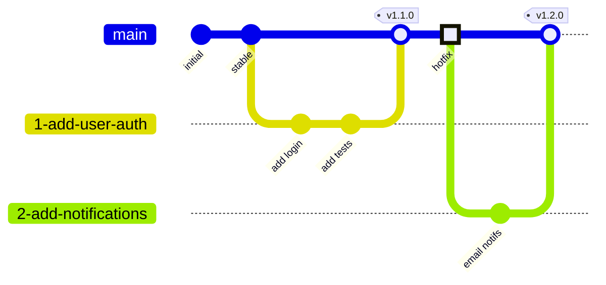

# Git Branching Strategy

*Lightweight branch management for agile development*

## Overview

This strategy follows **[GitHub Flow](https://docs.github.com/en/get-started/using-github/github-flow)** - a simple, branch-based workflow that supports continuous delivery.

**Core principle**: `main` branch is always deployable. All work happens in feature branches, merged via pull requests after review.

> **When compound-engineering is in use**: see [`process/compound-engineering-integration.md`](./compound-engineering-integration.md) for branch-naming carve-outs (CE's `lfg`/`ce-work` autonomous flows) and the AI-review discipline that complements branch protection.

### Workflow Diagram



## Guiding Principles

1. **Main is always deployable** - Never commit broken code directly to `main`
2. **Branch from main** - All work branches from and merges back to `main`
3. **Issue-driven development** - Create GitHub issues, branch from them
4. **Small, focused branches** - One feature/fix per branch, short-lived (hours to days)
5. **Merge via pull requests** - Always use PRs for review and CI validation

---

## Branch Types

### `main` - The Production Branch

**Purpose**: Represents deployable production-ready code

**Rules**:
- Always deployable and passing all tests
- Protected - requires pull request + review to merge
- No direct commits (except initial setup)
- Tagged with version numbers for releases

### Feature Branches

**Purpose**: Develop features, fix bugs, implement technical work

**Naming Convention**: Use GitHub's auto-generated branch names from issues

**Format**: `{issue-number}-{slugified-issue-title}`

**Examples**:
- Issue #1: "Write branching strategy standards doc" → `1-write-branching-strategy-standards-doc`
- Issue #42: "Fix login timeout error" → `42-fix-login-timeout-error`
- Issue #137: "Add email notifications" → `137-add-email-notifications`

**How to create**: Use GitHub's "Create a branch" feature directly from the issue

**Type classification**: Use issue labels instead of branch name prefixes. [`process/issue-tracking.md`](./issue-tracking.md#label-strategy) defines the set. `feature` and `refactor` are not in it: use `enhancement` and `tech-debt`.

**Lifecycle**:
1. Create issue, assign labels
2. Create branch from issue (GitHub auto-names it)
3. Develop and commit iteratively
4. Open pull request when ready, naming the issue in the body (`Closes #<n>` or `Part of #<n>`, see step 6)
5. Merge to `main` when approved and CI passes
6. GitHub closes the issue only through one of these routes, and none is automatic:
   - **PR body**: a closing keyword for the issue (`Closes #<n>`) in the body of a pull request that targets the default branch, acting when it merges. A pull request that is only part of an issue says `Part of #<n>` and carries no closing keyword before the issue number anywhere, quoted text included.
   - **Development sidebar**: the issue linked to a pull request into the default branch, acting when it merges.
   - **Commit message**: a closing keyword in a commit message, acting when that commit reaches the default branch by any route, including a stacked pull request's base merging or a direct push. Under squash merge it survives only if the squash commit message keeps the commit messages (the repository's squash-message setting, or the merger's edit at merge time), and a keyword in the PR title or a body included in the squash message acts the same way.

   Before merge, check the body with `gh pr view <pr> --json closingIssuesReferences --jq '[.closingIssuesReferences[].number]'` and search the branch's commit messages; see [A closing keyword anywhere in a pull request body closes the issue](../docs/solutions/best-practices/a-closing-keyword-anywhere-in-a-pr-body-closes-the-issue.md) for both checks. GitHub deletes the branch only if the repository's "Automatically delete head branches" setting is on ([Branch Protection Configuration](#branch-protection-configuration))

---

## Workflow

For detailed mechanics, see [GitHub Flow documentation](https://docs.github.com/en/get-started/using-github/github-flow).

### Starting Work

1. Create or find GitHub issue
2. Click "Create a branch" from the issue
3. Pull the branch locally and start working

### Keeping Branches Current

If `main` advances while working, sync your branch:

```bash
git fetch origin
git rebase origin/main  # or: git merge origin/main
git push --force-with-lease  # if rebased
```

Choose rebase (cleaner history) or merge (preserves history) and use consistently per project.

**Force push safety**:
- Always use `--force-with-lease` instead of `--force` (prevents overwriting others' work)
- Never force push to `main` (should be prevented by branch protection)
- Coordinate with teammates if sharing a feature branch

### Merging to Main

1. Open pull request, naming the issue in the body (`Closes #<n>` or `Part of #<n>`)
2. Get review approval and passing CI
3. **Squash and merge** (recommended) - creates clean single commit per issue
4. The issue closes only if a pull request into the default branch carries a closing keyword for it or is linked to it, or a commit message on `main` does, and the branch is deleted only with the auto-delete setting on (see [Feature Branches](#feature-branches), Lifecycle step 6)

**Note on squash merging**: When you squash and merge, all individual commits on the branch are combined into a single commit. This means:
- Individual commit messages are preserved in the squashed commit body under GitHub's default squash-message setting; another setting, or an edit at merge time, can drop them (and any closing keywords in them, see [Lifecycle](#feature-branches) step 6)
- The PR title is what GitHub builds the final commit message summary from (see [PR Title](#pr-title))
- Write clear, incremental commits during development for your own tracking
- Write the PR title to the format in [Commit Messages](#commit-messages); [PR Title](#pr-title) covers exactly how it reaches `main`

---

## Commit Messages

### Format

```
<type>: <summary in present tense>

[optional body: context, reasoning, references]
```

Scope is optional. When it tells the reader something the summary does not, add it to the type:

```
<type>(<scope>): <summary in present tense>
```

### Types

Common types (simplified subset of [Conventional Commits](https://www.conventionalcommits.org)):

- `feat:` - New feature
- `fix:` - Bug fix
- `refactor:` - Code restructuring
- `docs:` - Documentation changes
- `test:` - Test additions/updates
- `perf:` - Performance improvements
- `chore:` - Build, dependencies, tooling
- `ci:` - CI/CD pipeline changes

### Examples

```
feat: add email notification preferences

Implements notification preferences UI and API endpoint
for users to configure email notification settings.

Refs: #137, docs/engineering/designs/notification-system.md
```

```
fix: prevent login timeout on slow connections

Increase timeout from 5s to 30s and add retry logic.

Fixes: #42
```

### Guidelines

- Use present tense: "add feature" not "added feature"
- Keep the whole first line to 72 characters or fewer, counting any `type(scope): ` prefix. That is [`gitlint`](https://jorisroovers.com/gitlint/latest/rules/builtin_rules/#t1-title-max-length)'s default `title-max-length`, and it sits under the [Linux kernel](https://www.kernel.org/doc/html/latest/process/submitting-patches.html)'s ceiling of no more than 70-75 characters for a patch summary. Git's own documentation suggests 50 for the whole summary line; this standard relaxes that to 72 to leave room for the type prefix. Note that in the widely cited 50/72 pair the 72 is the body wrap width, not a subject limit
- The limit applies to the subject as authored. GitHub appends ` (#<number>)` when it squashes, and that suffix is not counted against it
- Reference issue number and specs when applicable
- Explain why, not what (code shows what)

See [Conventional Commits](https://www.conventionalcommits.org) for more details.

---

## Pull Request Guidelines

### PR Title

A PR title must satisfy [Commit Messages](#commit-messages) above. Squash and merge is the recommended default, and GitHub builds the squash subject from the PR title, appending ` (#<number>)` to it, so a PR title that ignores the commit format lands on `main` as a commit that violates it:
- ✅ `feat: add user notification preferences UI`
- ✅ `fix: prevent login timeout on slow connections`
- ❌ `Add user notification preferences UI` (no type prefix)
- ❌ `Updates` (too vague, and no type prefix)

### PR Description

Every pull request description opens with [At a glance](#at-a-glance), for someone who uses the repository, then the sections for contributors:

```markdown
## At a glance

**Problem.** What was wrong or missing, for a user (125 words or fewer)

**Spec drift.** What changed after the issue (or plan), why, and who decided (50-100 words), or: None.

**Solution.** How this change solves it, in plain language (125 words or fewer)

## What
Brief description of the change

## Why
The technical reason for the change, for contributors (the user-facing problem is in At a glance); link the issue or spec

## How
Implementation approach (reference design doc if applicable)

## Testing
How this was tested (unit tests, manual testing, edge cases)

## Related
<!-- Keep one line: the first closes the issue on merge, the second leaves it open -->
- Closes #123
- Part of #123
- Spec: docs/engineering/designs/feature-name.md (if applicable)
```

#### At a glance

The top of the description, before any technical detail, written for someone who uses the repository rather than contributes to it. The author writes it when opening the pull request and brings it up to date before merge, Spec drift especially, since a plan usually changes during review. It applies to every pull request. Three sections, each with a hard word limit:

- **Problem**, 125 words or fewer: what was wrong or missing, and why it matters to that reader. No drift here.
- **Spec drift**, 50 to 100 words: what changed in the plan, meaning what was added, cut or changed after the issue was filed (or, with no issue, after the plan was written), why, and who decided. When the change matches the request, the section is exactly **None.**
- **Solution**, 125 words or fewer: how this pull request solves the problem. Explain the mechanism in plain language, meaning what it does and where it steps in, so the reader understands how it works. Don't restate the problem from the other side ("merges are now blocked").

**Plain language in At a glance.**

- Say what a check does, not its name: "another project ran 62 test cases through it", not "the adopter test passed".
- Spell out an issue's subject the first time it is cited: "#76, a guard that keeps agent sessions from merging".
- No file names, command syntax, commit hashes or internal labels (decision numbers, finding severities) unless the reader would type them.
- Say who decided by role, not by name: for example the operator, a lead or a reviewer.
- Count the words. The limits are what keep the section readable at a glance.

**Example.** An At a glance for the description of [#90](https://github.com/rmorison/engineering-standards/pull/90), the agent policy hook, written after it merged; #90 predates this convention.

> **Problem.** AI agent sessions all act on GitHub as the operator's own account, the operator being the person who signs off on their work and merges it. Nothing technical stopped a session from merging its own pull request or loosening a repository setting so a check would pass. The rule "the operator merges; agents never do" lived only in written instructions, and an agent keen to finish its job could break it by mistake. Because every session looks like the operator to GitHub, GitHub's own protection rules can't tell an agent from the operator.
>
> **Spec drift.** The original request (#76, a guard that keeps agent sessions from merging or changing settings) asked for the guard only in "worker" sessions, the ones that build changes. The operator signed off on covering every agent session instead, as the lead of buzai, another project using these standards, had suggested: a session that lost its "worker" label would go unguarded. The operator also signed off on refusing saves straight to a repository's main line, which the request hadn't named, with a switch only a person can turn on for repositories used as notebooks.
>
> **Solution.** The change adds a guard that runs before every command or GitHub action an agent session takes, so it steps in before anything reaches GitHub. The guard reads the command and recognises three kinds of action, in the many forms each can be written: merging a pull request, changing a repository's settings or protection rules, and saving straight to a repository's main line. It refuses those with a message saying what was refused and that the operator does it in GitHub's web pages. Everything else goes through untouched: in another project's 62 test cases, no everyday work was refused. The operator still merges from the web pages, or from a terminal outside the AI tool, where the guard doesn't run.

### PR Size

**Target**: 200-400 lines of changes (excluding generated code)

**Why**: Smaller PRs = faster, better reviews

**How**: Break large features into multiple issues/PRs, use feature flags if needed

---

## Release and Versioning

### Semantic Versioning

Follow [semver](https://semver.org): `MAJOR.MINOR.PATCH`

- **MAJOR**: Breaking changes
- **MINOR**: New features (backward compatible)
- **PATCH**: Bug fixes (backward compatible)

### Tagging Releases

```bash
git checkout main
git pull origin main
git tag -a v1.2.0 -m "Release 1.2.0: Add notification system"
git push origin v1.2.0
```

Maintain `CHANGELOG.md` or use [GitHub Releases](https://docs.github.com/en/repositories/releasing-projects-on-github).

---

## Common Scenarios

### Hotfix for Production Bug

1. Create urgent issue with `bug` and `priority:high` labels (defined in [`process/issue-tracking.md`](./issue-tracking.md#label-strategy))
2. Branch from `main`: `45-fix-critical-auth-bug`
3. Fix with minimal changes, add test
4. Expedited PR review and merge
5. Tag as patch release (e.g., v1.2.1), deploy immediately

### Long-Running Feature

**Problem**: Feature takes 2+ weeks, don't want stale branch

**Solution**:
- Break into multiple issues/sub-features
- Each gets own branch and PR (keep each under 1 week)
- Use feature flags to hide incomplete UI
- Merge small increments continuously

### Experimental Work

1. Create issue labeled `spike` (defined in [`process/issue-tracking.md`](./issue-tracking.md#label-strategy))
2. Document in `docs/experiments/feature-name.md`, the location [`process/documentation-standards.md`](./documentation-standards.md#optional-directories-add-as-needed) declares
3. Develop on branch, timebox the exploration
4. **If successful**: Clean up, merge to `main`
5. **If unsuccessful**: Record findings in the brief, close the issue without merging

---

## Anti-Patterns

### ❌ Long-Lived Feature Branches

**Problem**: Diverge from `main`, painful merges, integration issues

**Solution**: Break work into smaller increments, merge frequently (max 1 week per branch)

### ❌ Direct Commits to Main

**Problem**: Skips review and CI validation

**Solution**: Protect `main` branch, require PRs (configure in repository settings)

### ❌ Large, Multi-Purpose PRs

**Problem**: Hard to review, slow feedback, risky merges

**Solution**: One issue per PR, use feature flags for incremental merges

### ❌ Branches Without Issues

**Problem**: No context, hard to track, unclear purpose

**Solution**: Create issue first (even for small fixes), use issue-based branching

**Exception**: When compound-engineering is in use, `lfg` and `ce-work` autonomous flows may produce topic-style branches (`feat/...`, `fix/...`) without a parent issue. File an issue retroactively only if review surfaces something worth tracking. See [`process/compound-engineering-integration.md`](./compound-engineering-integration.md).

### ❌ Stale Branches Not Synced

**Problem**: Merge conflicts, integration problems discovered late

**Solution**: Rebase/merge from `main` regularly (daily for active branches)

---

## Integration with AI Development

This strategy works well with AI-assisted development:

**AI benefits from clear context**:
- Issue descriptions provide full context for AI agents
- Branch names tied to issues help AI understand intent
- Specs linked in issues give AI complete requirements

**Best practices with AI tools**:
- Provide issue description and specs as context to AI
- Keep branches focused so AI maintains context
- Generate code in small increments (commit frequently)
- Always review and test AI-generated code before pushing
- Document AI-generated approaches in commit messages

**Example**: When asking AI to implement a feature, reference the issue number and include links to relevant specs from `docs/` directory.

---

## Branch Protection Configuration

Configure these rules for `main` branch in repository settings:

- ✅ Require pull request before merging
- ✅ Require at least 1 approval
- ✅ Require status checks to pass (CI/tests)
- ✅ Require branches to be up to date before merging
- ✅ Delete head branches automatically after merge ("Automatically delete head branches" under General settings). Without it, merged branches stay until someone deletes them; the Lifecycle's branch deletion depends on this setting

**When compound-engineering is in use**: the "Require at least 1 approval" rule has a process-level complement — the AI-review **discipline** (`ce-code-review` + `ce-doc-review`) defined in [`process/compound-engineering-integration.md`](./compound-engineering-integration.md). The discipline is process-level, not enforced by repo configuration; the standards' approval rule re-engages when a human reviewer onboards.

See [GitHub branch protection](https://docs.github.com/en/repositories/configuring-branches-and-merges-in-your-repository/managing-protected-branches) for setup details.

---

## When to Deviate

This strategy assumes:
- Continuous delivery model
- Small to medium team
- Web services / cloud deployments

**Consider alternatives if**:
- Multiple production versions maintained simultaneously → Use [GitFlow](https://nvie.com/posts/a-successful-git-branching-model/)
- Regulated deployments with long certification cycles → Add release branches
- Very large team (100+ developers) → May need coordination branches

Document deviations and rationale in project README.

---

## References

- [GitHub Flow](https://docs.github.com/en/get-started/using-github/github-flow)
- [Creating branches from issues](https://docs.github.com/en/issues/tracking-your-work-with-issues/creating-a-branch-for-an-issue)
- [Semantic Versioning](https://semver.org)
- [Conventional Commits](https://www.conventionalcommits.org)

---

## Status

**Draft** - This standard is in active development and subject to revision based on practical experience.
